# ML |线性回归中的正态方程

> 原文:[https://www . geesforgeks . org/ml-线性回归中的正态方程/](https://www.geeksforgeeks.org/ml-normal-equation-in-linear-regression/)

**正态方程**是一种具有最小二乘成本函数的线性回归分析方法。不用[梯度下降](https://www.geeksforgeeks.org/gradient-descent-in-linear-regression/)，我们可以直接求出θ的值。当使用具有小要素的数据集时，遵循这种方法是一种有效且省时的选择。
**正态方程如下:**

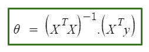

在上式中，
**θ:** 假设参数对其定义最好。
**X:** 输入每个实例的特征值。
**Y:** 每个实例的输出值。

#### 方程式背后的数学–

假设函数

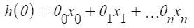

其中，
**n:** 数据集中要素的数量。
**x <sub>0</sub> :** 1(用于向量乘法)
请注意，这是θ和 x 值之间的点积。所以为了方便求解，我们可以写成:

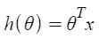

线性回归的动机是最小化**成本函数** :

J(\Theta) = \frac{1}{2m} \sum_{i = 1}^{m} \frac{1}{2} [h_{\Theta}(x^{(i)}) – y^{(i)}]^{2}  

其中，
**x<sup>I</sup>:**I<sup>ih</sup>训练示例的输入值。
**m:** 训练实例数量
**n:** 数据集特征数量
**y<sup>I</sup>:**I<sup>第</sup>个实例
的预期结果让我们用向量形式来表示成本函数。

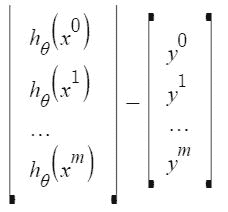

我们这里忽略了 1/2m，因为这不会对工作产生任何影响。它用于计算梯度下降时的数学便利。但这里不再需要了。

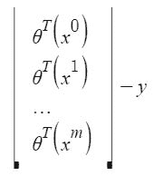

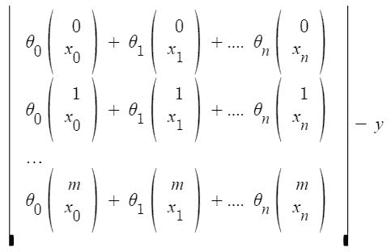

**x<sup>I</sup>T3】j:I<sup>ih</sup>训练示例中 j <sup>ih</sup> 特征的**值。
这可以进一步简化为

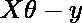

但是每个残值都是平方的。我们不能简单地把上面的表达式平方。因为向量/矩阵的平方不等于其每个值的平方。所以要得到平方值，把向量/矩阵乘以它的转置。所以，最终导出的方程是

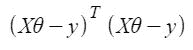

因此，成本函数为

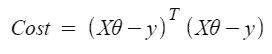

所以，现在用导数
得到θ的值

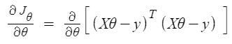

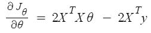

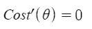

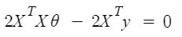

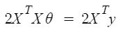

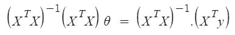


所以，这是最终导出的**正规方程，θ给出最小成本值。**

#### 示例:

## 蟒蛇 3

```
# This code may not run on GFG IDE
# as required modules not found.

# import required modules
import numpy as np
import matplotlib.pyplot as plt
from sklearn.datasets import make_regression

# Create data set.
x,y=make_regression(n_samples=100,n_features=1,n_informative=1,noise = 10,random_state=10)

# Plot the generated data set.
plt.scatter(x,y,s=30,marker='o')
plt.xlabel("Feature_1 --->")
plt.ylabel("Target_Variable --->")
plt.title('Simple Linear Regression')
plt.show()

# Convert  target variable array from 1d to 2d.
y=y.reshape(100,1)
```

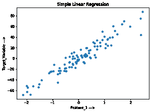

#### 让我们实现正常方程:

## 蟒蛇 3

```
# code

# Adding x0=1 to each instance
x_new=np.array([np.ones(len(x)),x.flatten()]).T

# Using Normal Equation.
theta_best_values=np.linalg.inv(x_new.T.dot(x_new)).dot(x_new.T).dot(y)

# Display best values obtained.
print(theta_best_values)
```

```
[[ 0.52804151]
 [30.65896337]]
```

#### 尝试预测新数据实例:

## 蟒蛇 3

```
# code

# sample data instance.
x_sample=np.array([[-2],[4]])

# Adding x0=1 to each instance.
x_sample_new=np.array([np.ones(len(x_sample)),x_sample.flatten()]).T

# Display the sample.
print("Before adding x0:\n",x_sample)
print("After adding x0:\n",x_sample_new)
```

```
Before adding x0:
 [[-2]
 [ 4]]
After adding x0:
 [[ 1\. -2.]
 [ 1\.  4.]]
```

## 蟒蛇 3

```
# code
# predict the values for given data instance.
predict_value=x_sample_new.dot(theta_best_values)
print(predict_value)
```

```
[[-60.78988524]
 [123.16389501]]
```

#### 绘制输出:

## 蟒蛇 3

```
# code

# Plot the output.
plt.scatter(x,y,s=30,marker='o')
plt.plot(x_sample,predict_value,c='red')
plt.plot()
plt.xlabel("Feature_1 --->")
plt.ylabel("Target_Variable --->")
plt.title('Simple Linear Regression')
plt.show()
```

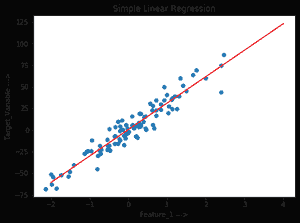

#### 使用 sklearn LinearRegression 类验证上述内容:

## 蟒蛇 3

```
# code

# Verification.
from sklearn.linear_model import LinearRegression
lr=LinearRegression()    # Object.
lr.fit(x,y)              # fit method.

# Print obtained theta values.
print("Best value of theta:",lr.intercept_,lr.coef_,sep='\n')

#predict.
print("predicted value:",lr.predict(x_sample),sep='\n')
```

```
Best value of theta:
[0.52804151]
[[30.65896337]]

predicted value:
[[-60.78988524]
 [123.16389501]]
```