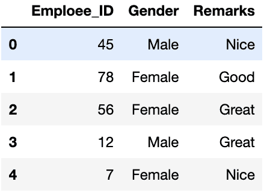
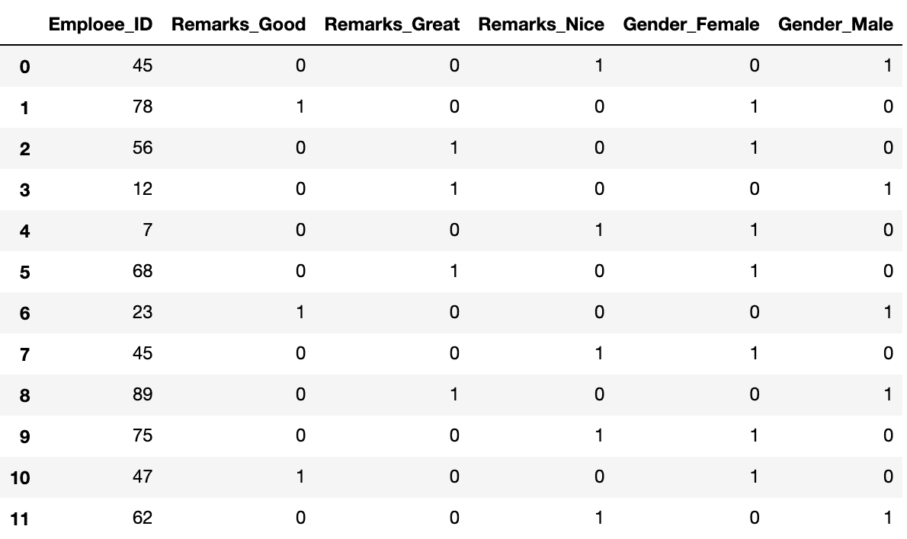

# ML |一次热编码处理分类数据参数

> 原文:[https://www . geesforgeks . org/ml-one-hot-encoding-of-dataset-in-python/](https://www.geeksforgeeks.org/ml-one-hot-encoding-of-datasets-in-python/)

有时在数据集中，我们会遇到包含分类特征(字符串值)的列，例如参数*性别*会有像*男*、*女*这样的分类参数。这些标签没有特定的优先顺序，而且由于数据是字符串标签，机器学习模型不能处理这些数据。

解决这个问题的一种方法是标签编码，我们将为这些标签分配一个数值，例如*男性*和*女性*映射到 *0* 和 *1* 。但这可能会增加我们模型中的偏差，因为它将开始给予*女性*参数更高的优先级，如 1 > 0，理想情况下，两个标签在数据集中同等重要。为了解决这个问题，我们将使用一个热编码技术。

## 一种热编码:

在这种技术中，我们每个分类参数，它将为标签为*的男性*和*的女性* *准备单独的列。所以，每当*性别*中有**男**时，*男*列为 1，*女*列为 0，反之亦然。*

**我们用一个例子来理解:**

考虑给出水果及其相应分类价值和价格的数据。

<center>

| 水果 | 水果的分类价值 | 价格 |
| --- | --- | --- |
| 苹果 | one | five |
| 芒果 | Two | Ten |
| 苹果 | one | Fifteen |
| 橙色的 | three | Twenty |

</center>

The output after one hot encoding the data is given as follows,

<center>

| 苹果 | 芒果 | 橙色的 | 价格 |
| --- | --- | --- | --- |
| one | Zero | Zero | five |
| Zero | one | Zero | Ten |
| one | Zero | Zero | Fifteen |
| Zero | Zero | one | Twenty |

</center>

 **代码:一热编码技术的 Python 代码实现**
**加载数据**

```py
# Program for demonstration of one hot encoding

# import libraries
import numpy as np
import pandas as pd

# import the data required
data = pd.read_csv("employee_data.csv")
print(data.head())
```

**输出:**


**检查分类参数**中的标签

```py
print(data['Gender'].unique())
print(data['Remarks'].unique())
```

**输出:**

```py
array(['Male', 'Female'], dtype=object)
array(['Nice', 'Good', 'Great'], dtype=object)

```

**检查分类参数**中的标签计数

```py
data['Gender'].value_counts()
data['Remarks'].value_counts()
```

**输出:**

```py
Female    7
Male      5
Name: Gender, dtype: int64

Nice     5
Great    4
Good     3
Name: Remarks, dtype: int64

```

**使用 *get_dummies()*** 对分类参数进行一键编码

```py
one_hot_encoded_data = pd.get_dummies(data, columns = ['Remarks', 'Gender'])
print(one_hot_encoded_data)
```

**输出:**


我们可以观察到数据中有 *3 备注*和 *2 性别*列。但是，如果它有 *n* 唯一标签，您可以只使用 *n-1* 列来定义参数。例如，如果我们只保留*性别 _ 女性*列，并删除*性别 _ 男性*列，那么我们也可以传达整个信息，因为当标签为 1 时，它意味着女性，当标签为 0 时，它意味着男性。这样，我们可以对分类数据进行编码，并减少参数的数量。