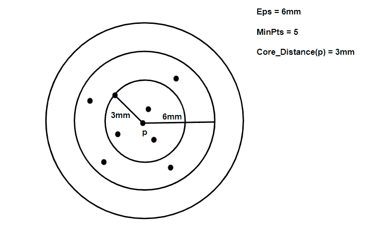
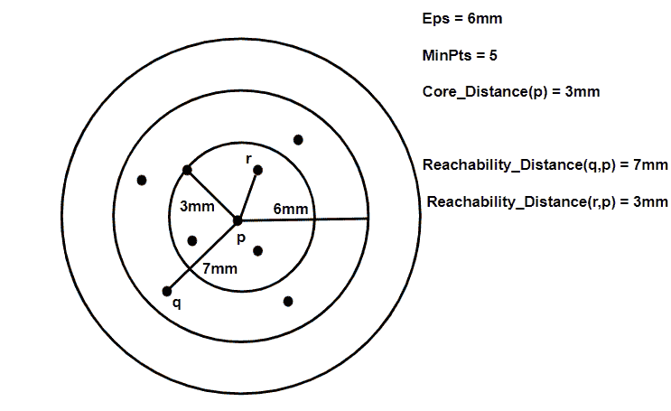

# ML |光学聚类解释

> 原文:[https://www . geesforgeks . org/ml-光学-聚类-解释/](https://www.geeksforgeeks.org/ml-optics-clustering-explanation/)

**先决条件:** [数据库扫描聚类](https://www.geeksforgeeks.org/dbscan-clustering-in-ml-density-based-clustering/)

光学聚类代表**排序点以识别聚类结构**。它从 DBSCAN 聚类算法中得到启发。它为 DBSCAN 集群的概念增加了两个术语。它们是:-

1.  **Core Distance:** It is the minimum value of radius required to classify a given point as a core point. If the given point is not a Core point, then it’s Core Distance is undefined.

    

2.  **可达性距离:**相对于另一个数据点 q(Let)定义。点 p 和 q 之间的可达性距离是 p 的核心距离和 p 和 q 之间的欧几里德距离(或其他距离度量)的最大值。请注意，如果 q 不是核心点，则不定义可达性距离。



这种聚类技术不同于其他聚类技术，因为这种技术没有明确地将数据分割成聚类。相反，它会生成可达性距离的可视化，并使用该可视化对数据进行聚类。

**伪代码:**

以下伪代码来自算法的[维基百科页面](https://en.wikipedia.org/wiki/OPTICS_algorithm)。

```py
OPTICS(DB, eps, MinPts)

    #Repeating the process for all points in the database
    for each point pt of DB

       #Initializing the reachability distance of the selected point
       pt.reachable_dist = UNDEFINED
    for each unprocessed point pt of DB

       #Getting the neighbours of the selected point
       #according to the definitions of epsilon and
       #minPts in DBSCAN
       Nbrs = getNbrs(pt, eps)

       mark pt as processed
       output pt to the ordered list

       #Checking if the selected point is not noise
       if (core_dist(pt, eps, Minpts) != UNDEFINED)

          #Initializing a priority queue to get the closest data point
          #in terms of Reachability distance
          Seeds = empty priority queue

          #Calling the update function
          update(Nbrs, pt, Seeds, eps, Minpts)

          #Repeating the process for the next closest point
          for each next q in Seeds
             Nbrs' = getNbrs(q, eps)
             mark q as processed
             output q to the ordered list
             if (core_dist(q, eps, Minpts) != UNDEFINED)
                update(Nbrs', q, Seeds, eps, Minpts)

```

更新函数的伪代码如下:

```py
update(Nbrs, pt, Seeds, eps, MinPts)

    #Calculating the core distance for the given point
    coredist = core_dist(pt, eps, MinPts)

    #Updating the Reachability distance for each neighbour of p
    for each obj in Nbrs
       if (obj is not processed)
          new_reach_distance = max(coredist, dist(pt, obj))

          #Checking if the neighbour point is in seeds
          if (obj.reachable_dist == UNDEFINED)

              #Updation step
              obj.reachabled_dist = new_reach_distance
              Seeds.insert(obj, new_reach_distance)
          else               
              if (new_reach_distance < obj.reachable_dist)

                 #Updation step
                 o.reachable_dist = new_reach_distance
                 Seeds.move-up(obj, new_reach_distance)

```

**光学聚类 v/s DBSCAN 聚类:**

1.  **内存成本:**OPTICS 群集技术需要更多内存，因为它维护一个优先级队列(最小堆)来确定下一个数据点，该数据点在可达性距离方面最接近当前正在处理的点。它还需要更多的计算能力，因为最近邻查询比数据库扫描中的半径查询更复杂。
2.  **更少的参数:**OPTICS 聚类技术不需要维护ε参数，仅在上述伪码中给出，以减少花费的时间。这导致参数调整的分析过程的减少。
3.  <strongpartitioning :="" strong="">这种技术不会将给定的数据分成簇。它仅仅产生可达性距离图，并且根据程序员的解释相应地对点进行聚类。</strongpartitioning>