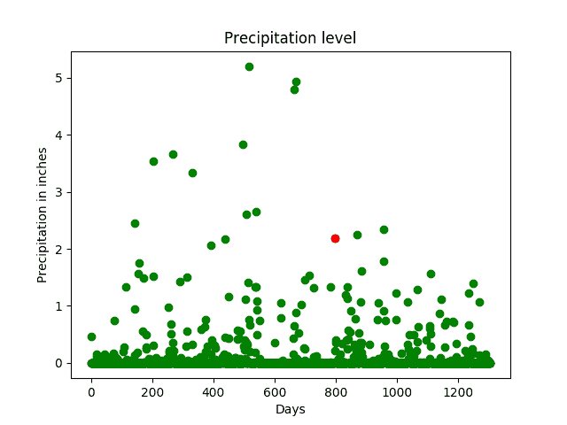
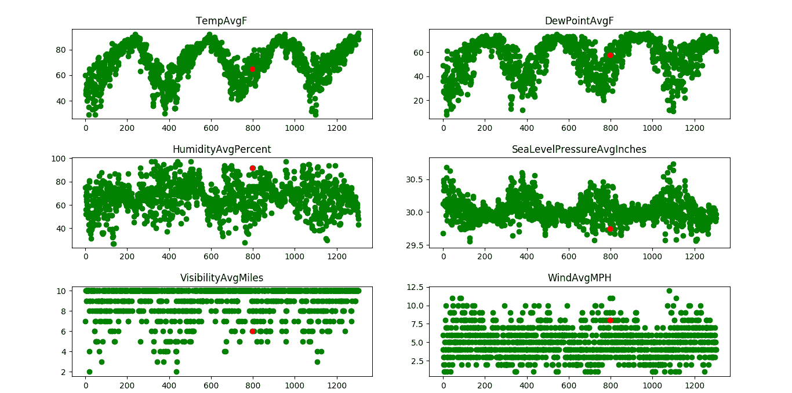

# ML |使用线性回归的降雨量预测

> 原文:[https://www . geesforgeks . org/ml-雨量-预测-使用-线性回归/](https://www.geeksforgeeks.org/ml-rainfall-prediction-using-linear-regression/)

**先决条件:** [线性回归](https://www.geeksforgeeks.org/linear-regression-python-implementation/)

降雨量预测是应用科学技术来预测一个地区的降雨量。准确确定降雨量对于有效利用水资源、作物生产力和预先规划水结构非常重要。

在本文中，我们将使用线性回归来预测降雨量。线性回归告诉我们可以预期多少英寸的降雨量。

该数据集是来自德克萨斯州奥斯汀的公共天气数据集，可在 Kaggle 上获得。数据集可以在[这里](https://www.kaggle.com/grubenm/austin-weather)找到。

**数据清理:**
数据以各种形式出现，其中大部分都非常杂乱和无组织。它们很少可以随时使用。数据集，无论大小，都有各种各样的问题——无效字段、缺失值和附加值，以及与我们要求的形式不同的值。为了使它成为可操作的或结构化的形式，我们需要“清理”我们的数据，并使其随时可用。一些常见的清理包括解析、转换为一热、删除不必要的数据等。

在我们的案例中，我们的数据有几天没有记录某些因素。如果有微量降水，以厘米为单位的降雨量标记为 T。我们的算法需要数字，所以我们不能处理数据中突然出现的字母。因此，在将数据应用到我们的模型之前，我们需要清理数据

用 Python 清理数据:

```py
# importing libraries
import pandas as pd
import numpy as np

# read the data in a pandas dataframe
data = pd.read_csv("austin_weather.csv")

# drop or delete the unnecessary columns in the data.
data = data.drop(['Events', 'Date', 'SeaLevelPressureHighInches', 
                  'SeaLevelPressureLowInches'], axis = 1)

# some values have 'T' which denotes trace rainfall
# we need to replace all occurrences of T with 0
# so that we can use the data in our model
data = data.replace('T', 0.0)

# the data also contains '-' which indicates no 
# or NIL. This means that data is not available
# we need to replace these values as well.
data = data.replace('-', 0.0)

# save the data in a csv file
data.to_csv('austin_final.csv')
```

一旦数据被清理，它可以被用作我们的线性回归模型的输入。线性回归是一种在因变量和许多独立解释变量之间形成关系的线性方法。这是通过绘制一条最符合散点图的线来完成的，即误差最小。这给出了价值预测，即多少，通过代入线方程中的独立值。

我们将使用 Scikit-learn 的线性回归模型来训练我们的数据集。一旦模型被训练好，我们就可以为各种列给出我们自己的输入，如温度、露点、压力等。根据这些属性来预测天气。

```py
# importing libraries
import pandas as pd
import numpy as np
import sklearn as sk
from sklearn.linear_model import LinearRegression
import matplotlib.pyplot as plt

# read the cleaned data
data = pd.read_csv("austin_final.csv")

# the features or the 'x' values of the data
# these columns are used to train the model
# the last column, i.e, precipitation column 
# will serve as the label 
X = data.drop(['PrecipitationSumInches'], axis = 1)

# the output or the label.
Y = data['PrecipitationSumInches']
# reshaping it into a 2-D vector
Y = Y.values.reshape(-1, 1)

# consider a random day in the dataset
# we shall plot a graph and observe this
# day
day_index = 798
days = [i for i in range(Y.size)]

# initialize a linear regression classifier
clf = LinearRegression()
# train the classifier with our 
# input data.
clf.fit(X, Y)

# give a sample input to test our model
# this is a 2-D vector that contains values
# for each column in the dataset.
inp = np.array([[74], [60], [45], [67], [49], [43], [33], [45],
                [57], [29.68], [10], [7], [2], [0], [20], [4], [31]])
inp = inp.reshape(1, -1)

# print the output.
print('The precipitation in inches for the input is:', clf.predict(inp))

# plot a graph of the precipitation levels
# versus the total number of days.
# one day, which is in red, is
# tracked here. It has a precipitation
# of approx. 2 inches.
print("the precipitation trend graph: ")
plt.scatter(days, Y, color = 'g')
plt.scatter(days[day_index], Y[day_index], color ='r')
plt.title("Precipitation level")
plt.xlabel("Days")
plt.ylabel("Precipitation in inches")

plt.show()
x_vis = X.filter(['TempAvgF', 'DewPointAvgF', 'HumidityAvgPercent',
                  'SeaLevelPressureAvgInches', 'VisibilityAvgMiles',
                  'WindAvgMPH'], axis = 1)

# plot a graph with a few features (x values)
# against the precipitation or rainfall to observe
# the trends

print("Precipitation vs selected attributes graph: ")

for i in range(x_vis.columns.size):
    plt.subplot(3, 2, i + 1)
    plt.scatter(days, x_vis[x_vis.columns.values[i][:100]],
                                               color = 'g')

    plt.scatter(days[day_index], 
                x_vis[x_vis.columns.values[i]][day_index],
                color ='r')

    plt.title(x_vis.columns.values[i])

plt.show()
```

**输出:**

```py
The precipitation in inches for the input is: [[1.33868402]]

The precipitation trend graph:
```



降水与选定属性图:


具有大约 2 英寸降水量的一天(红色)被多个参数跟踪(同一天被多个特征如温度、压力等跟踪)。x 轴表示天数，y 轴表示特征量，如温度、压力等。从图中可以观察到，当温度高、湿度大时，降雨量可以预计会很高。