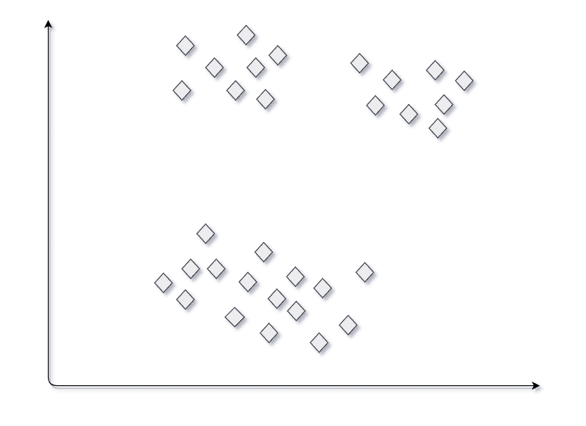
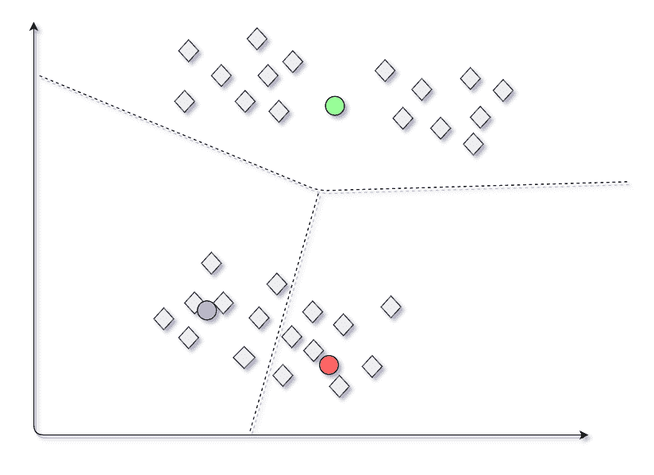
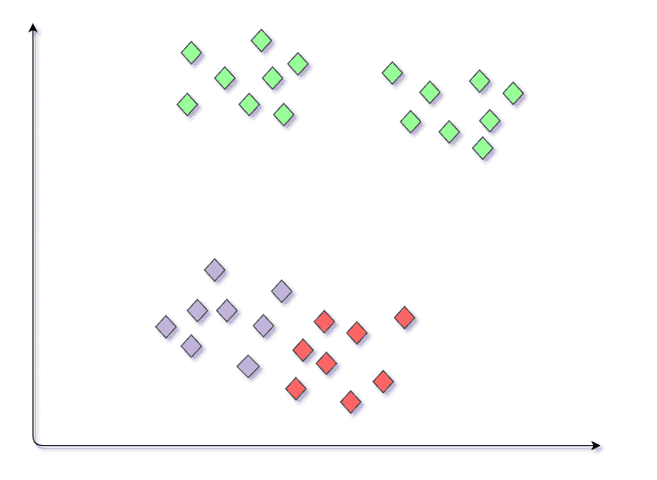
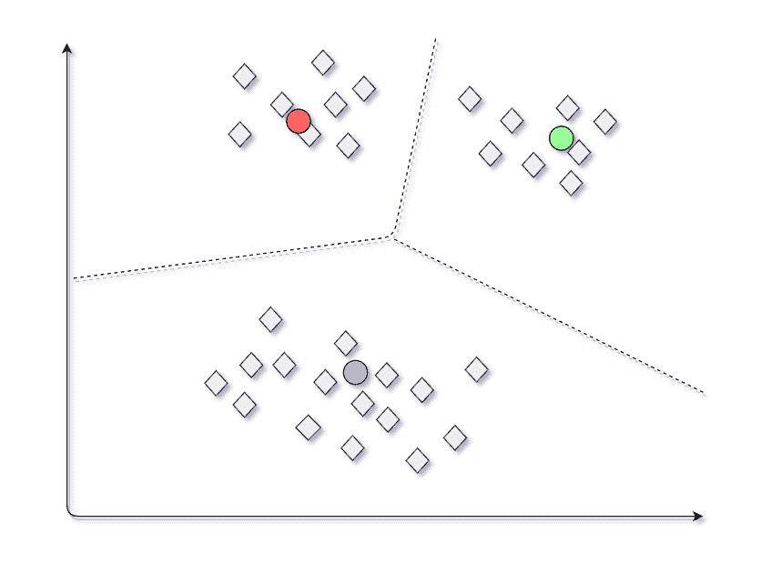
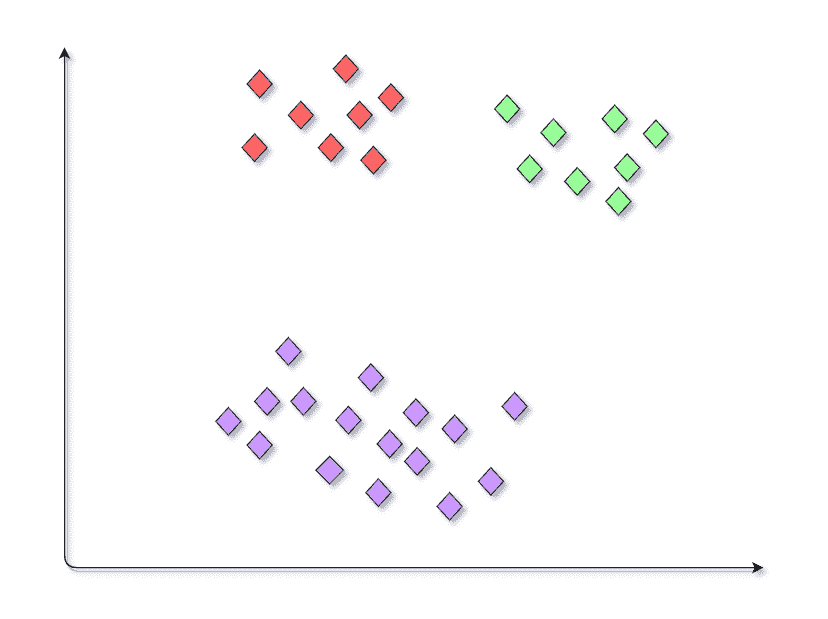

# ML | K 均值中的随机初始化陷阱

> 原文:[https://www . geesforgeks . org/ml-random-initialization-trap-in-k-means/](https://www.geeksforgeeks.org/ml-random-intialization-trap-in-k-means/)

随机初始化陷阱是 K-means 算法中出现的一个问题。在随机初始化陷阱中，当用户明确定义要生成的聚类的质心时，可能会产生不一致，这有时会导致在数据集中生成错误的聚类。因此，随机初始化陷阱有时可能会阻止我们开发正确的集群。

**示例:**
假设你有一个数据集，图中显示了以下几个点，你想通过执行 K-means 聚类在这个数据集中根据它们的属性生成三个聚类。从图中，我们可以直观的得到需要生成哪些聚类。K-means 将根据输入算法的质心进行聚类，并根据这些质心生成所需的聚类。

**初审**
假设我们按照下图选择 3 组质心。对应于这些质心生成的簇如下图所示。

**最终模型**

**第二次试验**
考虑另一种情况，我们为数据集选择另一组质心，如图所示。现在生成的集群集将不同于之前练习中生成的集群。

**最终模型**

同样，我们可能会在同一数据集上获得不同的模型输出。当一组不同的质心被提供给 K-means 算法使其不一致和不可靠时，产生一组不同的簇的这种情况被称为随机初始化陷阱。