# ML |原始和中心时刻

> 原文:[https://www.geeksforgeeks.org/ml-raw-and-central-moments/](https://www.geeksforgeeks.org/ml-raw-and-central-moments/)

**矩**是一组统计参数，用于描述频率分布的不同特征和特性，即频率曲线的中心趋势、色散、对称性和峰值(驼峰)。

对于*未分组数据*即离散数据，变量 X 的观测值作为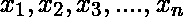获得，对于*分组数据*即连续数据，变量 X 的观测值作为频率表中的 K 类区间获得并列表。区间的中点由表示，它们分别以频率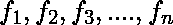和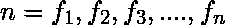出现。

| 班级间隔 | 中点() | 绝对频率(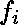) |
| --- | --- | --- |
| 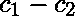 |  |  |
| 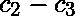 | 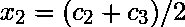 |  |
| 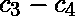 |  |  |
| … | … | … |
| … | … | … |
| 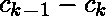 | 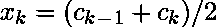 | 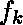 |

**关于任意点 A 的力矩**
关于观测值上任意点 A 的变量 X 的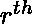力矩定义为:

> **对于未分组的数据** 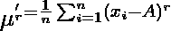
> 
> **分组数据** 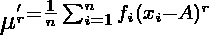
> 
> 其中
> 

**关于 Python 中任意点的时刻–**

考虑给定的数据点。以下是 20 个不同的人每周在极客博客门户网站上花费的时间(以小时为单位)。

```
15, 25, 18, 36, 40, 28, 30, 32, 23, 22, 21, 27, 31, 20, 14, 10, 33, 11, 7, 13
```

```
# data points
time = [15, 25, 18, 36, 40, 28, 30, 32, 23, 22, 
        21, 27, 31, 20, 14, 10, 33, 11, 7, 13]

# Arbitrary point 
A = 22

# Moment for r = 1
moment = (sum([(item-A) for item in time]))/len(time)
```

## 原始时刻–

原点 A = 0 周围的力矩称为原始力矩，定义为:

> 对于未分组的数据，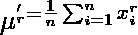
> 对于分组的数据，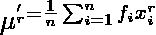
> 
> 其中，

**备注:**

> **- >** 我们可以通过用 1 替换 r 来找到第一个原始时刻(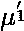)，通过用 2 替换 r 来找到第二个原始时刻(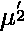)以此类推。
> **- >** 当 r = 0 时，分组和非分组数据的时刻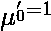。

**Python 中的原始时刻–**

```
# data points
time = [15, 25, 18, 36, 40, 28, 30, 32, 23,
       22, 21, 27, 31, 20, 14, 10, 33, 11, 7, 13]

# Moment for r = 1
moment = sum(time)/len(time)
```

## 中心时刻–

变量 X 关于算术平均值(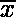)的矩称为中心矩，定义为:

> 对于未分组的数据，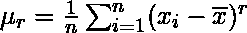
> 
> 对于分组数据，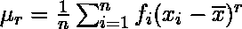
> 
> 其中和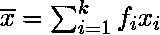

**备注:**

> **- >** 我们用 1 代替 r 就可以找到第一个原始矩(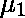)，用 2 代替 r 就可以找到第二个原始矩()以此类推。
> **- >** 当 r = 0 时的时刻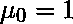，以及当 r = 1 时的时刻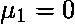对于分组和未分组的数据。

```
# data points
time = [15, 25, 18, 36, 40, 28, 30, 32, 23, 22,
       21, 27, 31, 20, 14, 10, 33, 11, 7, 13]

# Mean 
A = sum(time)/len(time)

# Moment for r = 1
moment = (sum([(item-A) for item in time]))/len(time)
```

**原始时刻和中心时刻之间的关系–**
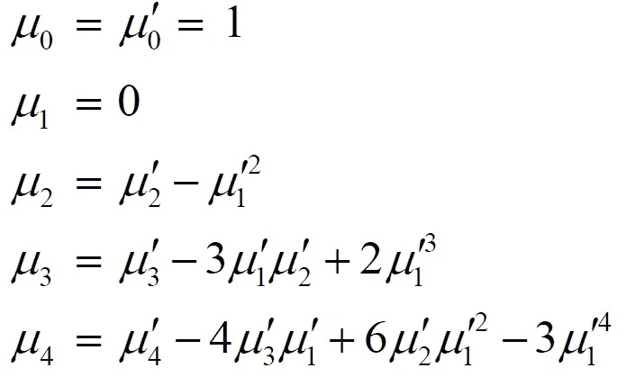