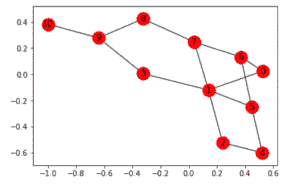
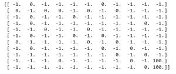
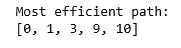
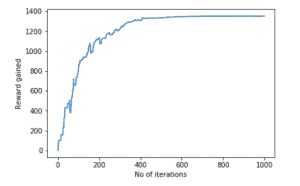
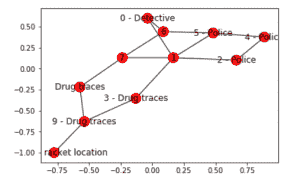
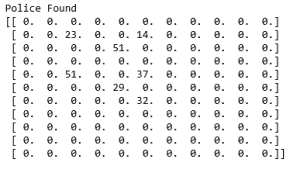
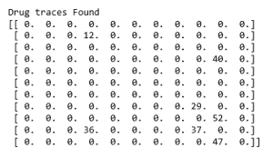

# ML |强化学习算法:使用 Q 学习的 Python 实现

> 原文:[https://www . geesforgeks . org/ml-强化-学习-算法-python-实现-使用-q-learning/](https://www.geeksforgeeks.org/ml-reinforcement-learning-algorithm-python-implementation-using-q-learning/)

**先决条件:** [问学术](https://www.geeksforgeeks.org/q-learning-in-python/)。

**强化学习**是一种机器学习范例，其中学习算法不是基于预设数据，而是基于反馈系统进行训练。这些算法被吹捧为机器学习的未来，因为它们消除了收集和清理数据的成本。

在本文中，我们将演示如何实现一个基本的强化学习算法，它被称为 **Q 学习技术**。在这个演示中，我们尝试使用 **Q-Learning 技术**来教机器人到达目的地。

**步骤 1:导入所需的库**

```py
import numpy as np
import pylab as pl
import networkx as nx
```

**步骤 2:定义和可视化图形**

```py
edges = [(0, 1), (1, 5), (5, 6), (5, 4), (1, 2), 
         (1, 3), (9, 10), (2, 4), (0, 6), (6, 7),
         (8, 9), (7, 8), (1, 7), (3, 9)]

goal = 10
G = nx.Graph()
G.add_edges_from(edges)
pos = nx.spring_layout(G)
nx.draw_networkx_nodes(G, pos)
nx.draw_networkx_edges(G, pos)
nx.draw_networkx_labels(G, pos)
pl.show()
```



**注意:**上面的图在复制代码时可能看起来不一样，因为 python 中的[网络](https://networkx.github.io/documentation/stable/)库根据给定的边生成一个随机图。

**第三步:定义机器人系统的奖励**

```py
MATRIX_SIZE = 11
M = np.matrix(np.ones(shape =(MATRIX_SIZE, MATRIX_SIZE)))
M *= -1

for point in edges:
    print(point)
    if point[1] == goal:
        M[point] = 100
    else:
        M[point] = 0

    if point[0] == goal:
        M[point[::-1]] = 100
    else:
        M[point[::-1]]= 0
        # reverse of point

M[goal, goal]= 100
print(M)
# add goal point round trip
```



**第 4 步:定义一些在训练中使用的实用功能**

```py
Q = np.matrix(np.zeros([MATRIX_SIZE, MATRIX_SIZE]))

gamma = 0.75
# learning parameter
initial_state = 1

# Determines the available actions for a given state
def available_actions(state):
    current_state_row = M[state, ]
    available_action = np.where(current_state_row >= 0)[1]
    return available_action

available_action = available_actions(initial_state)

# Chooses one of the available actions at random
def sample_next_action(available_actions_range):
    next_action = int(np.random.choice(available_action, 1))
    return next_action

action = sample_next_action(available_action)

def update(current_state, action, gamma):

  max_index = np.where(Q[action, ] == np.max(Q[action, ]))[1]
  if max_index.shape[0] > 1:
      max_index = int(np.random.choice(max_index, size = 1))
  else:
      max_index = int(max_index)
  max_value = Q[action, max_index]
  Q[current_state, action] = M[current_state, action] + gamma * max_value
  if (np.max(Q) > 0):
    return(np.sum(Q / np.max(Q)*100))
  else:
    return (0)
# Updates the Q-Matrix according to the path chosen

update(initial_state, action, gamma)
```

**第五步:使用 Q 矩阵**训练和评估机器人

```py
scores = []
for i in range(1000):
    current_state = np.random.randint(0, int(Q.shape[0]))
    available_action = available_actions(current_state)
    action = sample_next_action(available_action)
    score = update(current_state, action, gamma)
    scores.append(score)

# print("Trained Q matrix:")
# print(Q / np.max(Q)*100)
# You can uncomment the above two lines to view the trained Q matrix

# Testing
current_state = 0
steps = [current_state]

while current_state != 10:

    next_step_index = np.where(Q[current_state, ] == np.max(Q[current_state, ]))[1]
    if next_step_index.shape[0] > 1:
        next_step_index = int(np.random.choice(next_step_index, size = 1))
    else:
        next_step_index = int(next_step_index)
    steps.append(next_step_index)
    current_state = next_step_index

print("Most efficient path:")
print(steps)

pl.plot(scores)
pl.xlabel('No of iterations')
pl.ylabel('Reward gained')
pl.show()
```





现在，让我们把这个机器人带到一个更现实的环境中。让我们想象一下，机器人是一名侦探，正试图找出一个大型贩毒集团的位置。他很自然地得出结论，毒品销售者不会在警方经常光顾的地方销售其产品，而且销售地点靠近毒品交易场所。此外，卖家会留下他们产品的销售痕迹，这可以帮助侦探找到所需的位置。我们想训练我们的机器人使用这些**环境线索**找到位置。

**步骤 6:用环境线索定义和可视化新图形**

```py
# Defining the locations of the police and the drug traces
police = [2, 4, 5]
drug_traces = [3, 8, 9]

G = nx.Graph()
G.add_edges_from(edges)
mapping = {0:'0 - Detective', 1:'1', 2:'2 - Police', 3:'3 - Drug traces',
           4:'4 - Police', 5:'5 - Police', 6:'6', 7:'7', 8:'Drug traces',
           9:'9 - Drug traces', 10:'10 - Drug racket location'}

H = nx.relabel_nodes(G, mapping)
pos = nx.spring_layout(H)
nx.draw_networkx_nodes(H, pos, node_size =[200, 200, 200, 200, 200, 200, 200, 200])
nx.draw_networkx_edges(H, pos)
nx.draw_networkx_labels(H, pos)
pl.show() 
```



**注:**上图看起来可能与上图有点不同，但实际上它们是相同的图。这是由于`networkx` 库对节点的随机放置。

**步骤 7:为训练过程定义一些实用函数**

```py
Q = np.matrix(np.zeros([MATRIX_SIZE, MATRIX_SIZE]))
env_police = np.matrix(np.zeros([MATRIX_SIZE, MATRIX_SIZE]))
env_drugs = np.matrix(np.zeros([MATRIX_SIZE, MATRIX_SIZE]))
initial_state = 1

# Same as above
def available_actions(state):
    current_state_row = M[state, ]
    av_action = np.where(current_state_row >= 0)[1]
    return av_action

# Same as above
def sample_next_action(available_actions_range):
    next_action = int(np.random.choice(available_action, 1))
    return next_action

# Exploring the environment
def collect_environmental_data(action):
    found = []
    if action in police:
        found.append('p')
    if action in drug_traces:
        found.append('d')
    return (found)

available_action = available_actions(initial_state)
action = sample_next_action(available_action)

def update(current_state, action, gamma):
  max_index = np.where(Q[action, ] == np.max(Q[action, ]))[1]
  if max_index.shape[0] > 1:
      max_index = int(np.random.choice(max_index, size = 1))
  else:
      max_index = int(max_index)
  max_value = Q[action, max_index]
  Q[current_state, action] = M[current_state, action] + gamma * max_value
  environment = collect_environmental_data(action)
  if 'p' in environment:
    env_police[current_state, action] += 1
  if 'd' in environment:
    env_drugs[current_state, action] += 1
  if (np.max(Q) > 0):
    return(np.sum(Q / np.max(Q)*100))
  else:
    return (0)
# Same as above
update(initial_state, action, gamma)

def available_actions_with_env_help(state):
    current_state_row = M[state, ]
    av_action = np.where(current_state_row >= 0)[1]

    # if there are multiple routes, dis-favor anything negative
    env_pos_row = env_matrix_snap[state, av_action]

    if (np.sum(env_pos_row < 0)):
        # can we remove the negative directions from av_act?
        temp_av_action = av_action[np.array(env_pos_row)[0]>= 0]
        if len(temp_av_action) > 0:
            av_action = temp_av_action
    return av_action
# Determines the available actions according to the environment
```

**步骤 8:可视化环境矩阵**

```py
scores = []
for i in range(1000):
    current_state = np.random.randint(0, int(Q.shape[0]))
    available_action = available_actions(current_state)
    action = sample_next_action(available_action)
    score = update(current_state, action, gamma)

# print environmental matrices
print('Police Found')
print(env_police)
print('')
print('Drug traces Found')
print(env_drugs)
```





**第九步:模型的训练和评估**

```py
scores = []
for i in range(1000):
    current_state = np.random.randint(0, int(Q.shape[0]))
    available_action = available_actions_with_env_help(current_state)
    action = sample_next_action(available_action)
    score = update(current_state, action, gamma)
    scores.append(score)

pl.plot(scores)
pl.xlabel('Number of iterations')
pl.ylabel('Reward gained')
pl.show()
```


上面的例子是一个非常基础的例子，很多像**自动驾驶汽车**这样的实际例子都涉及到[博弈论](https://www.geeksforgeeks.org/game-theory/)的概念。