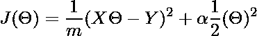

# ML |使用 sklearn 的岭回归器

> 原文:[https://www . geeksforgeeks . org/ml-ridge-reversor-using-sklearn/](https://www.geeksforgeeks.org/ml-ridge-regressor-using-sklearn/)

岭回归基本上是线性回归的正则化版本。也就是说，在线性回归的原始成本函数中，我们添加了一个正则项，该正则项迫使学习算法拟合数据，并有助于保持尽可能低的权重。正则项具有参数“α”，该参数控制模型的正则化，即有助于降低估计的方差。
岭回归器的成本函数。

<center>

(1) 

</center>

这里，
第一项是我们的基本线性回归的成本函数，第二项是我们新的正则化权重项，它使用 L2 范数来拟合数据。如果“alpha”为零，则模型与线性回归相同，较大的“alpha”值指定更强的正则化。
注意:在使用岭回归之前，需要对输入进行缩放，因为这个模型对输入的缩放很敏感。因此，通过 sklearn 的 StandardScalar 执行缩放将是有益的。
**代码:实现岭回归器的 Python 代码。**

## 蟒蛇 3

```py
# importing libraries
from sklearn.linear_model import Ridge
from sklearn.model_selection import train_test_split
from sklearn.datasets import load_boston
from sklearn.preprocessing import StandardScaler

# loading boston dataset
boston = load_boston()
X = boston.data[:, :13]
y = boston.target

print ("Boston dataset keys : \n", boston.keys())

print ("\nBoston data : \n", boston.data)

# scaling the inputs
scaler = StandardScaler()
scaled_X = scaler.fit_transform(X)

# Train Test split will be used for both models
X_train, X_test, y_train, y_test = train_test_split(scaled_X, y,
                                                    test_size = 0.3)

# training model with 0.5 alpha value
model = Ridge(alpha = 0.5, normalize = False, tol = 0.001, \
              solver ='auto', random_state = 42)
model.fit(X_train, y_train)

# predicting the y_test
y_pred = model.predict(X_test)

# finding score for our model
score = model.score(X_test, y_test)
print("\n\nModel score : ", score)
```

**输出:**

```py
Boston dataset keys : 
 dict_keys(['feature_names', 'DESCR', 'data', 'target'])

Boston data : 
 [[6.3200e-03 1.8000e+01 2.3100e+00 ... 1.5300e+01 3.9690e+02 4.9800e+00]
 [2.7310e-02 0.0000e+00 7.0700e+00 ... 1.7800e+01 3.9690e+02 9.1400e+00]
 [2.7290e-02 0.0000e+00 7.0700e+00 ... 1.7800e+01 3.9283e+02 4.0300e+00]
 ...
 [6.0760e-02 0.0000e+00 1.1930e+01 ... 2.1000e+01 3.9690e+02 5.6400e+00]
 [1.0959e-01 0.0000e+00 1.1930e+01 ... 2.1000e+01 3.9345e+02 6.4800e+00]
 [4.7410e-02 0.0000e+00 1.1930e+01 ... 2.1000e+01 3.9690e+02 7.8800e+00]]

Model score :  0.6819292026260749
```

一个更新版本的 RidgeCV 带有阿尔法的内置交叉验证，所以肯定更好。只传递一些 alpha 范围值的数组，它会自动为“alpha”选择最佳值。
**注:**“tol”是测量损失下降并确保模型停止在该提供值位置或下降(全局最小值)的参数。