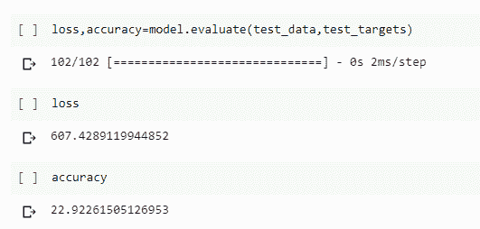
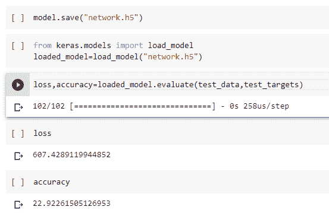

# ML–在 Keras 中保存深度学习模型

> 原文:[https://www . geesforgeks . org/ml-saving-a-deep-learning-model-in-keras/](https://www.geeksforgeeks.org/ml-saving-a-deep-learning-model-in-keras/)

训练神经网络/深度学习模型通常需要花费大量时间，尤其是当系统的硬件容量不符合要求时。训练完成后，我们将模型保存到一个文件中。为了在稍后的时间点重用模型来进行预测，我们加载保存的模型。
通过 Keras，模型可以三种格式保存:

*   YAML 格式
*   JSON 格式
*   HDF5 格式

YAML 和 JSON 文件只存储模型结构，而 HDF5 文件存储完整的神经网络模型以及结构和权重。因此，如果使用 YAML 或 JSON 格式保存模型结构，权重应该存储在 HDF5 文件中，以存储整个模型。
考虑波士顿房价数据集:
**代码:加载数据集并预处理数据**

```py
import keras
from keras.datasets import boston_housing

(train_data, train_targets), (test_data, test_targets)= boston_housing.load_data()

mean = train_data.mean(axis = 0)
train_data-= mean
std = train_data.std(axis = 0)

train_data/= std
test_data-= mean
test_data/= std
```

**代码:在上面训练神经网络模型**

```py
from keras import models
from keras import layers

model = models.Sequential()
model.add(layers.Dense(64, activation ="relu", input_shape =(train_data.shape[1], )))
model.add(layers.Dense(64, activation ="relu"))
model.add(layers.Dense(1))
model.compile(optimizer ="rmsprop", loss ="mse", metrics =["mae"])
loss, accuracy = model.evaluate(test_data, test_targets)
```

**输出:**

<center>
</center>

 **Code: Saving and reloading model in HDF5 file format**

```py
from keras.models import load_model
model.save("network.h5")
loaded_model = load_model("network.h5")
loss, accuracy = loaded_model.evaluate(test_data, test_targets)
```

**输出:**

<center></center>

**代码:以 JSON 文件格式**保存并重装模型

```py
# Saving model structure to a JSON file

model_json = model.to_json() # with open("network.json", "w") as json_file:
    json_file.write(model_json)

# Saving weights of the model to a HDF5 file
model.save_weights("network.h5")

# Loading JSON file 
json_file = open("network.json", 'r')
loaded_model_json = json_file.read()
json_file.close()
loaded_model = model_from_json(loaded_model_json)

# Loading weights
loaded_model.load_weights("network.h5")
loss, accuracy = loaded_model.evaluate(test_data, test_targets)
```

**代码:保存并重装 YAML 文件格式的模型**

```py
# Saving model structure to a YAML file
model_yaml = model.to_yaml() 
with open("network.yaml", "w") as yaml_file:
    yaml_file.write(model_yaml)

# Saving weights of the model to a HDF5 file
model.save_weights("network.h5")

# Loading YAML file 
yaml_file = open("network.yaml", 'r')
loaded_model_yaml = yaml_file.read()
yaml_file.close()
loaded_model = model_from_yaml(loaded_model_yaml)

# Loading weights
loaded_model.load_weights("network.h5")
loss, accuracy = loaded_model.evaluate(test_data, test_targets)
```