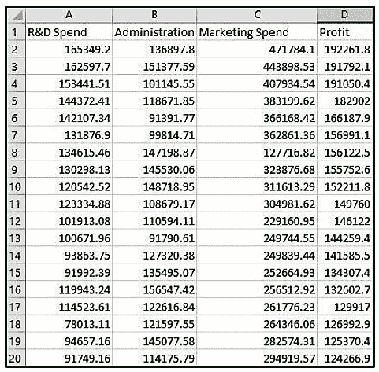
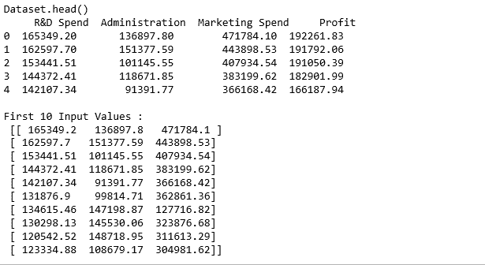
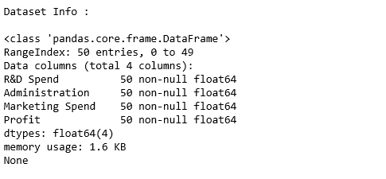
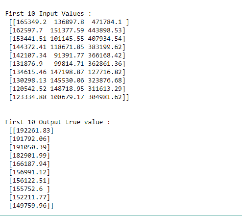

# ML |硬化. linear_model。python〔t1〕中的线性回归()

> 哎哎哎:# t0]https://www . geeksforgeeks . org/ml-硬化-linear _ model-linear regression-in-python/

这是来自 sklearn.linear_module 的普通最小二乘线性回归。
**语法:**
sklearn.linear_model。线性回归(拟合截距=真，归一化=假，复制 X =真，n _ 作业=1):

**参数:**

> **fit_intercept :** 【布尔值，默认值为真】是否为模型计算截距。
> **归一化:**【布尔，默认值为假】回归前归一化。
> **copy_X :** 【布尔值，默认值为真】如果为真，则覆盖 X 的副本。
> **n _ jobs:**【int，默认值为 1】如果-1，则使用所有 CPU。这将加快处理大型数据集的速度。

在给定的数据集中，给出了 50 家公司的 R&D 支出、管理成本和营销支出以及获得的利润。目标是准备一个最大似然模型，如果给定一个公司的 R&D 成本、管理成本和营销成本，该模型可以预测该公司的利润价值。

要下载数据集点击这里。

**代码:**利用线性回归预测公司利润

```
# Importing the libraries
import numpy as np
import pandas as pd

# Importing the dataset
dataset = pd.read_csv('https://media.geeksforgeeks.org/wp-content/uploads/50_Startups.csv')

print ("Dataset.head() \n ", dataset.head())

# Input values
x = dataset.iloc[:, :-1].values
print("\nFirst 10 Input Values : \n", x[0:10, :])

```



```
print ("Dataset Info : \n")
print (dataset.info())
```



```
# Input values
x = dataset.iloc[:, :-1].values
print("\nFirst 10 Input Values : \n", x[0:10, :])

# Output values
y = dataset.iloc[:, 3].values 
y1 = y
y1 = y1.reshape(-1, 1)
print("\n\nFirst 10 Output true value : \n", y1[0:10, :])
```



```
# Dividing input and output data to train and test data
# Training : Testing = 80 : 20
from sklearn.cross_validation import train_test_split
xtrain, xtest, ytrain, ytest = train_test_split(x, y, test_size = 0.2, 
                                                     random_state = 0)

# Feature Scaling
# Multilinear regression takes care of Feature Scaling
# So we need not do it manually 

# Fitting Multi Linear regression model to training model
from sklearn.linear_model import LinearRegression
regressor = LinearRegression()
regressor.fit(xtrain, ytrain)

# predicting the test set results
y_pred = regressor.predict(xtest)

y_pred1 = y_pred
y_pred1 = y_pred1.reshape(-1,1)

print("\n   RESULT OF LINEAR REGRESSION PREDICTION : ")
print ("\nFirst 10 Predicted value : \n", y_pred1[0:10, :])
```

