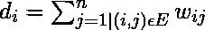
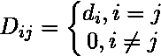
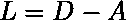
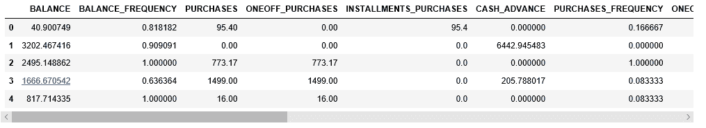
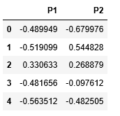
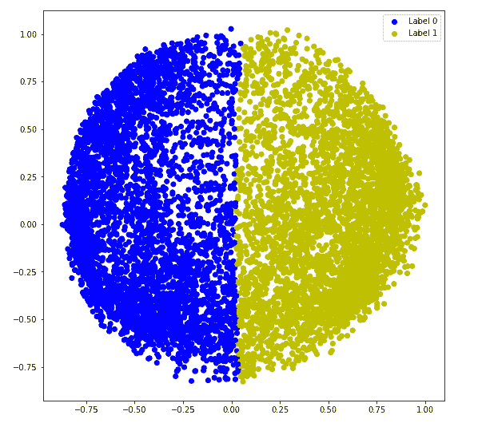
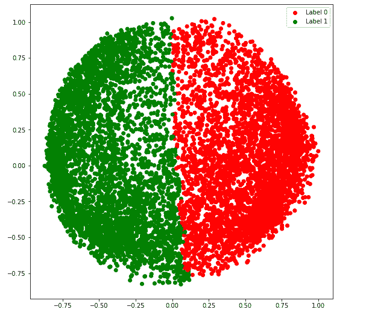
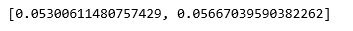
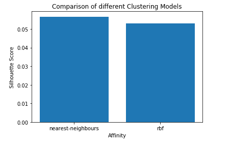

# ML |光谱聚类

> 原文:[https://www.geeksforgeeks.org/ml-spectral-clustering/](https://www.geeksforgeeks.org/ml-spectral-clustering/)

**先决条件:** [K-Means 聚类](https://www.geeksforgeeks.org/k-means-clustering-introduction/)

**谱聚类**是一种不断增长的聚类算法，在很多情况下都比很多传统的聚类算法表现得更好。它将每个数据点视为一个图节点，从而将聚类问题转化为图划分问题。典型的实现包括三个基本步骤:-

1.  **构建相似图:**该步骤以邻接矩阵的形式构建相似图，该邻接矩阵由 a 表示。邻接矩阵可以通过以下方式构建:-
    *   **ε-邻域图:**参数ε是预先固定的。然后，每个点都连接到它的ε半径内的所有点。如果任意两点之间的所有距离在比例上相似，则通常不存储边的权重，即两点之间的距离，因为它们不提供任何附加信息。因此，在这种情况下，构建的图是一个无向和未加权的图。
    *   **K-最近邻**参数 K 是预先固定的。然后，对于两个顶点 u 和 v，只有当 v 在 u 的 k 近邻中时，边才从 u 指向 v。注意，这导致形成加权有向图，因为对于具有 v 作为 k 近邻之一的每个 u，其 k 近邻中具有 u 的 v 不总是相同的情况。为了使该图没有方向，遵循以下方法之一
        1.  如果 v 是 u 的 k 近邻之一**或** u 是 v 的 k 近邻之一，则从 u 到 v 和从 v 到 u 引导一条边。
        2.  如果 v 是 u 的 k 近邻**和** u 是 v 的 k 近邻，则从 u 到 v 和从 v 到 u 引导一条边。
    *   **全连通图:**为了构建该图，每个点都与一条无向边相连，该边由两点到每隔一点的距离加权。由于这种方法用于模拟局部邻域关系，因此通常使用高斯相似性度量来计算距离。
2.  **Projecting the data onto a lower Dimensional Space:** This step is done to account for the possibility that members of the same cluster may be far away in the given dimensional space. Thus the dimensional space is reduced so that those points are closer in the reduced dimensional space and thus can be clustered together by a traditional clustering algorithm. It is done by computing the **Graph Laplacian Matrix** . To compute it though first, the degree of a node needs to be defined. The degree of the ith node is given by

    <center></center>

    注意是上面邻接矩阵中定义的节点 I 和 j 之间的边。

    度矩阵定义如下

    <center></center>

    因此，图拉普拉斯矩阵被定义为:-

    <center></center>

    然后对该矩阵进行标准化，以提高数学效率。为了降低维数，首先，计算特征值和各自的特征向量。如果簇的数量是 k，那么取第一个特征值和它们的特征向量，并堆叠成矩阵，使得特征向量是列。

3.  **Clustering the Data:** This process mainly involves clustering the reduced data by using any traditional clustering technique – typically K-Means Clustering. First, each node is assigned a row of the normalized of the Graph Laplacian Matrix. Then this data is clustered using any traditional technique. To transform the clustering result, the node identifier is retained.

    **属性:**

    1.  **假设-无:**这种聚类技术与其他传统技术不同，不假设数据遵循某种属性。因此，这使得这种技术能够回答更一般的一类聚类问题。
    2.  **易实现性和速度:**该算法比其他聚类算法更容易实现，并且速度也非常快，因为它主要由数学计算组成。
    3.  **不可伸缩:**由于它涉及矩阵的构建以及特征值和特征向量的计算，因此对于密集数据集来说非常耗时。

下面的步骤演示了如何使用 Sklearn 实现光谱聚类。以下步骤的数据为**信用卡数据**，可从[卡格尔](https://www.kaggle.com/arjunbhasin2013/ccdata)下载。

**步骤 1:导入所需的库**

```
import pandas as pd
import matplotlib.pyplot as plt
from sklearn.cluster import SpectralClustering
from sklearn.preprocessing import StandardScaler, normalize
from sklearn.decomposition import PCA
from sklearn.metrics import silhouette_score
```

**第二步:加载和清理数据**

```
# Changing the working location to the location of the data
cd "C:\Users\Dev\Desktop\Kaggle\Credit_Card"

# Loading the data
X = pd.read_csv('CC_GENERAL.csv')

# Dropping the CUST_ID column from the data
X = X.drop('CUST_ID', axis = 1)

# Handling the missing values if any
X.fillna(method ='ffill', inplace = True)

X.head()
```



**第三步:对数据进行预处理，使数据可视化**

```
# Preprocessing the data to make it visualizable

# Scaling the Data
scaler = StandardScaler()
X_scaled = scaler.fit_transform(X)

# Normalizing the Data
X_normalized = normalize(X_scaled)

# Converting the numpy array into a pandas DataFrame
X_normalized = pd.DataFrame(X_normalized)

# Reducing the dimensions of the data
pca = PCA(n_components = 2)
X_principal = pca.fit_transform(X_normalized)
X_principal = pd.DataFrame(X_principal)
X_principal.columns = ['P1', 'P2']

X_principal.head()
```



**步骤 4:建立聚类模型并可视化聚类**

在下面的步骤中，两个不同的光谱聚类模型具有不同的参数“相似性”值。您可以在这里阅读光谱聚类类[的文档。](https://scikit-learn.org/stable/modules/generated/sklearn.metrics.silhouette_score.html)

a) **亲和力= 'rbf'**

```
# Building the clustering model
spectral_model_rbf = SpectralClustering(n_clusters = 2, affinity ='rbf')

# Training the model and Storing the predicted cluster labels
labels_rbf = spectral_model_rbf.fit_predict(X_principal)
```

```
# Building the label to colour mapping
colours = {}
colours[0] = 'b'
colours[1] = 'y'

# Building the colour vector for each data point
cvec = [colours[label] for label in labels_rbf]

# Plotting the clustered scatter plot

b = plt.scatter(X_principal['P1'], X_principal['P2'], color ='b');
y = plt.scatter(X_principal['P1'], X_principal['P2'], color ='y');

plt.figure(figsize =(9, 9))
plt.scatter(X_principal['P1'], X_principal['P2'], c = cvec)
plt.legend((b, y), ('Label 0', 'Label 1'))
plt.show()
```



b) **亲和力= '最近邻'**

```
# Building the clustering model
spectral_model_nn = SpectralClustering(n_clusters = 2, affinity ='nearest_neighbors')

# Training the model and Storing the predicted cluster labels
labels_nn = spectral_model_nn.fit_predict(X_principal)
```



**第五步:评估绩效**

```
# List of different values of affinity
affinity = ['rbf', 'nearest-neighbours']

# List of Silhouette Scores
s_scores = []

# Evaluating the performance
s_scores.append(silhouette_score(X, labels_rbf))
s_scores.append(silhouette_score(X, labels_nn))

print(s_scores)
```



**第六步:性能对比**

```
# Plotting a Bar Graph to compare the models
plt.bar(affinity, s_scores)
plt.xlabel('Affinity')
plt.ylabel('Silhouette Score')
plt.title('Comparison of different Clustering Models')
plt.show()
```

