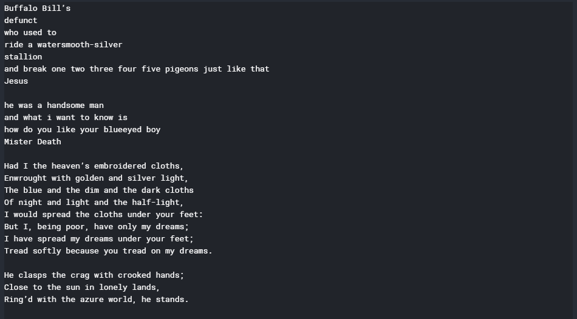
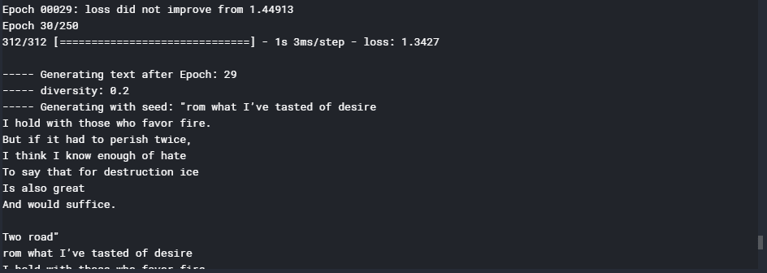
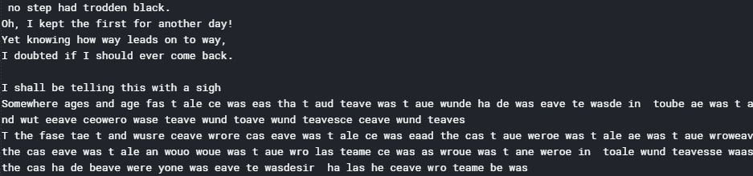

# ML |使用门控递归单位网络的文本生成

> 原文:[https://www . geesforgeks . org/ml-text-generation-use-gated-recursive-unit-networks/](https://www.geeksforgeeks.org/ml-text-generation-using-gated-recurrent-unit-networks/)

本文将演示如何通过构建**门控循环单元网络**来构建**文本生成器**。训练网络的概念过程是首先向网络馈送网络正在训练的文本中存在的每个字符到唯一数字的映射。然后每个字符被热编码成一个矢量，这是网络所需的格式。
所述程序的数据是著名诗人的短诗和名诗的集合，并且是. txt 格式。可以从[这里](https://www.kaggle.com/alindgupta99/poems-lyrics)下载。
**步骤 1:导入所需的库**

## 蟒蛇 3

```
from __future__ import absolute_import, division,
                       print_function, unicode_literals

import numpy as np
import tensorflow as tf

from keras.models import Sequential
from keras.layers import Dense, Activation
from keras.layers import LSTM

from keras.optimizers import RMSprop

from keras.callbacks import LambdaCallback
from keras.callbacks import ModelCheckpoint
from keras.callbacks import ReduceLROnPlateau
import random
import sys
```

**第二步:将数据加载到字符串中**

## 蟒蛇 3

```
# Changing the working location to the location of the text file
cd C:\Users\Dev\Desktop\Kaggle\Poems

# Reading the text file into a string
with open('poems.txt', 'r') as file:
    text = file.read()

# A preview of the text file   
print(text)
```



**步骤 3:创建从文本中每个唯一字符到唯一数字的映射**

## 蟒蛇 3

```
# Storing all the unique characters present in the text
vocabulary = sorted(list(set(text)))

# Creating dictionaries to map each character to an index
char_to_indices = dict((c, i) for i, c in enumerate(vocabulary))
indices_to_char = dict((i, c) for i, c in enumerate(vocabulary))

print(vocabulary)
```


**第四步:数据预处理**

## 蟒蛇 3

```
# Dividing the text into subsequences of length max_length
# So that at each time step the next max_length characters
# are fed into the network
max_length = 100
steps = 5
sentences = []
next_chars = []
for i in range(0, len(text) - max_length, steps):
    sentences.append(text[i: i + max_length])
    next_chars.append(text[i + max_length])

# Hot encoding each character into a boolean vector

# Initializing a matrix of boolean vectors with each column representing
# the hot encoded representation of the character
X = np.zeros((len(sentences), max_length, len(vocabulary)), dtype = np.bool)
y = np.zeros((len(sentences), len(vocabulary)), dtype = np.bool)

# Placing the value 1 at the appropriate position for each vector
# to complete the hot-encoding process
for i, sentence in enumerate(sentences):
    for t, char in enumerate(sentence):
        X[i, t, char_to_indices[char]] = 1
    y[i, char_to_indices[next_chars[i]]] = 1
```

**第五步:建设 GRU 网络**

## 蟒蛇 3

```
# Initializing the LSTM network
model = Sequential()

# Defining the cell type
model.add(GRU(128, input_shape =(max_length, len(vocabulary))))

# Defining the densely connected Neural Network layer
model.add(Dense(len(vocabulary)))

# Defining the activation function for the cell
model.add(Activation('softmax'))

# Defining the optimizing function
optimizer = RMSprop(lr = 0.01)

# Configuring the model for training
model.compile(loss ='categorical_crossentropy', optimizer = optimizer)
```

**第 6 步:定义一些将在网络**
训练期间使用的辅助函数注意，下面给出的前两个函数是参考了来自 Keras 团队的[官方文本生成示例的文档。
a) **辅助函数采样下一个字符:**](https://github.com/keras-team/keras/blob/master/examples/lstm_text_generation.py)

## 蟒蛇 3

```
# Helper function to sample an index from a probability array
def sample_index(preds, temperature = 1.0):
# temperature determines the freedom the function has when generating text

    # Converting the predictions vector into a numpy array
    preds = np.asarray(preds).astype('float64')

    # Normalizing the predictions array
    preds = np.log(preds) / temperature
    exp_preds = np.exp(preds)
    preds = exp_preds / np.sum(exp_preds)

    # The main sampling step. Creates an array of probabilities signifying
    # the probability of each character to be the next character in the
    # generated text
    probas = np.random.multinomial(1, preds, 1)

    # Returning the character with maximum probability to be the next character
    # in the generated text
    return np.argmax(probas)
```

b) **帮助器功能，在每个纪元后生成文本**

## 蟒蛇 3

```
# Helper function to generate text after the end of each epoch
def on_epoch_end(epoch, logs):
    print()
    print('----- Generating text after Epoch: % d' % epoch)

    # Choosing a random starting index for the text generation
    start_index = random.randint(0, len(text) - max_length - 1)

    # Sampling for different values of diversity
    for diversity in [0.2, 0.5, 1.0, 1.2]:
        print('----- diversity:', diversity)

        generated = ''

        # Seed sentence
        sentence = text[start_index: start_index + max_length]

        generated += sentence
        print('----- Generating with seed: "' + sentence + '"')
        sys.stdout.write(generated)

        for i in range(400):
            # Initializing the predictions vector
            x_pred = np.zeros((1, max_length, len(vocabulary)))

            for t, char in enumerate(sentence):
                x_pred[0, t, char_to_indices[char]] = 1.

            # Making the predictions for the next character
            preds = model.predict(x_pred, verbose = 0)[0]

            # Getting the index of the most probable next character
            next_index = sample_index(preds, diversity)

            # Getting the most probable next character using the mapping built
            next_char = indices_to_char[next_index]

            # Building the generated text
            generated += next_char
            sentence = sentence[1:] + next_char

            sys.stdout.write(next_char)
            sys.stdout.flush()
        print()

# Defining a custom callback function to
# describe the internal states of the network
print_callback = LambdaCallback(on_epoch_end = on_epoch_end)
```

c) **帮助器功能，在损耗减少的每个时期后保存模型**

## 蟒蛇 3

```
# Defining a helper function to save the model after each epoch
# in which the loss decreases
filepath = "weights.hdf5"
checkpoint = ModelCheckpoint(filepath, monitor ='loss',
                             verbose = 1, save_best_only = True,
                             mode ='min')
```

d) **每次学习停滞时降低学习率的辅助功能**

## 蟒蛇 3

```
# Defining a helper function to reduce the learning rate each time
# the learning plateaus
reduce_alpha = ReduceLROnPlateau(monitor ='loss', factor = 0.2,
                              patience = 1, min_lr = 0.001)
callbacks = [print_callback, checkpoint, reduce_alpha]
```

**第七步:训练 GRU 模型**

## 蟒蛇 3

```
# Training the GRU model
model.fit(X, y, batch_size = 128, epochs = 30, callbacks = callbacks)
```



**第八步:生成新的随机文本**

## 蟒蛇 3

```
def generate_text(length, diversity):
    # Get random starting text
    start_index = random.randint(0, len(text) - max_length - 1)

    # Defining the generated text
    generated = ''
    sentence = text[start_index: start_index + max_length]
    generated += sentence

    # Generating new text of given length
    for i in range(length):

            # Initializing the predicition vector
            x_pred = np.zeros((1, max_length, len(vocabulary)))
            for t, char in enumerate(sentence):
                x_pred[0, t, char_to_indices[char]] = 1.

            # Making the predictions
            preds = model.predict(x_pred, verbose = 0)[0]

            # Getting the index of the next most probable index
            next_index = sample_index(preds, diversity)

            # Getting the most probable next character using the mapping built
            next_char = indices_to_char[next_index]

            # Generating new text
            generated += next_char
            sentence = sentence[1:] + next_char
    return generated

print(generate_text(500, 0.2))
```



**注:**虽然现在输出没有太大意义，但是通过训练更多时代的模型，可以显著提高输出。