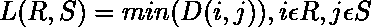
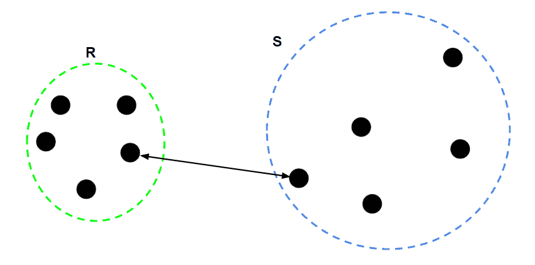
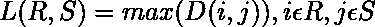
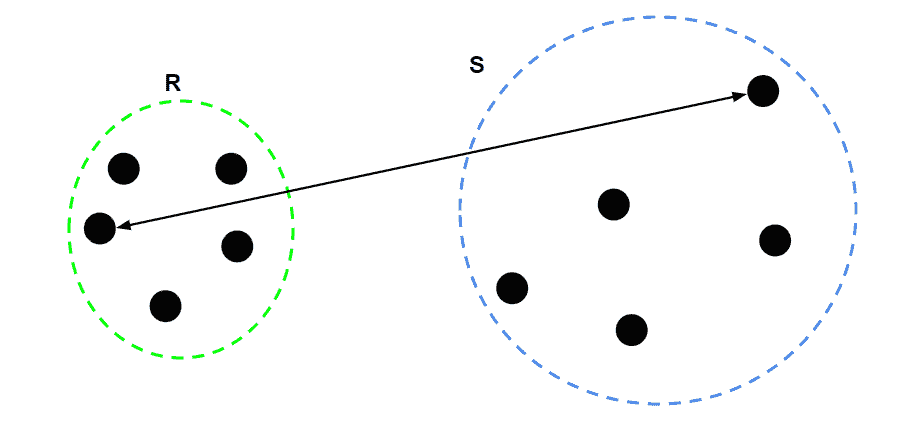
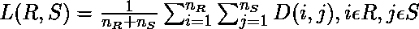
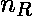
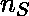
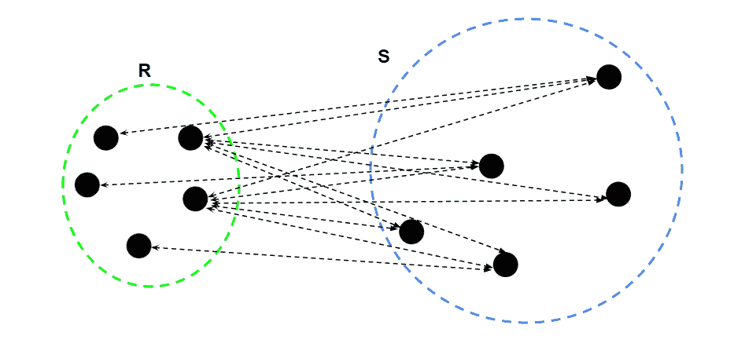

# ML |聚类中的链接类型

> 原文:[https://www . geesforgeks . org/ml-聚类中的链接类型/](https://www.geeksforgeeks.org/ml-types-of-linkages-in-clustering/)

**先决条件:** [层次聚类](https://www.geeksforgeeks.org/ml-hierarchical-clustering-agglomerative-and-divisive-clustering/)

分层聚类的过程包括以自下而上的方式将子聚类(第一次迭代中的数据点)聚类成较大的聚类，或者以自上而下的方式将较大的聚类分成较小的子聚类。在两种类型的分级聚类中，需要计算两个子聚类之间的距离。不同类型的联系描述了测量两个子数据点之间距离的不同方法。不同类型的联系如下

1.**单键:**对于两个聚类 R 和 S，单键返回两点 I 和 j 之间的最小距离，使得 I 属于 R，j 属于 S。

2.**完全联动:**对于两个聚类 R 和 S，完全联动返回两点 I 和 j 之间的最大距离，使得 I 属于 R，j 属于 S。

3.**平均关联:**对于两个聚类 R 和 S，首先计算 R 中任意数据点 I 和 S 中任意数据点 j 之间的距离，然后计算这些距离的算术平均值。平均链接返回算术平均值。

在哪里

–R 中的数据点数量

–以秒为单位的数据点数量

