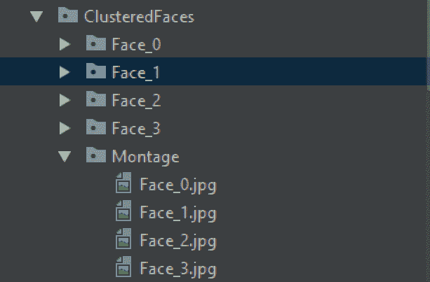

# ML |无监督人脸聚类流水线

> 原文:[https://www . geesforgeks . org/ml-无人监督-人脸-聚类-管道/](https://www.geeksforgeeks.org/ml-unsupervised-face-clustering-pipeline/)

实时人脸识别是自动化安全部门仍然面临的问题。随着卷积神经网络的进步，特别是美国有线电视新闻网区域的创新方式，已经证实了以我们目前的技术，我们可以选择监督学习选项，如 YOLO 的 FaceNet，在现实世界环境中进行快速实时的人脸识别。
为了训练一个有监督的模型，我们需要获取目标标签的数据集，这仍然是一个繁琐的任务。我们需要一个高效且自动化的解决方案来生成*数据集**并通过用户干预最小化标注工作*。

#### 建议的解决方案–

**简介:**我们正在提出一个数据集生成管道，该管道以一个*视频剪辑*为源，提取所有人脸，并将它们聚类成有限且精确的图像集，这些图像集代表一个不同的人。每一组都可以很容易地通过人工输入进行标记。
**技术细节:**我们将使用 opencv lib 从输入视频剪辑中每秒提取帧。1 秒似乎适合覆盖相关数据和有限的处理帧。
我们将使用人脸识别库(由 dlib 支持)从帧中提取人脸，并将其对齐进行特征提取。
然后，我们将提取人类可观察的特征，并使用 *scikit-learn* 提供的 *DBSCAN 聚类*进行聚类。
对于该解决方案，我们将裁剪出所有的人脸，创建标签，并将其分组到文件夹中，以便用户将其调整为训练用例的数据集。
**实施中的挑战:**针对更大的受众群体，我们计划将解决方案实施为在 CPU 中执行，而不是在 NVIDIA GPU 中执行。使用英伟达图形处理器可能会提高流水线的效率。
面部嵌入提取的 CPU 实现非常慢(每张图像 30+秒)。为了解决这个问题，我们用并行管道执行来实现它们(导致每个图像大约 13 秒)，然后合并它们的结果用于进一步的聚类任务。我们引入了 tqdm 和 PyPiper，用于进度更新和调整从输入视频中提取的帧的大小，以平滑执行管道。

```py
Input: Footage.mp4
Output: 
```



> **所需 Python3 模块:**
> os，cv2，numpy，tensorflow，json，re，shutil，time，pickle，pyPiper，tqdm，immortal，face_recognition，dlib，warnings，硬化

**片段部分:**
对于包含所有类定义的文件**的内容，下面是它们工作的片段和解释。
ResizeUtils 的类实现提供了函数 rescale_by_height 和 rescale_by_width。
“按宽度重新缩放”是一个以‘图像’和‘目标宽度’为输入的函数。它将图像尺寸放大/缩小为宽度，以满足 target_width。高度是自动计算的，因此纵横比保持不变。rescale_by_height 也是相同的，但它的目标不是宽度，而是高度。** 

## 蟒蛇 3

```py
'''
The ResizeUtils provides resizing function
           to keep the aspect ratio intact
Credits: AndyP at StackOverflow'''
class ResizeUtils:
    # Given a target height, adjust the image
    # by calculating the width and resize
    def rescale_by_height(self, image, target_height,
                        method = cv2.INTER_LANCZOS4):

        # Rescale `image` to `target_height`
        # (preserving aspect ratio)
        w = int(round(target_height * image.shape[1] / image.shape[0]))
        return (cv2.resize(image, (w, target_height),
                             interpolation = method))

    # Given a target width, adjust the image
    # by calculating the height and resize
    def rescale_by_width(self, image, target_width,
                        method = cv2.INTER_LANCZOS4):

        # Rescale `image` to `target_width`
        # (preserving aspect ratio)
        h = int(round(target_width * image.shape[0] / image.shape[1]))
        return (cv2.resize(image, (target_width, h),
                            interpolation = method))
```

下面是 FramesGenerator 类的定义。这个类提供了通过顺序读取视频来提取 jpg 图像的功能。如果我们举一个输入视频文件的例子，它可以有大约 30 fps 的帧率。我们可以得出结论，1 秒钟的视频，会有 30 张图片。即使是 2 分钟的视频，需要处理的图像数量也是 2 * 60 * 30 = 3600。需要处理的图像数量太多，可能需要几个小时才能完成流水线处理。
但还有一个事实，脸和人可能不会在一秒钟内改变。因此，考虑到一个 2 分钟的视频，在 1 秒钟内生成 30 幅图像的过程既麻烦又重复。相反，我们只能在 1 秒钟内拍摄 1 张照片。“帧生成器”的实现每秒只从一个视频剪辑转储 1 个图像。
考虑到转储图像进行人脸识别/dlib 处理进行人脸提取，我们尽量保持高度不大于 500，宽度上限为 700 的阈值。该限制由“自动调整大小”功能施加，该功能进一步调用重缩放高度或重缩放宽度，以便在达到限制但仍保持纵横比的情况下减小图像的大小。
接下来的片段，AutoResize 函数试图对给定图像的尺寸进行限制。如果宽度大于 700，我们缩小它以保持宽度 700 并保持纵横比。这里设置的另一个限制是，高度不得大于 500。

## 蟒蛇 3

```py
# The FramesGenerator extracts image
# frames  from the given video file
# The image frames are resized for
# face_recognition / dlib processing
class FramesGenerator:
    def __init__(self, VideoFootageSource):
        self.VideoFootageSource = VideoFootageSource

    # Resize the given input to fit in a specified
    # size for face embeddings extraction
    def AutoResize(self, frame):
        resizeUtils = ResizeUtils()

        height, width, _ = frame.shape

        if height > 500:
            frame = resizeUtils.rescale_by_height(frame, 500)
            self.AutoResize(frame)

        if width > 700:
            frame = resizeUtils.rescale_by_width(frame, 700)
            self.AutoResize(frame)

        return frame
```

下面是 GenerateFrames 函数的代码片段。它查询 fps 以决定在多少帧中，可以转储 1 个图像。我们清除输出目录，并开始迭代整个帧。在转储任何图像之前，如果图像达到自动调整大小功能中指定的限制，我们会调整图像的大小。

## 蟒蛇 3

```py
# Extract 1 frame from each second from video footage
# and save the frames to a specific folder
def GenerateFrames(self, OutputDirectoryName):
    cap = cv2.VideoCapture(self.VideoFootageSource)
    _, frame = cap.read()

    fps = cap.get(cv2.CAP_PROP_FPS)
    TotalFrames = cap.get(cv2.CAP_PROP_FRAME_COUNT)

    print("[INFO] Total Frames ", TotalFrames, " @ ", fps, " fps")
    print("[INFO] Calculating number of frames per second")

    CurrentDirectory = os.path.curdir
    OutputDirectoryPath = os.path.join(
      CurrentDirectory, OutputDirectoryName)

    if os.path.exists(OutputDirectoryPath):
        shutil.rmtree(OutputDirectoryPath)
        time.sleep(0.5)
    os.mkdir(OutputDirectoryPath)

    CurrentFrame = 1
    fpsCounter = 0
    FrameWrittenCount = 1
    while CurrentFrame < TotalFrames:
        _, frame = cap.read()
        if (frame is None):
            continue

        if fpsCounter > fps:
            fpsCounter = 0

            frame = self.AutoResize(frame)

            filename = "frame_" + str(FrameWrittenCount) + ".jpg"
            cv2.imwrite(os.path.join(
              OutputDirectoryPath, filename), frame)

            FrameWrittenCount += 1

        fpsCounter += 1
        CurrentFrame += 1

    print('[INFO] Frames extracted')
```

下面是 FramesProvider 类的代码片段。它继承了“节点”，可用于构建图像处理管道。我们实现“设置”和“运行”功能。“setup”函数中定义的任何参数都可以有参数，构造函数在创建对象时会将这些参数作为参数。在这里，我们可以将 sourcePath 参数传递给 FramesProvider 对象。“设置”功能只运行一次。“run”函数通过调用处理管道的 emit 函数来运行并持续发出数据，直到调用 close 函数。
这里，在“设置”中，我们接受 sourcePath 作为参数，并遍历给定框架目录中的所有文件。无论文件的扩展名是什么。jpg(将由类 FrameGenerator 生成)，我们将其添加到“filesList”列表中。
在运行函数的调用过程中，来自“文件列表”的所有 jpg 图像路径都被打包成指定唯一“id”和“图像路径”作为对象的属性，并被发送到管道进行处理。

## 蟒蛇 3

```py
# Following are nodes for pipeline constructions.
# It will create and asynchronously execute threads
# for reading images, extracting facial features and
# storing them independently in different threads

# Keep emitting the filenames into
# the pipeline for processing
class FramesProvider(Node):
    def setup(self, sourcePath):
        self.sourcePath = sourcePath
        self.filesList = []
        for item in os.listdir(self.sourcePath):
            _, fileExt = os.path.splitext(item)
            if fileExt == '.jpg':
                self.filesList.append(os.path.join(item))
        self.TotalFilesCount = self.size = len(self.filesList)
        self.ProcessedFilesCount = self.pos = 0

    # Emit each filename in the pipeline for parallel processing
    def run(self, data):
        if self.ProcessedFilesCount < self.TotalFilesCount:
            self.emit({'id': self.ProcessedFilesCount,
                'imagePath': os.path.join(self.sourcePath,
                              self.filesList[self.ProcessedFilesCount])})
            self.ProcessedFilesCount += 1

            self.pos = self.ProcessedFilesCount
        else:
            self.close()
```

下面是继承“Node”的“ *FaceEncoder* 的类实现，可以在图像处理流水线中推送。在“设置”功能中，我们接受“人脸识别/dlib”人脸识别器调用的“检测方法”值。它可以有基于“有线电视新闻网”的探测器或基于“猪”的探测器。
“运行”功能将传入数据解包为“id”和“imagePath”。
随后，它从“imagePath”中读取图像，运行“face_recognition/dlib”库中定义的“face_location”来裁剪出对齐的人脸图像，这是我们感兴趣的区域。对齐的人脸图像是一个矩形裁剪图像，眼睛和嘴唇与图像中的特定位置对齐(注意:实现可能与其他库不同，例如 opencv)。
此外，我们调用“人脸识别/dlib”中定义的“人脸编码”函数，从每个框中提取人脸嵌入。这种嵌入浮动值可以帮助您在对齐的人脸图像中找到特征的准确位置。
我们将变量“d”定义为一组盒子和各自的嵌入。现在，我们将“id”和嵌入数组打包为对象中的“编码”键，并将其发送到图像处理管道。

## 蟒蛇 3

```py
# Encode the face embedding, reference path
# and location and emit to pipeline
class FaceEncoder(Node):
    def setup(self, detection_method = 'cnn'):
        self.detection_method = detection_method
        # detection_method can be cnn or hog

    def run(self, data):
        id = data['id']
        imagePath = data['imagePath']
        image = cv2.imread(imagePath)
        rgb = cv2.cvtColor(image, cv2.COLOR_BGR2RGB)

        boxes = face_recognition.face_locations(
               rgb, model = self.detection_method)

        encodings = face_recognition.face_encodings(rgb, boxes)
        d = [{"imagePath": imagePath, "loc": box, "encoding": enc}
                         for (box, enc) in zip(boxes, encodings)]

        self.emit({'id': id, 'encodings': d})
```

下面是 DatastoreManager 的一个实现，它也继承了“Node”，可以插入到图像处理管道中。该类的目的是将“编码”数组转储为 pickle 文件，并使用“id”参数唯一命名 pickle 文件。我们希望管道运行多线程。
为了利用多线程来提高性能，我们需要适当地分离异步任务，并尽量避免任何同步需求。因此，为了获得最佳性能，我们独立地让管道中的线程将数据写入单独的文件，而不干扰任何其他线程操作。
万一你在想节省了多少时间，在用过的开发硬件中，没有多线程，平均嵌入提取时间为~30 秒。多线程流水线之后(有 4 个线程)，它减少到大约 10 秒，但代价是高 CPU 使用率。
由于线程需要大约 10 秒，因此不会发生频繁的磁盘写入，也不会影响我们的多线程性能。
另一种情况，如果你在想为什么用泡菜代替 JSON 替代？事实是 JSON 是泡菜更好的替代品。Pickle 对数据存储和通信非常不安全。Pickles 可以被恶意修改，用于在 Python 中嵌入可执行代码。JSON 文件是人类可读的，编码和解码速度更快。pickle 唯一擅长的是将 python 对象和内容无错误地转储到二进制文件中。
由于我们不打算存储和分发 pickle 文件，为了无错误执行，我们使用 pickle。否则，强烈建议使用 JSON 和其他替代品。

## 蟒蛇 3

```py
# Receive the face embeddings for clustering and
# id for naming the distinct filename
class DatastoreManager(Node):
    def setup(self, encodingsOutputPath):
        self.encodingsOutputPath = encodingsOutputPath
    def run(self, data):
        encodings = data['encodings']
        id = data['id']
        with open(os.path.join(self.encodingsOutputPath,
                   'encodings_' + str(id) + '.pickle'), 'wb') as f:
            f.write(pickle.dumps(encodings))
```

下面是 PickleListCollator 类的实现。它旨在读取多个 pickle 文件中的对象数组，合并成一个数组，并将组合数组转储到单个 pickle 文件中。
这里只有一个函数 GeneratePickle 接受 outputFilepath，该函数指定将包含合并数组的单个输出 Pickle 文件。

## 蟒蛇 3

```py
# PicklesListCollator takes multiple pickle
# files as input and merges them together
# It is made specifically to support use-case
# of merging distinct pickle files into one
class PicklesListCollator:
    def __init__(self, picklesInputDirectory):
        self.picklesInputDirectory = picklesInputDirectory

    # Here we will list down all the pickles
    # files generated from multiple threads,
    # read the list of results append them to a
    # common list and create another pickle
    # with combined list as content
    def GeneratePickle(self, outputFilepath):
        datastore = []

        ListOfPickleFiles = []
        for item in os.listdir(self.picklesInputDirectory):
            _, fileExt = os.path.splitext(item)
            if fileExt == '.pickle':
                ListOfPickleFiles.append(os.path.join(
                    self.picklesInputDirectory, item))

        for picklePath in ListOfPickleFiles:
            with open(picklePath, "rb") as f:
                data = pickle.loads(f.read())
                datastore.extend(data)

        with open(outputFilepath, 'wb') as f:
            f.write(pickle.dumps(datastore))
```

以下是 FaceClusterUtility 类的实现。定义了一个构造函数，它将带有值的“EncodingFilePath”作为合并的 pickle 文件的路径。我们从 pickle 文件中读取数组，并尝试使用“scikit”库中的“DBSCAN”实现对它们进行集群。与 k 均值不同，DBSCAN 扫描不需要簇的数量。群集的数量取决于阈值参数，并将自动计算。
DBSCAN 实现在“scikit”中提供，也接受用于计算的线程数。
在这里，我们有一个函数“Cluster”，它将被调用来从 pickle 文件中读取数组数据，运行“DBSCAN”，将唯一的集群打印为唯一的面并返回标签。标签是代表类别的唯一值，可用于识别阵列中人脸的类别。(数组内容来自 pickle 文件)。

## 蟒蛇 3

```py
# Face clustering functionality
class FaceClusterUtility:

    def __init__(self, EncodingFilePath):
        self.EncodingFilePath = EncodingFilePath

    # Credits: Arian's pyimagesearch for the clustering code
    # Here we are using the sklearn.DBSCAN functionality
    # cluster all the facial embeddings to get clusters
    # representing distinct people
    def Cluster(self):
        InputEncodingFile = self.EncodingFilePath
        if not (os.path.isfile(InputEncodingFile) and
                os.access(InputEncodingFile, os.R_OK)):
            print('The input encoding file, ' +
                    str(InputEncodingFile) +
                    ' does not exists or unreadable')
            exit()

        NumberOfParallelJobs = -1

        # load the serialized face encodings
        # + bounding box locations from disk,
        # then extract the set of encodings to
        # so we can cluster on them
        print("[INFO] Loading encodings")
        data = pickle.loads(open(InputEncodingFile, "rb").read())
        data = np.array(data)

        encodings = [d["encoding"] for d in data]

        # cluster the embeddings
        print("[INFO] Clustering")
        clt = DBSCAN(eps = 0.5, metric ="euclidean",
                      n_jobs = NumberOfParallelJobs)

        clt.fit(encodings)

        # determine the total number of
        # unique faces found in the dataset
        labelIDs = np.unique(clt.labels_)
        numUniqueFaces = len(np.where(labelIDs > -1)[0])
        print("[INFO] # unique faces: {}".format(numUniqueFaces))

        return clt.labels_
```

下面是继承自“tqdm”的 TqdmUpdate 类的实现。tqdm 是一个 Python 库，可以在控制台界面中可视化进度条。
变量“n”和“total”由“tqdm”识别。这两个变量的值用于计算所取得的进展。
当绑定到管道框架“PyPiper”中的更新事件时，“update”函数中的参数“done”和“total_size”被提供值。超级()。refresh()调用“tqdm”类中“refresh”函数的实现，该函数可视化并更新控制台中的进度条。

## 蟒蛇 3

```py
# Inherit class tqdm for visualization of progress
class TqdmUpdate(tqdm):

    # This function will be passed as progress
    # callback function. Setting the predefined
    # variables for auto-updates in visualization
    def update(self, done, total_size = None):
        if total_size is not None:
            self.total = total_size

        self.n = done
        super().refresh()
```

下面是 FaceImageGenerator 类的实现。该类提供了从聚类后产生的标签生成蒙太奇、裁剪的人像图像和用于未来训练目的的注释(例如，Darknet YOLO)的功能。
构造函数期望 EncodingFilePath 作为合并的 pickle 文件路径。它将用于加载所有的面部编码。我们现在对生成图像的“图像路径”和面部坐标感兴趣。
对“生成图像”的调用完成了预期的工作。我们从合并的 pickle 文件中加载数组。我们对标签应用独特的操作，并在整个标签中循环。在标签的迭代中，对于每个唯一的标签，我们列出了具有相同当前标签的所有数组索引。
再次迭代这些数组索引来处理每个人脸。
对于处理人脸，我们使用索引来获取图像文件的路径和人脸的坐标。
从图像文件的路径加载图像文件。面部的坐标被扩展为肖像形状(我们还确保它的扩展不会超过图像的尺寸)，并且它被裁剪并转储到文件中作为肖像图像。
我们从原始坐标重新开始，稍微扩展一下，为未来的监督训练选项创建注释，以提高识别能力。
对于注释，我们只是为“Darknet YOLO”设计的，但也可以适应其他任何框架。最后，我们构建一个蒙太奇，并将其写入图像文件。

## 蟒蛇 3

```py
class FaceImageGenerator:
    def __init__(self, EncodingFilePath):
        self.EncodingFilePath = EncodingFilePath

    # Here we are creating montages for
    # first 25 faces for each distinct face.
    # We will also generate images for all
    # the distinct faces by using the labels
    # from clusters and image url from the
    # encodings pickle file.

    # The face bounding box is increased a
    # little more for training purposes and
    # we also created the exact annotation for
    # each face image (similar to darknet YOLO)
    # to easily adapt the annotation for future
    # use in supervised training
    def GenerateImages(self, labels, OutputFolderName = "ClusteredFaces",
                                            MontageOutputFolder = "Montage"):
        output_directory = os.getcwd()

        OutputFolder = os.path.join(output_directory, OutputFolderName)
        if not os.path.exists(OutputFolder):
            os.makedirs(OutputFolder)
        else:
            shutil.rmtree(OutputFolder)
            time.sleep(0.5)
            os.makedirs(OutputFolder)

        MontageFolderPath = os.path.join(OutputFolder, MontageOutputFolder)
        os.makedirs(MontageFolderPath)

        data = pickle.loads(open(self.EncodingFilePath, "rb").read())
        data = np.array(data)

        labelIDs = np.unique(labels)

        # loop over the unique face integers
        for labelID in labelIDs:
            # find all indexes into the `data` array
            # that belong to the current label ID, then
            # randomly sample a maximum of 25 indexes
            # from the set

            print("[INFO] faces for face ID: {}".format(labelID))

            FaceFolder = os.path.join(OutputFolder, "Face_" + str(labelID))
            os.makedirs(FaceFolder)

            idxs = np.where(labels == labelID)[0]

            # initialize the list of faces to
            # include in the montage
            portraits = []

            # loop over the sampled indexes
            counter = 1
            for i in idxs:

                # load the input image and extract the face ROI
                image = cv2.imread(data[i]["imagePath"])
                (o_top, o_right, o_bottom, o_left) = data[i]["loc"]

                height, width, channel = image.shape

                widthMargin = 100
                heightMargin = 150

                top = o_top - heightMargin
                if top < 0: top = 0

                bottom = o_bottom + heightMargin
                if bottom > height: bottom = height

                left = o_left - widthMargin
                if left < 0: left = 0

                right = o_right + widthMargin
                if right > width: right = width

                portrait = image[top:bottom, left:right]

                if len(portraits) < 25:
                    portraits.append(portrait)

                resizeUtils = ResizeUtils()
                portrait = resizeUtils.rescale_by_width(portrait, 400)

                FaceFilename = "face_" + str(counter) + ".jpg"

                FaceImagePath = os.path.join(FaceFolder, FaceFilename)
                cv2.imwrite(FaceImagePath, portrait)

                widthMargin = 20
                heightMargin = 20

                top = o_top - heightMargin
                if top < 0: top = 0

                bottom = o_bottom + heightMargin
                if bottom > height: bottom = height

                left = o_left - widthMargin
                if left < 0: left = 0

                right = o_right + widthMargin
                if right > width:
                    right = width

                AnnotationFilename = "face_" + str(counter) + ".txt"
                AnnotationFilePath = os.path.join(FaceFolder, AnnotationFilename)

                f = open(AnnotationFilePath, 'w')
                f.write(str(labelID) + ' ' +
                        str(left) + ' ' + str(top) + ' ' +
                        str(right) + ' ' + str(bottom) + "\n")
                f.close()

                counter += 1

            montage = build_montages(portraits, (96, 120), (5, 5))[0]

            MontageFilenamePath = os.path.join(
               MontageFolderPath, "Face_" + str(labelID) + ".jpg")

            cv2.imwrite(MontageFilenamePath, montage)
```

将文件保存为 **FaceClusteringLibrary.py** ，其中将包含所有的类定义。
下面是文件 **Driver.py** ，它调用这些功能来创建一个管道。

## 蟒蛇 3

```py
# importing all classes from above Python file
from FaceClusteringLibrary import *

if __name__ == "__main__":

    # Generate the frames from given video footage
    framesGenerator = FramesGenerator("Footage.mp4")
    framesGenerator.GenerateFrames("Frames")

    # Design and run the face clustering pipeline
    CurrentPath = os.getcwd()
    FramesDirectory = "Frames"
    FramesDirectoryPath = os.path.join(CurrentPath, FramesDirectory)
    EncodingsFolder = "Encodings"
    EncodingsFolderPath = os.path.join(CurrentPath, EncodingsFolder)

    if os.path.exists(EncodingsFolderPath):
        shutil.rmtree(EncodingsFolderPath, ignore_errors = True)
        time.sleep(0.5)
    os.makedirs(EncodingsFolderPath)

    pipeline = Pipeline(
                    FramesProvider("Files source", sourcePath = FramesDirectoryPath) |
                    FaceEncoder("Encode faces") |
                    DatastoreManager("Store encoding",
                    encodingsOutputPath = EncodingsFolderPath),
                    n_threads = 3, quiet = True)

    pbar = TqdmUpdate()
    pipeline.run(update_callback = pbar.update)

    print()
    print('[INFO] Encodings extracted')

    # Merge all the encodings pickle files into one
    CurrentPath = os.getcwd()
    EncodingsInputDirectory = "Encodings"
    EncodingsInputDirectoryPath = os.path.join(
          CurrentPath, EncodingsInputDirectory)

    OutputEncodingPickleFilename = "encodings.pickle"

    if os.path.exists(OutputEncodingPickleFilename):
        os.remove(OutputEncodingPickleFilename)

    picklesListCollator = PicklesListCollator(
                    EncodingsInputDirectoryPath)
    picklesListCollator.GeneratePickle(
           OutputEncodingPickleFilename)

    # To manage any delay in file writing
    time.sleep(0.5)

    # Start clustering process and generate
    # output images with annotations
    EncodingPickleFilePath = "encodings.pickle"

    faceClusterUtility = FaceClusterUtility(EncodingPickleFilePath)
    faceImageGenerator = FaceImageGenerator(EncodingPickleFilePath)

    labelIDs = faceClusterUtility.Cluster()
    faceImageGenerator.GenerateImages(
      labelIDs, "ClusteredFaces", "Montage")
```

**蒙太奇输出:**

   

**故障排除–**
**问题 1:** 提取面部嵌入时，整个 pc 冻结。
**解决方案:**解决方案是从输入视频剪辑中提取帧时，减少帧大小调整功能中的值。请记住，减少太多的值将导致不正确的人脸聚类。代替调整帧大小，我们可以引入一些正面人脸检测和裁剪正面人脸只是为了提高准确性。
**问题 2:**PC 在运行管道时变得缓慢。
**解决方案:**将最大程度使用 CPU。为了限制使用，可以减少在管道构造函数中指定的线程数。
**问题 3:** 输出聚类太不准确。
**解决方案:**出现这种情况的唯一原因可能是从输入视频剪辑中提取的帧将具有非常小分辨率的非常多的人脸，或者帧数非常少(大约 7-8 帧)。请获取一个视频剪辑，其中有明亮清晰的人脸图像，或者对于后一种情况，获取一个 2 分钟的视频或带有视频帧提取源代码的 mod。
参考 Github 链接获取完整代码和使用的附加文件:[https://Github . com/cppxa/face recognition pipeline _ geeks forgeeks](https://github.com/cppxaxa/FaceRecognitionPipeline_GeeksForGeeks)

**参考文献:**
1。阿德里安关于人脸聚类的博文
2。PyPiper 指南
3。OpenCV 手册
4。StackOverflow