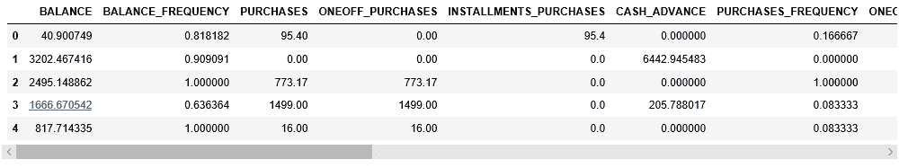
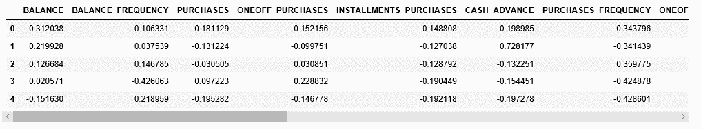
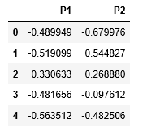
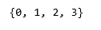
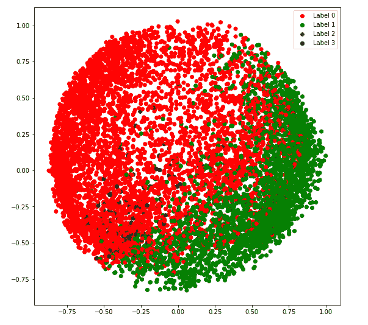
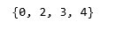
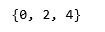
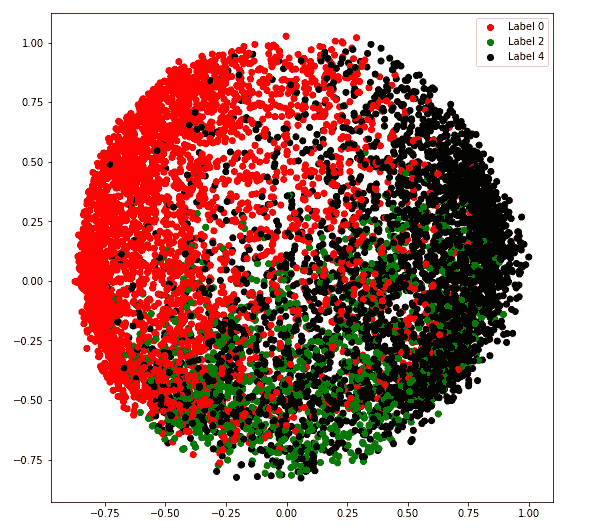
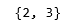
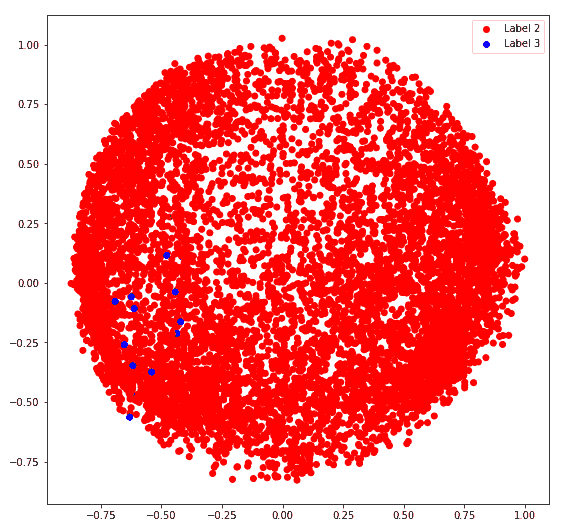

# ML |高斯混合模型的变分贝叶斯推理

> 原文:[https://www . geesforgeks . org/ml-变分-贝叶斯-高斯混合推理/](https://www.geeksforgeeks.org/ml-variational-bayesian-inference-for-gaussian-mixture/)

**先决条件:** [高斯混合](https://www.geeksforgeeks.org/gaussian-mixture-model/)

高斯混合模型假设数据被分成多个聚类，使得给定聚类中的每个数据点遵循特定的多变量高斯分布，并且每个聚类的多变量高斯分布彼此独立。为了在这种模型中对数据进行聚类，需要计算给定观测数据下数据点属于给定聚类的后验概率。为此目的的一种近似方法是贝叶法。但是对于大型数据集，边际概率的计算非常繁琐。由于只需要找到给定点的最可能的聚类，可以使用近似方法，因为它们减少了机械功。最好的近似方法之一是使用变分贝叶斯推断方法。该方法使用了 [KL 散度](https://en.wikipedia.org/wiki/Kullback%E2%80%93Leibler_divergence)和[平均场近似](https://en.wikipedia.org/wiki/Mean_field_theory)的概念。

以下步骤将演示如何使用 Sklearn 在高斯混合模型中实现变分贝叶斯推理。所用数据为**信用卡数据**，可从[卡格尔](https://www.kaggle.com/arjunbhasin2013/ccdata)下载。

**步骤 1:导入所需的库**

```
import numpy as np
import pandas as pd
import matplotlib.pyplot as plt
from sklearn.mixture import BayesianGaussianMixture
from sklearn.preprocessing import normalize, StandardScaler
from sklearn.decomposition import PCA
```

**第二步:加载和清理数据**

```
# Changing the working location to the location of the data
cd "C:\Users\Dev\Desktop\Kaggle\Credit_Card"

# Loading the Data
X = pd.read_csv('CC_GENERAL.csv')

# Dropping the CUST_ID column from the data
X = X.drop('CUST_ID', axis = 1)

# Handling the missing values
X.fillna(method ='ffill', inplace = True)

X.head()
```



**第三步:数据预处理**

```
# Scaling the data to bring all the attributes to a comparable level
scaler = StandardScaler()
X_scaled = scaler.fit_transform(X)

# Normalizing the data so that the data
# approximately follows a Gaussian distribution
X_normalized = normalize(X_scaled)

# Converting the numpy array into a pandas DataFrame
X_normalized = pd.DataFrame(X_normalized)

# Renaming the columns
X_normalized.columns = X.columns

X_normalized.head()
```



**第四步:降低数据的维度，使其可视化**

```
# Reducing the dimensions of the data
pca = PCA(n_components = 2)
X_principal = pca.fit_transform(X_normalized)

# Converting the reduced data into a pandas dataframe
X_principal = pd.DataFrame(X_principal)

# Renaming the columns
X_principal.columns = ['P1', 'P2']

X_principal.head()
```

<center></center>

贝叶斯高斯混合类的两个主要参数是 **n 分量**和**协方差类型**。

1.  **n_components:** 它决定给定数据中的最大簇数。
2.  **协方差 _type:** 描述要使用的协方差参数的类型。

你可以在它的[文档](https://scikit-learn.org/stable/modules/generated/sklearn.mixture.BayesianGaussianMixture.html#sklearn.mixture.BayesianGaussianMixture)中阅读所有其他属性。

在下面给出的步骤中，参数 n_components 将固定为 5，而参数协方差 _type 将针对所有可能的值而变化，以可视化该参数对聚类的影响。

**第五步:为不同的协方差类型值建立聚类模型并可视化结果**

a) **协方差 _type = 'full'**

```
# Building and training the model
vbgm_model_full = BayesianGaussianMixture(n_components = 5, covariance_type ='full')
vbgm_model_full.fit(X_normalized)

# Storing the labels
labels_full = vbgm_model_full.predict(X)
print(set(labels_full))
```

<center></center>

```
colours = {}
colours[0] = 'r'
colours[1] = 'g'
colours[2] = 'b'
colours[3] = 'k'

# Building the colour vector for each data point
cvec = [colours[label] for label in labels_full]

# Defining the scatter plot for each colour
r = plt.scatter(X_principal['P1'], X_principal['P2'], color ='r');
g = plt.scatter(X_principal['P1'], X_principal['P2'], color ='g');
b = plt.scatter(X_principal['P1'], X_principal['P2'], color ='b');
k = plt.scatter(X_principal['P1'], X_principal['P2'], color ='k');

# Plotting the clustered data
plt.figure(figsize =(9, 9))
plt.scatter(X_principal['P1'], X_principal['P2'], c = cvec)
plt.legend((r, g, b, k), ('Label 0', 'Label 1', 'Label 2', 'Label 3'))
plt.show()
```

<center></center>

b) **协方差 _type = '并列'**

```
# Building and training the model
vbgm_model_tied = BayesianGaussianMixture(n_components = 5, covariance_type ='tied')
vbgm_model_tied.fit(X_normalized)

# Storing the labels
labels_tied = vbgm_model_tied.predict(X)
print(set(labels_tied))
```

<center></center>

```
colours = {}
colours[0] = 'r'
colours[2] = 'g'
colours[3] = 'b'
colours[4] = 'k'

# Building the colour vector for each data point
cvec = [colours[label] for label in labels_tied]

# Defining the scatter plot for each colour
r = plt.scatter(X_principal['P1'], X_principal['P2'], color ='r');
g = plt.scatter(X_principal['P1'], X_principal['P2'], color ='g');
b = plt.scatter(X_principal['P1'], X_principal['P2'], color ='b');
k = plt.scatter(X_principal['P1'], X_principal['P2'], color ='k');

# Plotting the clustered data
plt.figure(figsize =(9, 9))
plt.scatter(X_principal['P1'], X_principal['P2'], c = cvec)
plt.legend((r, g, b, k), ('Label 0', 'Label 2', 'Label 3', 'Label 4'))
plt.show()
```

<center></center>

c) **协方差 _type = 'diag'**

```
# Building and training the model
vbgm_model_diag = BayesianGaussianMixture(n_components = 5, covariance_type ='diag')
vbgm_model_diag.fit(X_normalized)

# Storing the labels
labels_diag = vbgm_model_diag.predict(X)
print(set(labels_diag))
```

<center></center>

```
colours = {}
colours[0] = 'r'
colours[2] = 'g'
colours[4] = 'k'

# Building the colour vector for each data point
cvec = [colours[label] for label in labels_diag]

# Defining the scatter plot for each colour
r = plt.scatter(X_principal['P1'], X_principal['P2'], color ='r');
g = plt.scatter(X_principal['P1'], X_principal['P2'], color ='g');
k = plt.scatter(X_principal['P1'], X_principal['P2'], color ='k');

# Plotting the clustered data
plt.figure(figsize =(9, 9))
plt.scatter(X_principal['P1'], X_principal['P2'], c = cvec)
plt.legend((r, g, k), ('Label 0', 'Label 2', 'Label 4'))
plt.show()
```

<center></center>

d) **协方差 _type = '球形'**

```
# Building and training the model
vbgm_model_spherical = BayesianGaussianMixture(n_components = 5,
                                              covariance_type ='spherical')
vbgm_model_spherical.fit(X_normalized)

# Storing the labels
labels_spherical = vbgm_model_spherical.predict(X)
print(set(labels_spherical))
```

<center></center>

```
colours = {}
colours[2] = 'r'
colours[3] = 'b'

# Building the colour vector for each data point
cvec = [colours[label] for label in labels_spherical]

# Defining the scatter plot for each colour
r = plt.scatter(X_principal['P1'], X_principal['P2'], color ='r');
b = plt.scatter(X_principal['P1'], X_principal['P2'], color ='b');

# Plotting the clustered data
plt.figure(figsize =(9, 9))
plt.scatter(X_principal['P1'], X_principal['P2'], c = cvec)
plt.legend((r, b), ('Label 2', 'Label 3'))
plt.show()
```

<center></center>