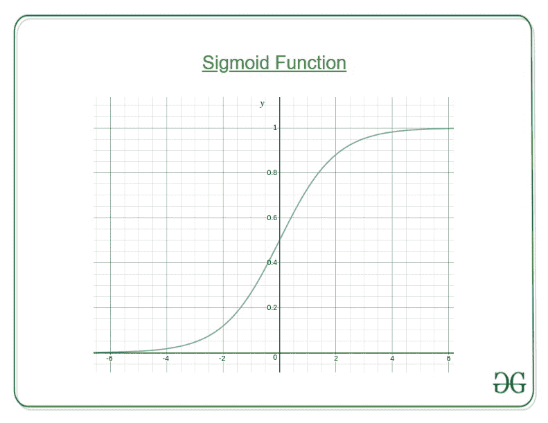
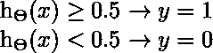
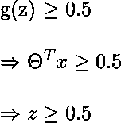
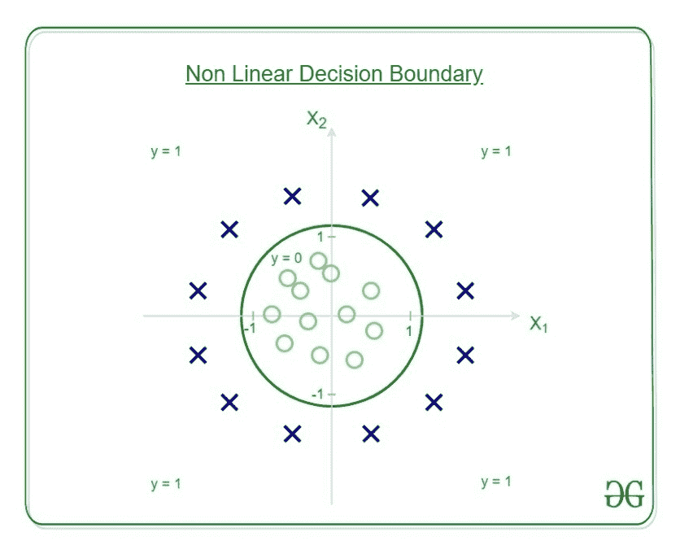
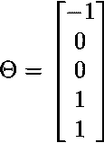
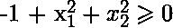
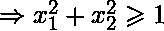

# ML |为什么分类要用 Logistic 回归？

> 原文:[https://www . geesforgeks . org/ml-why-logistic-revolution-in-class/](https://www.geeksforgeeks.org/ml-why-logistic-regression-in-classification/)

使用线性回归，所有> = 0.5 的预测可视为 1，其余所有< 0.5 的可视为 0。但是随之而来的问题是为什么分类不能用它来执行？

**问题–**

假设我们将一封邮件分类为垃圾邮件或非垃圾邮件，我们的输出是 **y** ，它可以是 0(垃圾邮件)或 1(非垃圾邮件)。线性回归时，h θ (x)可以是> 1 或< 0。虽然我们的预测应该在 0 和 1 之间，但模型会预测超出范围的值，即可能是> 1 或< 0。

所以，这就是为什么对于分类任务，逻辑斯蒂/西格玛回归扮演了它的角色。

这里，我们将 **θ T x** 代入逻辑函数，其中θ为权重/参数， **x** 为输入， **h θ (x)** 为假设函数。 **g()** 为乙状结肠功能。

意味着当 x 参数化为 **θ** 时，y = 1 的概率

为了获得用于分类的离散值 0 或 1，定义了离散边界。假设函数可以翻译为

决策边界是区分 y=0 和 y=1 的区域的线。这些决策边界是由所考虑的假设函数产生的。

**用例子理解决策边界–**
让我们的假设函数为

![  h_{\Theta}(x)= g[\Theta_{0}+ \Theta_1x_1+\Theta_2x_2+ \Theta_3x_1^2 + \Theta_4x_2^2 ]  ](img/347b0c395e63fc7cbf29d36429f6e84e.png "Rendered by QuickLaTeX.com")

然后决策边界看起来像

让权重或参数为–

所以，它预测 y = 1，如果

这就是半径= 1，原点为中心的圆的方程。这是我们定义的假设的决策边界。