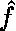
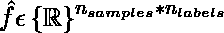
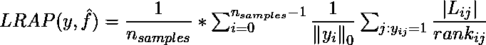
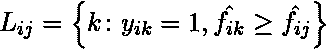
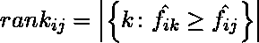
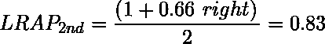
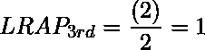
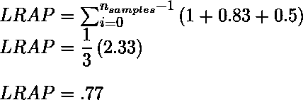

# 多标签排名指标-标签排名平均精度| ML

> 原文:[https://www . geesforgeks . org/multi label-ranking-metrics-label-ranking-average-precision-ml/](https://www.geeksforgeeks.org/multilabel-ranking-metrics-label-ranking-average-precision-ml/)

标签排名平均精度(LRAP)衡量预测模型的平均精度，但使用精度召回。它衡量每个样本的标签排名。其值始终大于 *0* 。这个指标的最佳值是 *1* 。这个度量与平均精度有关，但是使用了标签排名而不是精度和召回
LRAP 基本上提出了一个问题，对于每个给定的样本，排名较高的标签中有多少百分比是真实标签。
给定一个基本事实标签的二进制指示矩阵

<center>.</center>

The score associated with each label is denoted by  where,

<center>

</center>

Then we can calculate LRAP using following formula:

<center>

</center>

where,

<center>

</center>

and

<center>

</center>

**Code : Python code to implement LRAP**

```
# import numpy and scikit-learn libraries
import numpy as np
from sklearn.metrics import label_ranking_average_precision_score

# take sample datasets
y_true = np.array([[1, 0, 0], 
                   [1, 0, 1], 
                   [1, 1, 0]])
y_score = np.array([[0.75, 0.5, 1], 
                    [1, 0.2, 0.1],
                    [0.9, 0.7, 0.6]])

# print the output
print(label_ranking_average_precision_score(
    y_true, y_score))
```

**输出:**

```
0.777
```

为了理解上面的例子，我们来看三类人(以*【1，0，0】*为代表)，猫(以*【0，1，0】*为代表)，狗(以*【0，0，1】*为代表)。我们收到了三个样品，如*【1，0，0】、【1，0，1】、【1，1，0】*。这意味着我们总共有 **5** 个地面真实标签(人类 3 个，猫 1 个，狗 1 个)。例如，在第一个样本中，只有真正的标签人类在预测标签中获得了 2 <sup>和</sup>的位置。所以，秩= 2。接下来我们需要找出一路上有多少正确的标签。只有一个正确的人类标签，因此分子值为 1。因此分数变为 1/2 = 0.5。
因此，第一个样品的 LRAP 值为:

<center>

</center>

In the second sample, the first rank prediction is of human, followed by cat and dog. The fraction for the human is 1/1 = 1 and the dog is 2/3 = 0.66 (number of true label ranking along the way/ranking of dog class in the predicted label).
LRAP value of 2nd sample is:

<center>

</center>

Similarly, for the third sample, the value of fractions for the human class is 1/1 = 1 and the cat class is 2/2 = 1\. LRAP value of 3rd sample is:

<center>

</center>

Therefore total LRAP is the sum of LRAP’s on each sample divided by the number of samples.

<center>

</center>