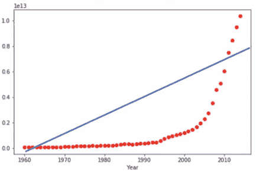
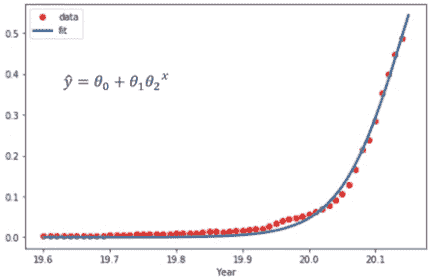
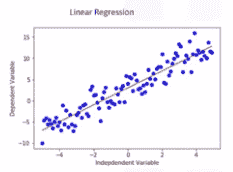
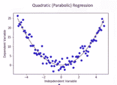
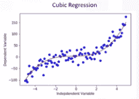
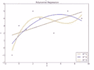
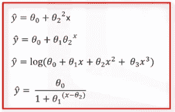

# 非线性回归示例–ML

> 原文:[https://www . geesforgeks . org/非线性回归-示例-ml/](https://www.geeksforgeeks.org/non-linear-regression-examples-ml/)

非线性回归是多项式回归的一种。这是一种在因变量和自变量之间建立非线性关系的方法。当数据显示曲线趋势时，它被适当地使用，与非线性回归相比，线性回归不会产生非常准确的结果。这是因为在线性回归中，数据是线性的。

**代码:**

## 蟒蛇 3

```py
import numpy as np
import pandas as pd

# downloading dataset
! wget -nv -O china_gdp.csv https://s3-api.us-geo.objectstorage.softlayer.net/
                    cf-courses-data/CognitiveClass/ML0101ENv3/labs/china_gdp.csv

df = pd.read_csv("china_gdp.csv")

def sigmoid(x, Beta_1, Beta_2):
     y = 1 / (1 + np.exp(-Beta_1*(x-Beta_2)))
     return y

beta_1 = 0.10
beta_2 = 1990.0

# logistic function
Y_pred = sigmoid(x_data, beta_1, beta_2)

# plot initial prediction against datapoints
plt.plot(x_data, Y_pred * 15000000000000.)
plt.plot(x_data, y_data, 'ro')   
```



散点图显示了一个国家的 GDP 和时间之间的关系，但这种关系不是线性的。相反，在 2005 年之后，这条线开始变成曲线，不再是直线。在这种情况下，需要一种特殊的估计方法，称为非线性回归。

**代码:**

## 蟒蛇 3

```py
import numpy as np
import pandas as pd

# downloading dataset
! wget -nv -O china_gdp.csv https://s3-api.us-geo.objectstorage.softlayer.net/
         cf-courses-data / CognitiveClass / ML0101ENv3 / labs / china_gdp.csv

df = pd.read_csv("china_gdp.csv")

def sigmoid(x, Beta_1, Beta_2):
     y = 1 / (1 + np.exp(-Beta_1*(x-Beta_2)))
     return y

x = np.linspace(1960, 2015, 55)
x = x / max(x)
y = sigmoid(x, *popt)

plt.figure(figsize =(8, 5))
plt.plot(xdata, ydata, 'ro', label ='data')
plt.plot(x, y, linewidth = 3.0, label ='fit')
plt.legend(loc ='best')
plt.ylabel('GDP')
plt.xlabel('Year')
plt.show()
```

**输出:**



根据我们的要求，有许多不同的回归存在，并且可以用来拟合数据集看起来像什么，例如二次回归、三次回归等无限程度。

**代码:**

## 蟒蛇 3

```py
import numpy as np
import matplotlib.pyplot as plt % matplotlib inline

x = np.arange(-5.0, 5.0, 0.1)

## You can adjust the slope and intercept to verify the changes in the graph
y = 2*(x) + 3
y_noise = 2 * np.random.normal(size = x.size)
ydata = y + y_noise
# plt.figure(figsize =(8, 6))
plt.plot(x, ydata,  'bo')
plt.plot(x, y, 'r')
plt.ylabel('Dependent Variable')
plt.xlabel('Independent Variable')
plt.show()
```

**输出:**



线性回归

**代码:**

## 蟒蛇 3

```py
import numpy as np
import matplotlib.pyplot as plt % matplotlib inline

x = np.arange(-5.0, 5.0, 0.1)

## You can adjust the slope and intercept to verify the changes in the graph

y = np.power(x, 2)
y_noise = 2 * np.random.normal(size = x.size)
ydata = y + y_noise
plt.plot(x, ydata,  'bo')
plt.plot(x, y, 'r')
plt.ylabel('Dependent Variable')
plt.xlabel('Independent Variable')
plt.show()
```

**输出:**



二次回归

**代码:**

## 蟒蛇 3

```py
import numpy as np
import matplotlib.pyplot as plt % matplotlib inline

x = np.arange(-5.0, 5.0, 0.1)

## You can adjust the slope and intercept to verify the changes in the graph
y = 1*(x**3) + 1*(x**2) + 1 * x + 3
y_noise = 20 * np.random.normal(size = x.size)
ydata = y + y_noise
plt.plot(x, ydata,  'bo')
plt.plot(x, y, 'r')
plt.ylabel('Dependent Variable')
plt.xlabel('Independent Variable')
plt.show()
```

**输出:**



三次回归

我们可以称所有这些多项式回归，其中自变量 X 和因变量 Y 之间的关系被建模为 X 中的第 n 次多项式



多项式回归

对于被认为是非线性的模型，Y 必须是参数θ的非线性函数，而不一定是特征 x。当涉及非线性方程时，它可以是指数、对数和逻辑的形状，或者许多其他类型。

**输出:**



非线性回归方程

正如你在所有这些方程中看到的，Y 帽子的变化取决于参数θ的变化，不一定只取决于 X。也就是说，在非线性回归中，模型通过参数是非线性的。