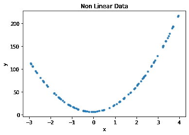
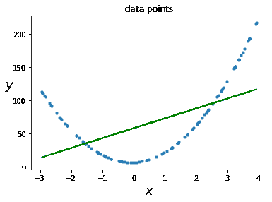
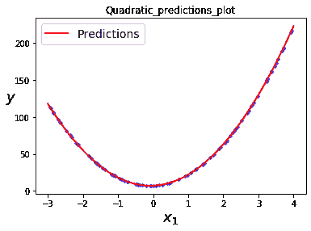

# 非线性数据的多项式回归–ML

> 原文:[https://www . geesforgeks . org/多项式回归非线性数据-ml/](https://www.geeksforgeeks.org/polynomial-regression-for-non-linear-data-ml/)

非线性数据在日常生活中经常遇到。考虑一些物理学中研究的运动方程。

*   **抛射体运动**:抛射体的高度计算为 h = - gt <sup>2</sup> +ut +ho
*   **自由落体运动方程**:物体在重力作用下自由下落*秒的距离为 g t <sup>2</sup> 。*
*   ***匀速加速物体所经过的距离**:该距离可以在 <sup>2</sup>
    计算为 ut +,其中，

    > g =重力加速度
    > u =初始速度
    > ho =初始高度
    > a =加速度* 

*除了这些例子之外，在组织的生长速度、疾病流行的进展、黑体辐射、钟摆的运动等方面也观察到非线性趋势。这些例子清楚地表明，我们不能总是在独立属性和从属属性之间有线性关系。**因此，线性回归不是处理这种非线性情况的好选择**。这就是多项式回归拯救我们的地方！！*

*多项式回归是遇到二次、三次或更高次非线性关系存在的情况的有力技术。多项式回归的基本概念是将每个独立属性的幂作为新属性相加，然后在这个扩展的特征集合上训练线性模型。
我们用一个例子来说明多项式回归的用法。考虑一种情况，其中因变量 y 相对于自变量 x 按照关系变化*

```py
*y = 13x<sup>2</sup> + 2x + 7*
```

*。*

*我们将使用 Scikit-Learn 的**多项式特征**类来实现。*

***步骤 1:导入库，生成随机数据集。***

```py
*# Importing the libraries
import numpy as np
import matplotlib.pyplot as plt
from sklearn.linear_model import LinearRegression
from sklearn.preprocessing import PolynomialFeatures
from sklearn.metrics import mean_squared_error, r2_score

# Importing the dataset
## x = data, y = quadratic equation
x = np.array(7 * np.random.rand(100, 1) - 3)
x1 = x.reshape(-1, 1)
y = 13 * x*x + 2 * x + 7 *
```

***步骤 2:绘制数据点。***

```py
*# data points
plt.scatter(x, y, s = 10)
plt.xlabel('x')
plt.ylabel('y')
plt.title('Non Linear Data')*
```

*

**第三步:首先尝试用线性模型拟合数据。***

```py
*# Model initialization
regression_model = LinearRegression()
# Fit the data(train the model)
regression_model.fit(x1, y)
print('Slope of the line is', regression_model.coef_)
print('Intercept value is', regression_model.intercept_)
# Predict
y_predicted = regression_model.predict(x1)*
```

***输出:***

```py
*Slope of the line is [[14.87780012]]
Intercept value is [58.31165769]* 
```

***第四步:绘制数据点和直线。***

```py
*# data points
plt.scatter(x, y, s = 10)
plt.xlabel("$x{content}quot;, fontsize = 18)
plt.ylabel("$y{content}quot;, rotation = 0, fontsize = 18)
plt.title("data points")

# predicted values
plt.plot(x, y_predicted, color ='g')*
```

***输出:**
*

```py
*Equation of the linear model is y = 14.87x + 58.31* 
```

***第五步:**根据均方误差、均方根误差和 r2 得分计算模型的性能。*

```py
*# model evaluation
mse = mean_squared_error(y, y_predicted)

rmse = np.sqrt(mean_squared_error(y, y_predicted))
r2 = r2_score(y, y_predicted)

# printing values

print('MSE of Linear model', mse)

print('R2 score of Linear model: ', r2)*
```

***输出:***

```py
*MSE of Linear model 2144.8229656677095
R2 score of Linear model:  0.3019970606151057* 
```

***线性模型的性能不令人满意。让我们试试二次多项式回归*** 

***第六步:**为了提高性能，我们需要把模型做得复杂一点。所以，让我们拟合一个 2 次多项式，然后进行线性回归。*

```py
*poly_features = PolynomialFeatures(degree = 2, include_bias = False)
x_poly = poly_features.fit_transform(x1)
x[3]*
```

***输出:***

```py
*Out[]:array([-2.84314447])*
```

```py
*x_poly[3]*
```

***输出:***

```py
 *Out[]:array([-2.84314447,  8.08347046])* 
```

 ***除了 x 列，还引入了一列，即实际数据的平方。现在我们继续简单的线性回归***

```py
*lin_reg = LinearRegression()
lin_reg.fit(x_poly, y)
print('Coefficients of x are', lin_reg.coef_)
print('Intercept is', lin_reg.intercept_)*
```

***输出:***

```py
*Coefficients of x are [[ 2\. 13.]]
Intercept is [7.]* 
```

 ***这是想要的方程式 13x <sup>2</sup> + 2x + 7*** 

***第七步:绘制得到的二次方程。***

```py
*x_new = np.linspace(-3, 4, 100).reshape(100, 1)
x_new_poly = poly_features.transform(x_new)
y_new = lin_reg.predict(x_new_poly)
plt.plot(x, y, "b.")
plt.plot(x_new, y_new, "r-", linewidth = 2, label ="Predictions")
plt.xlabel("$x_1{content}quot;, fontsize = 18)
plt.ylabel("$y{content}quot;, rotation = 0, fontsize = 18)
plt.legend(loc ="upper left", fontsize = 14)

plt.title("Quadratic_predictions_plot")
plt.show()*
```

***输出:** * 

***第八步:计算多项式回归得到的模型的性能。***

```py
*y_deg2 = lin_reg.predict(x_poly)
# model evaluation
mse_deg2 = mean_squared_error(y, y_deg2)

r2_deg2 = r2_score(y, y_deg2)

# printing values

print('MSE of Polyregression model', mse_deg2)

print('R2 score of Linear model: ', r2_deg2)*
```

***输出:***

```py
*MSE of Polyregression model 7.668437973562934e-28
R2 score of Linear model:  1.0* 
```

*对于给定的二次方程，多项式回归模型的性能远远优于线性回归模型。
**重要事实**:多项式特征(度= d)将包含 n 个特征的数组转换为包含 *(n + d)的数组！/ d！n！*特色。*

***结论**:多项式回归是处理非线性数据的一种有效方法，因为它可以找到特征之间的关系，这是普通线性回归模型难以做到的。*