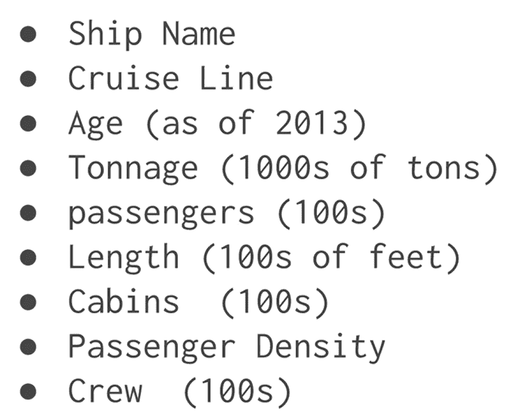
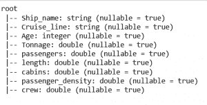
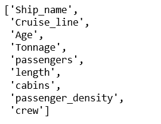
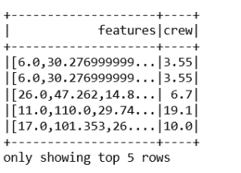
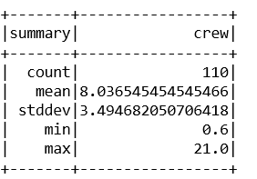
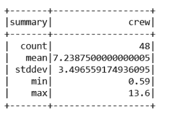
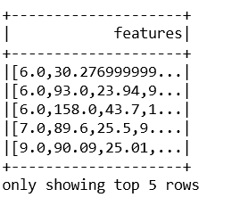
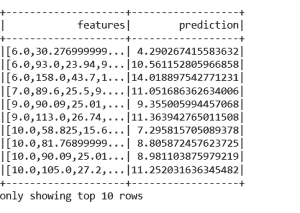

# Pyspark |使用 Apache MLlib 的线性回归

> 原文:[https://www . geesforgeks . org/py spark-线性回归-使用-apache-mllib/](https://www.geeksforgeeks.org/pyspark-linear-regression-using-apache-mllib/)

问题陈述:为航运公司建立一个预测模型，以估计一艘船需要多少船员。
数据集包含 159 个实例和 9 个特征。

数据集的**描述如下:

我们来做线性回归模型，预测船员**

附数据集:[邮轮信息](https://media.geeksforgeeks.org/wp-content/uploads/20190708145230/cruise_ship_info.csv)

```
import pyspark
from pyspark.sql import SparkSession
#SparkSession is now the entry point of Spark
#SparkSession can also be construed as gateway to spark libraries

#create instance of spark class
spark=SparkSession.builder.appName('housing_price_model').getOrCreate()

#create spark dataframe of input csv file
df=spark.read.csv('D:\python coding\pyspark_tutorial\Linear regression\cruise_ship_info.csv'
                  ,inferSchema=True,header=True)
df.show(10)
```

**输出:**

```
+-----------+-----------+---+------------------+----------+------+------+-----------------+----+
|  Ship_name|Cruise_line|Age|           Tonnage|passengers|length|cabins|passenger_density|crew|
+-----------+-----------+---+------------------+----------+------+------+-----------------+----+
|    Journey|    Azamara|  6|30.276999999999997|      6.94|  5.94|  3.55|            42.64|3.55|
|      Quest|    Azamara|  6|30.276999999999997|      6.94|  5.94|  3.55|            42.64|3.55|
|Celebration|   Carnival| 26|            47.262|     14.86|  7.22|  7.43|             31.8| 6.7|
|   Conquest|   Carnival| 11|             110.0|     29.74|  9.53| 14.88|            36.99|19.1|
|    Destiny|   Carnival| 17|           101.353|     26.42|  8.92| 13.21|            38.36|10.0|
|    Ecstasy|   Carnival| 22|            70.367|     20.52|  8.55|  10.2|            34.29| 9.2|
|    Elation|   Carnival| 15|            70.367|     20.52|  8.55|  10.2|            34.29| 9.2|
|    Fantasy|   Carnival| 23|            70.367|     20.56|  8.55| 10.22|            34.23| 9.2|
|Fascination|   Carnival| 19|            70.367|     20.52|  8.55|  10.2|            34.29| 9.2|
|    Freedom|   Carnival|  6|110.23899999999999|      37.0|  9.51| 14.87|            29.79|11.5|
+-----------+-----------+---+------------------+----------+------+------+-----------------+----+

```

```
#prints structure of dataframe along with datatype
df.printSchema()
```

**输出:**


```
#In our predictive model, below are the columns
df.columns
```

**输出:**


```
#columns identified as features are as below:
#['Cruise_line','Age','Tonnage','passengers','length','cabins','passenger_density']
#to work on the features, spark MLlib expects every value to be in numeric form
#feature 'Cruise_line is string datatype
#using StringIndexer, string type will be typecast to numeric datatype
#import library strinindexer for typecasting

from pyspark.ml.feature import StringIndexer
indexer=StringIndexer(inputCol='Cruise_line',outputCol='cruise_cat')
indexed=indexer.fit(df).transform(df)

#above code will convert string to numeric feature and create a new dataframe
#new dataframe contains a new feature 'cruise_cat' and can be used further
#feature cruise_cat is now vectorized and can be used to fed to model
for item in indexed.head(5):
    print(item)
    print('\n')
```

**输出:**

```
Row(Ship_name='Journey', Cruise_line='Azamara', Age=6, 
Tonnage=30.276999999999997, passengers=6.94, length=5.94, 
cabins=3.55, passenger_density=42.64, crew=3.55, cruise_cat=16.0)

Row(Ship_name='Quest', Cruise_line='Azamara', Age=6, 
Tonnage=30.276999999999997, passengers=6.94, length=5.94, 
cabins=3.55, passenger_density=42.64, crew=3.55, cruise_cat=16.0)

Row(Ship_name='Celebration', Cruise_line='Carnival', Age=26, 
Tonnage=47.262, passengers=14.86, length=7.22, 
cabins=7.43, passenger_density=31.8, crew=6.7, cruise_cat=1.0)

Row(Ship_name='Conquest', Cruise_line='Carnival', Age=11, 
Tonnage=110.0, passengers=29.74, length=9.53,
 cabins=14.88, passenger_density=36.99, crew=19.1, cruise_cat=1.0)

Row(Ship_name='Destiny', Cruise_line='Carnival', Age=17, 
Tonnage=101.353, passengers=26.42, length=8.92, 
cabins=13.21, passenger_density=38.36, crew=10.0, cruise_cat=1.0)

```

```
from pyspark.ml.linalg import Vectors
from pyspark.ml.feature import VectorAssembler
#creating vectors from features
#Apache MLlib takes input if vector form
assembler=VectorAssembler(inputCols=['Age',
 'Tonnage',
 'passengers',
 'length',
 'cabins',
 'passenger_density',
 'cruise_cat'],outputCol='features')
output=assembler.transform(indexed)
output.select('features','crew').show(5)
#output as below
```

**输出:**


```
#final data consist of features and label which is crew.
final_data=output.select('features','crew')
#splitting data into train and test
train_data,test_data=final_data.randomSplit([0.7,0.3])
train_data.describe().show()
```

**输出:**


```
test_data.describe().show()
```

**输出:**


```
#import LinearRegression library
from pyspark.ml.regression import LinearRegression
#creating an object of class LinearRegression
#object takes features and label as input arguments
ship_lr=LinearRegression(featuresCol='features',labelCol='crew')
#pass train_data to train model
trained_ship_model=ship_lr.fit(train_data)
#evaluating model trained for Rsquared error
ship_results=trained_ship_model.evaluate(train_data)

print('Rsquared Error :',ship_results.r2)
#R2 value shows accuracy of model is 92%
#model accuracy is very good and can be use for predictive analysis
```

**输出:**


```
#testing Model on unlabeled data
#create unlabeled data from test_data
#testing model on unlabeled data
unlabeled_data=test_data.select('features')
unlabeled_data.show(5)
```

**输出:**


```
predictions=trained_ship_model.transform(unlabeled_data)
predictions.show()
#below are the results of output from test data
```

**输出:**
