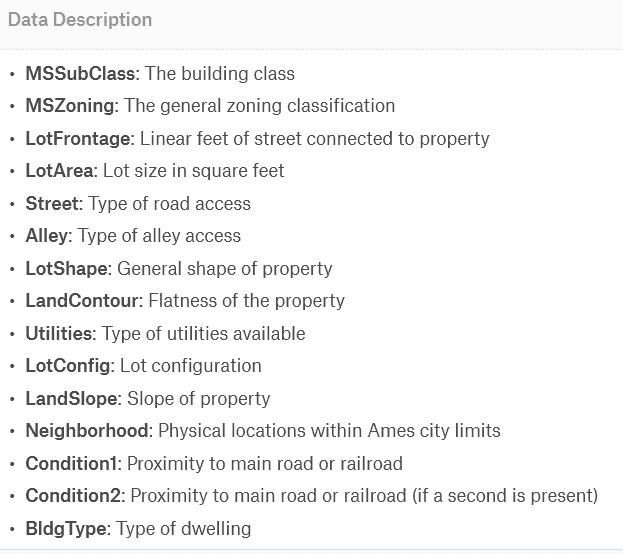
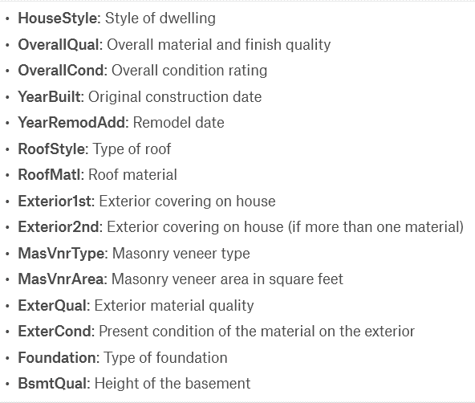
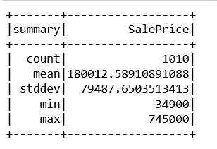
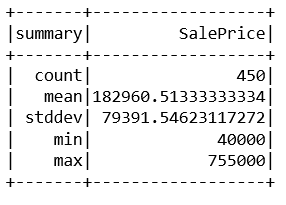
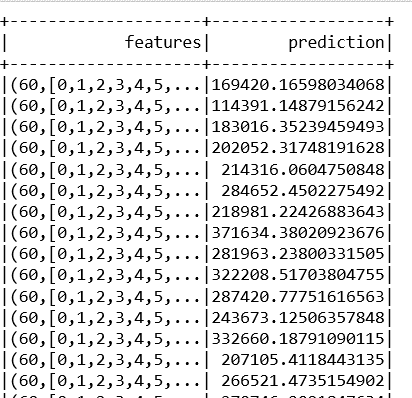

# Pyspark |使用 Apache MLlib 使用高级特征数据集进行线性回归

> 原文:[https://www . geesforgeks . org/py spark-线性回归-带高级-特征-数据集-使用-apache-mllib/](https://www.geeksforgeeks.org/pyspark-linear-regression-with-advanced-feature-dataset-using-apache-mllib/)

艾姆斯住房数据:艾姆斯住房数据集由迪恩·德·科克(Dean De Cock)编辑，用于数据科学教育，是经常被引用的波士顿住房数据集的扩展版。提供的数据集有 80 个要素和 1459 个实例。
数据集描述如下:



对于演示，显示的列很少，但是数据集中有更多的列。

**示例:**
**输入附属数据集:[Ames _ housing _ Dataset](https://media.geeksforgeeks.org/wp-content/uploads/20190722201330/Ames_hosuing_dataset.csv)** 
**代码:**

```py
# SparkSession is now the entry point of Spark
# SparkSession can also be construed as gateway to spark libraries
import pyspark
from pyspark.sql import SparkSession
# create instance of spark class
spark = SparkSession.builder.appName('ames_housing_price_model').getOrCreate()
df_train = spark.read.csv(r'D:\python coding\pyspark_tutorial\Linear regression'
                        '\housing price multiple features'
                        '\house-prices-advanced-regression-techniques'
                        '\train.csv', inferSchema = True, header = True)
```

**代码:**

```py
# identifying the columns having less meaningful data on the basis of datatypes
l_int =[]
for item in df_train.dtypes:
    if item[1]=='int':
        l_int.append(item[0])
print(l_int) 

l_str =[]
for item in df_train.dtypes:
    if item[1]=='string':
        l_str.append(item[0])
print(l_str)
```

**输出**

```py
Integer Datatypes:
['Id', 'MSSubClass', 'LotArea', 'OverallQual', 'OverallCond', 'YearBuilt', 
'YearRemodAdd', 'BsmtFinSF1', 'BsmtFinSF2', 'BsmtUnfSF', 'TotalBsmtSF', 
'1stFlrSF', '2ndFlrSF', 'LowQualFinSF', 'GrLivArea', 'BsmtFullBath',
 'BsmtHalfBath', 'FullBath', 'HalfBath', 'BedroomAbvGr', 'KitchenAbvGr', 
'TotRmsAbvGrd', 'Fireplaces', 'GarageCars', 'GarageArea', 'WoodDeckSF', 
'OpenPorchSF', 'EnclosedPorch', '3SsnPorch', 'ScreenPorch', 'PoolArea', 
'MiscVal', 'MoSold', 'YrSold', 'SalePrice']

String Datatypes:
['MSZoning', 'LotFrontage', 'Street', 'Alley', 'LotShape', 'LandContour',
 'Utilities', 'LotConfig', 'LandSlope', 'Neighborhood', 'Condition1', 'Condition2', 
'BldgType', 'HouseStyle', 'RoofStyle', 'RoofMatl', 'Exterior1st', 'Exterior2nd', 
'MasVnrType', 'MasVnrArea', 'ExterQual', 'ExterCond', 'Foundation', 'BsmtQual', 
'BsmtCond', 'BsmtExposure', 'BsmtFinType1', 'BsmtFinType2', 'Heating', 'HeatingQC',
 'CentralAir', 'Electrical', 'KitchenQual', 'Functional', 'FireplaceQu', 'GarageType',
 'GarageYrBlt', 'GarageFinish', 'GarageQual', 'GarageCond', 'PavedDrive', 'PoolQC', 'Fence',
 'MiscFeature', 'SaleType', 'SaleCondition'] 
```

**代码:**

```py
# identifying integer column records having less meaningful data
# identifying integer column records having less meaningful data
for i in df_train.columns:
    if i in l_int:
        a ='df_train'+'.'+i
        ct_total = df_train.select(i).count()
        ct_zeros = df_train.filter((col(i)== 0)).count()
    per_zeros =(ct_zeros / ct_total)*100
    print('total count / zeros count '
          +i+' '+str(ct_total)+' / '+str(ct_zeros)+' / '+str(per_zeros))
```

**输出零的百分比:**

```py
total count/zeros count/zeros_percent OpenPorchSF 1460 / 656 / 44.93150684931507
total count/zeros count/zeros_percent EnclosedPorch 1460 / 1252 / 85.75342465753425
total count/zeros count/zeros_percent 3SsnPorch 1460 / 1436 / 98.35616438356163
total count/zeros count/zeros_percent ScreenPorch 1460 / 1344 / 92.05479452054794
total count/zeros count/zeros_percent PoolArea 1460 / 1453 / 99.52054794520548
total count/zeros count/zeros_percent PoolQC 1460 / 1453 / 99.52054794520548
total count/zeros count/zeros_percent Fence 1460 / 1453 / 99.52054794520548
total count/zeros count/zeros_percent MiscFeature 1460 / 1453 / 99.52054794520548
total count/zeros count/zeros_percent MiscVal 1460 / 1408 / 96.43835616438356
total count/zeros count/zeros_percent MoSold 1460 / 0 / 0.0
total count/zeros count/zeros_percent YrSold 1460 / 0 / 0.0

```

**代码:**

```py
# above calculation gives us an insight about the useful features
# now drop the columns having zeros or NA % more than 75 % 

df_new = df_train.drop(*['BsmtFinSF2', 'LowQualFinSF', 'BsmtHalfBath',
                       'EnclosedPorch', '3SsnPorch', 'ScreenPorch',
                       'PoolArea', 'PoolQC', 'Fence', 'MiscFeature',
                       'MiscVal', 'Alley'])
df_new = df_new.drop(*['Id'])
# now we have the clean data to work
```

**代码:**

```py
# converting string to numeric feature
from pyspark.ml.feature import StringIndexer
from pyspark.ml import Pipeline
feat_list =['MSZoning', 'LotFrontage', 'Street', 'LotShape', 'LandContour',
           'Utilities', 'LotConfig', 'LandSlope', 'Neighborhood', 'Condition1',
           'Condition2', 'BldgType', 'HouseStyle', 'RoofStyle',
           'RoofMatl', 'Exterior1st', 'Exterior2nd', 'MasVnrType',
           'MasVnrArea', 'ExterQual', 'ExterCond', 'Foundation',
           'BsmtQual', 'BsmtCond', 'BsmtExposure', 'BsmtFinType1', 'BsmtFinType2',
           'Heating', 'HeatingQC', 'CentralAir', 'Electrical', 'KitchenQual',
           'Functional', 'FireplaceQu', 'GarageType',      
           'GarageYrBlt', 'GarageFinish', 'GarageQual', 'GarageCond',
           'PavedDrive', 'SaleType', 'SaleCondition']
print('indexed list created')

# there are multiple features to work
# using pipeline we can convert multiple features to indexers
indexers = [StringIndexer(inputCol = column, outputCol = column+"_index").fit(df_new) for column in feat_list]
type(indexers)
# Combines a given list of columns into a single vector column.
# input_cols: Columns to be assembled.
# returns Dataframe with assembled column.

pipeline = Pipeline(stages = indexers)
df_feat = pipeline.fit(df_new).transform(df_new)
df_feat.columns
# using above code we have converted list of features into indexes

from pyspark.ml.linalg import Vectors
from pyspark.ml.feature import VectorAssembler

# we will convert below columns into features to work with
assembler = VectorAssembler(inputCols =['MSSubClass', 'LotArea', 'OverallQual',
                                     'OverallCond', 'YearBuilt', 'YearRemodAdd',
                                     'BsmtFinSF1', 'BsmtUnfSF', 'TotalBsmtSF',
                                     '1stFlrSF', '2ndFlrSF', 'GrLivArea', 
                                     'BsmtFullBath', 'FullBath', 'HalfBath',
                                     'GarageArea', 'MoSold', 'YrSold', 
                                     'MSZoning_index', 'LotFrontage_index',
                                     'Street_index', 'LotShape_index', 
                                     'LandContour_index', 'Utilities_index', 
                                     'LotConfig_index', 'LandSlope_index',
                                     'Neighborhood_index', 'Condition1_index',
                                     'Condition2_index', 'BldgType_index',
                                     'HouseStyle_index', 'RoofStyle_index', 
                                     'RoofMatl_index', 'Exterior1st_index', 
                                     'Exterior2nd_index', 'MasVnrType_index',
                                     'MasVnrArea_index', 'ExterQual_index', 
                                     'ExterCond_index', 'Foundation_index',
                                     'BsmtQual_index', 'BsmtCond_index', 
                                     'BsmtExposure_index', 'BsmtFinType1_index', 
                                     'BsmtFinType2_index', 'Heating_index',
                                     'HeatingQC_index', 'CentralAir_index',
                                     'Electrical_index', 'KitchenQual_index',
                                     'Functional_index', 'FireplaceQu_index',
                                     'GarageType_index', 'GarageYrBlt_index',
                                     'GarageFinish_index', 'GarageQual_index',
                                     'GarageCond_index', 'PavedDrive_index', 
                                     'SaleType_index', 'SaleCondition_index'],
                                      outputCol ='features')
output = assembler.transform(df_feat)

final_data = output.select('features', 'SalePrice')

# splitting data for test and validation
train_data, test_data = final_data.randomSplit([0.7, 0.3])
```

**代码:**

```py
train_data.describe().show()
```



```py
test_data.describe().show()
```



**代码:**

```py
from pyspark.ml.regression import LinearRegression
house_lr = LinearRegression(featuresCol ='features', labelCol ='SalePrice')
trained_house_model = house_lr.fit(train_data)
house_results = trained_house_model.evaluate(train_data)
print('Rsquared Error :', house_results.r2)

# Rsquared Error : 0.8279155904297449
# model accuracy is 82 % with train data

# evaluate model on test_data
test_results = trained_house_model.evaluate(test_data)
print('Rsquared error :', test_results.r2)

# Rsquared error : 0.8431420382408793
# result is quiet better with 84 % accuracy

# create unlabelled data from test_data
# test_data.show()
unlabeled_data = test_data.select('features')
unlabeled_data.show()
```


**代码:**

```py
predictions = trained_house_model.transform(unlabeled_data)
predictions.show()
```

