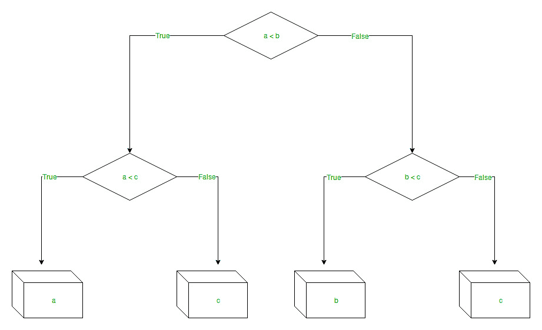

# Python |使用 sklearn 的决策树回归

> 原文:[https://www . geesforgeks . org/python-决策树-回归-使用-sklearn/](https://www.geeksforgeeks.org/python-decision-tree-regression-using-sklearn/)

**决策树**是一种决策工具，它使用类似流程图的树结构，或者是决策及其所有可能结果的模型，包括结果、投入成本和效用。
决策树算法属于监督学习算法的范畴。它适用于连续和分类输出变量。

分支/边表示节点的结果，节点具有:

1.  条件[决策节点]
2.  结果[结束节点]

分支/边代表陈述的真/假，take 根据以下示例做出决定，该示例显示了评估三个数字中最小数字的决策树:

<center>
</center>

**决策树回归:**
决策树回归观察对象的特征，并以树的结构训练模型，预测未来的数据，产生有意义的连续输出。连续输出意味着输出/结果不是离散的，即它不仅仅由离散的、已知的一组数字或值来表示。

**离散输出示例:**预测某一天是否会下雨的天气预测模型。
**连续产出示例:**一种利润预测模型，陈述销售产品可能产生的利润。
这里，借助决策树回归模型预测连续值。

让我们看看逐步实现–

*   **步骤 1:** 导入所需的库。

## 蟒蛇 3

```py
# import numpy package for arrays and stuff
import numpy as np 

# import matplotlib.pyplot for plotting our result
import matplotlib.pyplot as plt

# import pandas for importing csv files 
import pandas as pd 
```

*   **步骤 2:** 初始化并打印数据集。

## 蟒蛇 3

```py
# import dataset
# dataset = pd.read_csv('Data.csv') 
# alternatively open up .csv file to read data

dataset = np.array(
[['Asset Flip', 100, 1000],
['Text Based', 500, 3000],
['Visual Novel', 1500, 5000],
['2D Pixel Art', 3500, 8000],
['2D Vector Art', 5000, 6500],
['Strategy', 6000, 7000],
['First Person Shooter', 8000, 15000],
['Simulator', 9500, 20000],
['Racing', 12000, 21000],
['RPG', 14000, 25000],
['Sandbox', 15500, 27000],
['Open-World', 16500, 30000],
['MMOFPS', 25000, 52000],
['MMORPG', 30000, 80000]
])

# print the dataset
print(dataset) 
```

**输出:**

```py
[['Asset Flip' '100' '1000']
 ['Text Based' '500' '3000']
 ['Visual Novel' '1500' '5000']
 ['2D Pixel Art' '3500' '8000']
 ['2D Vector Art' '5000' '6500']
 ['Strategy' '6000' '7000']
 ['First Person Shooter' '8000' '15000']
 ['Simulator' '9500' '20000']
 ['Racing' '12000' '21000']
 ['RPG' '14000' '25000']
 ['Sandbox' '15500' '27000']
 ['Open-World' '16500' '30000']
 ['MMOFPS' '25000' '52000']
 ['MMORPG' '30000' '80000']]
```

*   **第三步:**选择数据集到“X”的所有行和列 1。

## 蟒蛇 3

```py
# select all rows by : and column 1
# by 1:2 representing features
X = dataset[:, 1:2].astype(int) 

# print X
print(X)
```