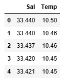
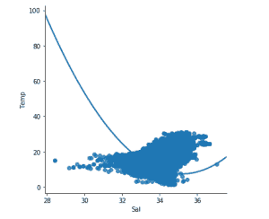
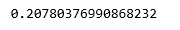
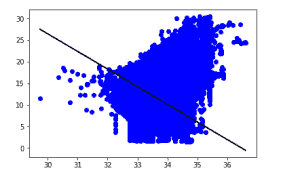
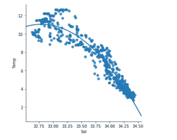
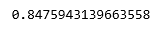
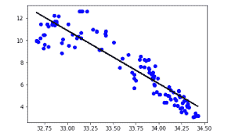

# Python |使用 sklearn 的线性回归

> 原文:[https://www . geesforgeks . org/python-线性回归-使用-sklearn/](https://www.geeksforgeeks.org/python-linear-regression-using-sklearn/)

**前提条件:** [线性回归](https://www.geeksforgeeks.org/ml-linear-regression/)

线性回归是一种基于监督学习的机器学习算法。它执行回归任务。回归基于自变量对目标预测值建模。它主要用于找出变量之间的关系并进行预测。不同的回归模型会因所考虑的因变量和自变量之间的关系类型以及所使用的自变量数量而有所不同。

本文将演示如何使用各种 Python 库在给定的数据集上实现线性回归。我们将演示二元线性模型，因为这将更容易可视化。

在这个演示中，模型将使用梯度下降来学习。你可以在这里了解一下。

**第一步:导入所有需要的库**

```
import numpy as np
import pandas as pd
import seaborn as sns
import matplotlib.pyplot as plt
from sklearn import preprocessing, svm
from sklearn.model_selection import train_test_split
from sklearn.linear_model import LinearRegression
```

**第二步:读取数据集**

可以在这里下载数据集[。](https://www.kaggle.com/sohier/calcofi)

```
cd C:\Users\Dev\Desktop\Kaggle\Salinity

# Changing the file read location to the location of the dataset
df = pd.read_csv('bottle.csv')
df_binary = df[['Salnty', 'T_degC']]

# Taking only the selected two attributes from the dataset
df_binary.columns = ['Sal', 'Temp']

# Renaming the columns for easier writing of the code
df_binary.head()

# Displaying only the 1st  rows along with the column names
```



**第三步:探索数据分散**

```
sns.lmplot(x ="Sal", y ="Temp", data = df_binary, order = 2, ci = None)

# Plotting the data scatter
```



**第四步:数据清理**

```
# Eliminating NaN or missing input numbers
df_binary.fillna(method ='ffill', inplace = True)
```

**第五步:训练我们的模型**

```
X = np.array(df_binary['Sal']).reshape(-1, 1)
y = np.array(df_binary['Temp']).reshape(-1, 1)

# Separating the data into independent and dependent variables
# Converting each dataframe into a numpy array 
# since each dataframe contains only one column
df_binary.dropna(inplace = True)

# Dropping any rows with Nan values
X_train, X_test, y_train, y_test = train_test_split(X, y, test_size = 0.25)

# Splitting the data into training and testing data
regr = LinearRegression()

regr.fit(X_train, y_train)
print(regr.score(X_test, y_test))
```



**第六步:探索我们的成果**

```
y_pred = regr.predict(X_test)
plt.scatter(X_test, y_test, color ='b')
plt.plot(X_test, y_pred, color ='k')

plt.show()
# Data scatter of predicted values
```



我们的模型的低精度分数表明我们的回归模型没有很好地拟合现有的数据。这表明我们的数据不适合线性回归。但是有时候，如果我们只考虑其中的一部分，数据集可能会接受线性回归。让我们检查一下这种可能性。

**步骤 7:使用较小的数据集**

```
df_binary500 = df_binary[:][:500]

# Selecting the 1st 500 rows of the data
sns.lmplot(x ="Sal", y ="Temp", data = df_binary500,
                               order = 2, ci = None)
```



我们已经可以看到，前 500 行遵循线性模型。继续和以前一样的步骤。

```
df_binary500.fillna(method ='ffill', inplace = True)

X = np.array(df_binary500['Sal']).reshape(-1, 1)
y = np.array(df_binary500['Temp']).reshape(-1, 1)

df_binary500.dropna(inplace = True)
X_train, X_test, y_train, y_test = train_test_split(X, y, test_size = 0.25)

regr = LinearRegression()
regr.fit(X_train, y_train)
print(regr.score(X_test, y_test))
```



```
y_pred = regr.predict(X_test)
plt.scatter(X_test, y_test, color ='b')
plt.plot(X_test, y_pred, color ='k')

plt.show()
```

