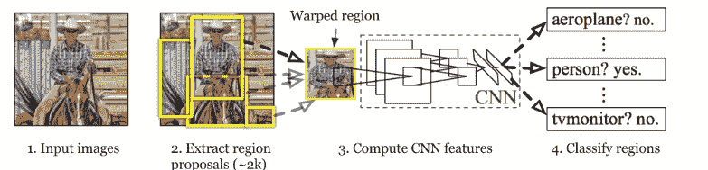

# R-CNN vs 快手 R-CNN vs 快手 R-CNN | ML

> 原文:[https://www . geesforgeks . org/r-CNN-vs-fast-r-CNN-vs-fast-r-CNN-ml/](https://www.geeksforgeeks.org/r-cnn-vs-fast-r-cnn-vs-faster-r-cnn-ml/)

**R-CNN:**
R-CNN 由 *Ross Girshick 等人*于 2014 年提出，旨在解决目标检测中高效的目标定位问题。以前的方法使用所谓的穷举搜索，即在图像上使用不同尺度的滑动窗口来提出区域建议。相反，本文使用选择性搜索算法，该算法利用对象的分割和穷举搜索来有效地确定区域建议。该选择性搜索算法为每幅图像提出大约 *2000* 个区域建议。这些然后被传递给美国有线电视新闻网模型(这里使用 AlexNet)。

美国有线电视新闻网架构

该 CNN 模型然后输出来自每个区域提议的 *(1，4096)* 特征向量。该向量然后被传递到 SVM 模型中，用于对象分类和边界框回归，用于定位。

**关于 R-CNN 的问题:**

*   每张图片需要分类 *2000* 区域提案。所以，训练网络需要很多时间。
*   在图形处理器上检测图像中的物体需要 *49* 秒。
*   要存储区域建议的特征图，还需要大量的磁盘空间。

**快速 R-CNN :**
在 R-CNN 中，我们在 CNN 架构中逐一传递了每个区域建议，并围绕 *2000* 区域建议生成了一个图像的选择性搜索。因此，使用 R-CNN 训练甚至测试图像在计算上是非常昂贵的。为了解决这一问题，提出了快速 R-CNN，它在一次前向传播中将整个图像和区域建议作为其 CNN 体系结构的输入。它还将架构的不同部分(如 ConvNet、RoI 池和分类层)结合在一个完整的架构中。这也消除了存储要素地图的要求，并节省了磁盘空间。它还在区域分类建议中使用 softmax 层而不是 SVM，这被证明比 SVM 更快并产生更好的精度。

快速无线网络体系结构

快速反应-有线电视新闻网大大提高了训练 *(8.75 小时对 84 小时)*和反应-有线电视新闻网的检测时间。与美国有线电视新闻网相比，它还略微提高了平均精度。

**快 R-CNN 的问题:**

*   Fast R-CNN 在检测过程中花费的大部分时间是一种选择性搜索区域建议生成算法。因此，这是该体系结构的瓶颈，在 fast R-CNN 中进行了处理。

**更快的 R-CNN:**

Fast R-CNN 由 *k He 等*在 2015 年推出，在 Fast R-CNN 之后，架构的瓶颈是选择性搜索。因为它需要为每个图像生成 *2000* 提案。它构成了整个建筑训练时间的主要部分。在更快的美国有线电视新闻网，它被地区提案网取代。首先，在这个网络中，我们把图像传入骨干网。该主干网络生成卷积特征图。这些特征地图然后被传递到区域建议网络。区域建议网络获取要素地图并生成锚点(滑动窗口的中心具有唯一的大小和比例)。这些锚点随后被传递到分类层(分类是否有对象)和回归层(定位与对象相关联的边界框)。

更快的有线电视新闻网架构

从检测时间上来说，快手比快手和快手都快。更快的美国有线电视新闻网也比以前的有更好的地图。

**R-CNN、快手 R-CNN 和快手 R-CNN 的对比:**

<figure class="table">

|  | **R-CNN** | **快 R-CNN** | **更快的 R-CNN** |
| --- | --- | --- | --- |
| **生成区域建议的方法** | 选择性搜索 | 选择性搜索 | 区域提案网络 |
| **帕斯卡 VOC 2007 测试数据集上的 mAP(%)** |  58.5 | 66.9(仅在接受 VOC 2007 培训时)

70.0(在 2007 年和 2012 年接受挥发性有机化合物培训时) | 69.9(仅在接受 VOC 2007 培训时)73.2(在 2007 年和 2012 年接受挥发性有机化合物培训时)78.8(在 2007 年和 2012 年接受挥发性有机化合物和可可培训时) |
| **帕斯卡 VOC 2012 测试数据集上的 mAP(%)** |  53.3 | 65.7(仅在接受 VOC 2012 培训时)68.4(在 2007 年和 2012 年接受挥发性有机化合物培训时) | 67.0(仅在接受 VOC 2012 培训时)70.4(在 2007 年和 2012 年接受挥发性有机化合物培训时)75.9(2007 年和 2012 年接受挥发性有机化合物和可可培训时) |
| **检测时间(秒)** | ~ 49(含地区提案生成) | ~ 2.32(含地区提案生成) | 0.2(VGG)，0.059(与 ZF 一起) |

</figure>

上述检测时间结果来自研究论文。它们可能因机器配置而异。
**参考文献:**

*   [R-CNN 论文](https://arxiv.org/abs/1311.2524)
*   [快速 R-CNN 论文](https://arxiv.org/abs/1504.08083)
*   [更快的 R-CNN 论文](https://arxiv.org/abs/1506.01497)