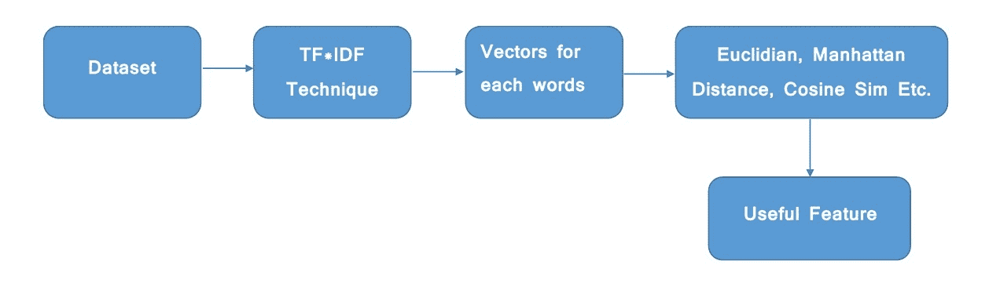

# Sklearn |使用 TF-IDF 进行特征提取

> 原文:[https://www . geesforgeks . org/sklearn-feature-extraction-with-TF-IDF/](https://www.geeksforgeeks.org/sklearn-feature-extraction-with-tf-idf/)

现在，您正在搜索 tf-idf，那么您可能熟悉特征提取及其含义。TF-IDF，代表**术语频率–反向文档频率**。它是用于信息检索的最重要的技术之一，用来表示特定的单词或短语对给定的文档有多重要。举个例子，我们有一个字符串或者**单词包(BOW)** ，我们必须从中提取信息，然后我们可以使用这个方法。

tf-idf 值与单词在文档中出现的次数成比例增加，但通常会被语料库中单词的出现频率所抵消，这有助于根据某些单词通常出现频率更高的事实进行调整。
TF-IDF 使用两种统计方法，第一种是术语频率，另一种是反向文档频率。术语频率是指给定术语出现在文档中的总次数与文档中所有单词的总数之比，以及单词提供的信息量的反向文档频率度量。它衡量给定单词在整个文档中的权重。IDF 显示给定单词在所有文档中有多常见或多罕见。
TF-IDF 可以计算为 tf * idf



Tf*Idf 不直接将原始数据转换为有用的功能。首先，它将原始字符串或数据集转换为向量，每个单词都有自己的向量。然后，我们将使用一种特殊的技术来检索像余弦相似性这样的特征，它对向量起作用，等等。我们知道，我们不能直接将字符串传递给我们的模型。因此，tf*idf 为我们提供了整个文档的数值。
为了从单词文档中提取特征，我们导入–

```py
from sklearn.feature_extraction.text import TfidfVectorizer
```

**输入:**

```py
1st Sentence - "hello i am pulkit"
2nd Sentence - "your name is akshit"

```

 **代码:Python 代码查找相似性度量**

```py
# importing libraries
from sklearn.feature_extraction.text import TfidfVectorizer
from sklearn.metrics.pairwise import cosine_similarity
from sklearn.metrics import pairwise_distances
from sklearn.metrics.pairwise import euclidean_distances
from scipy.spatial import distance
import pandas as pd
import numpy as np

## Converting 3D array of array into 1D array
def arr_convert_1d(arr):
    arr = np.array(arr)
    arr = np.concatenate( arr, axis=0 )
    arr = np.concatenate( arr, axis=0 )
    return arr

## Cosine Similarity
cos = []
def cosine(trans):
    cos.append(cosine_similarity(trans[0], trans[1]))

## Manhatten Distance
manhatten = []
def manhatten_distance(trans):
    manhatten.append(pairwise_distances(trans[0], trans[1], 
                                        metric = 'manhattan'))

## Euclidean Distance
euclidean = []
def euclidean_function(vectors):
    euc=euclidean_distances(vectors[0], vectors[1])
    euclidean.append(euc)

# This Function finds the similarity between two 
# sentences by using above functions.

## TF - IDF
def tfidf(str1, str2):
    ques = []
    # You have to provide the dataset. Link of the dataset 
    # is given in the end of this article. 
    # and if you are using a different dataset then adjust 
    # it according to your dataset's columns and rows
    dataset = pd.read_csv('C:\\Users\\dell\\Desktop\\quora_duplicate_questions.tsv', 
                          delimiter='\t',encoding='utf-8')

    x = dataset.iloc[:, 1:5]
    x = x.dropna(how = 'any')

    for k in range(len(x)):
        for j in [2, 3]:
            ques.append(x.iloc[k, j])
    vect = TfidfVectorizer()
    # Fit the your whole dataset. After all, this'll 
    # produce the vectors which is based on words in corpus/dataset
    vect.fit(ques)

    corpus = [str1,str2]
    trans = vect.transform(corpus)

    euclidean_function(trans)
    cosine(trans)
    manhatten_distance(trans)
    return convert()

def convert():
    dataf = pd.DataFrame()
    lis2 = arr_convert_1d(manhatten)
    dataf['manhatten'] = lis2
    lis2 = arr_convert_1d(cos)
    dataf['cos_sim'] = lis2
    lis2 = arr_convert_1d(euclidean)
    dataf['euclidean'] = lis2
    return dataf

newData = pd.DataFrame(); 
str1 = "hello i am pulkit"
str2 = "your name is akshit"
newData = tfidf(str1,str2);
print(newData);
```

**输出:**

```py
 manhatten  cos_sim  euclidean
0   2.955813      0.0   1.414214 
```

**数据集:** [谷歌驱动链接](https://drive.google.com/open?id=1JPTG0LlrFyTgX1IdlX0PyL5_iuIafZjN)
**注:**数据集很大，所以需要 30-40 秒才能产生输出，如果你打算照原样运行，那就不行了。它只在您在 IDE 中复制这段代码并在 tfidf 函数中提供数据集时有效。