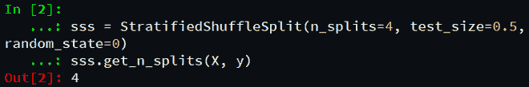
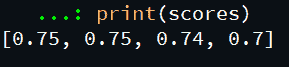

# Sklearn。Python 中的 StratifiedShuffleSplit()函数

> 原文:[https://www . geesforgeks . org/sklearn-stratifiedshufflesplit-python 中的函数/](https://www.geeksforgeeks.org/sklearn-stratifiedshufflesplit-function-in-python/)

在本文中，我们将从 *sklearn* 库中了解 *StratifiedShuffleSplit* 交叉验证器，该库提供训练测试索引以将数据拆分为训练测试集。

## **什么是 StratifiedShuffleSplit？**

*StratifiedShuffleSplit* 是 *ShuffleSplit* 和*stratifiedfold*的组合。使用 *StratifiedShuffleSplit* 类标签的分布比例在训练和测试数据集之间几乎是均匀的。 *StratifiedShuffleSplit* 和*stratifiedfold*(shuffle = True)的主要区别在于在*stratifiedfold*中，数据集在开始时只被洗牌一次，然后分裂成指定数量的折叠。这就排除了列车测试集重叠的任何机会。
然而，在 *StratifiedShuffleSplit* 中，每次在分割完成之前，数据都会被打乱，这就是为什么在训练测试集之间重叠的可能性更大的原因。

> **语法:** sklearn.model_selection。StratifiedShuffleSplit(n _ splits = 10，* test _ size =无，train _ size =无，random _ state =无)
> 
> **参数:**
> 
> **n_splits:** int，默认值=10
> 
> 重新洗牌和拆分迭代的次数。
> 
> **test_size:** float 或 int，默认值=None
> 
> 如果为浮点型，则应介于 0.0 和 1.0 之间，并表示要包含在测试分割中的数据集的比例。
> 
> **train_size:** float 或 int，默认值=None
> 
> 如果为浮点型，则应介于 0.0 和 1.0 之间，并表示要包含在训练分割中的数据集的比例。
> 
> **随机 _ 状态:** int
> 
> 控制所产生的训练和测试指标的随机性。

下面是实现。

**步骤 1)** 导入所需模块。

## 蟒蛇 3

```py
# import the libraries
import pandas as pd
from sklearn.ensemble import RandomForestClassifier
from sklearn import preprocessing
from sklearn.metrics import accuracy_score
from sklearn.model_selection import StratifiedShuffleSplit
```

**步骤 2)** 加载数据集，识别因变量和自变量。**T3】**

数据集可以从[这里下载。](https://drive.google.com/file/d/1S8Il7npD3J-xeClVS9x8j4xhFTgW-L1W/view?usp=sharing)

## 蟒蛇 3

```py
# convert data set into dataframe
churn_df = pd.read_csv(r"ChurnData.csv")

# assign dependent and independent variables
X = churn_df[['tenure', 'age', 'address', 'income',
              'ed', 'employ', 'equip',   'callcard', 'wireless']]

y = churn_df['churn'].astype('int')
```

**步骤 3)** 预处理数据。

## 蟒蛇 3

```py
# data pre-processing
X = preprocessing.StandardScaler().fit(X).transform(X)
```

**第 4 步)**创建*层的对象*类。

## 蟒蛇 3

```py
# use StratifiedShuffleSplit()
sss = StratifiedShuffleSplit(n_splits=4, test_size=0.5,
                             random_state=0)
sss.get_n_splits(X, y)
```

**输出:**



**步骤 5)** 调用实例，将数据帧拆分为训练样本和测试样本。 *split()* 函数返回列车测试样本的指数。使用回归算法，比较每个预测值的准确性。

## 蟒蛇 3

```py
scores = []

# using regression to get predicted data
rf = RandomForestClassifier(n_estimators=40, max_depth=7)
for train_index, test_index in sss.split(X, y):
    X_train, X_test = X[train_index], X[test_index]
    y_train, y_test = y[train_index], y[test_index]
    rf.fit(X_train, y_train)
    pred = rf.predict(X_test)
    scores.append(accuracy_score(y_test, pred))

# get accurracy of each prediction
print(scores)
```

**输出:**

