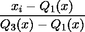
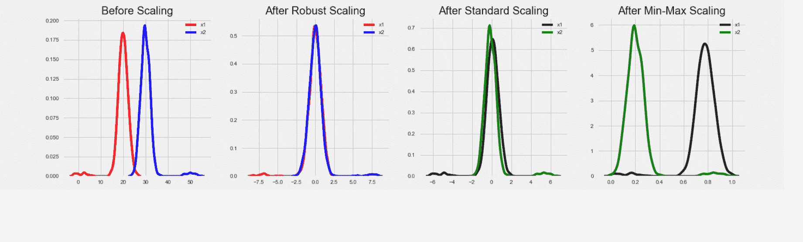

# 标准缩放器、最小最大缩放器和鲁棒缩放器技术–ML

> 原文:[https://www . geesforgeks . org/standard scaler-minmax scaler-and-robust scaler-technologies-ml/](https://www.geeksforgeeks.org/standardscaler-minmaxscaler-and-robustscaler-techniques-ml/)

**标准标度**遵循**标准正态分布**。因此，它使*均值= 0* 并将数据换算成单位方差。
**最小最大缩放器**缩放范围*【0，1】*内的所有数据特征，如果数据集中有负值，则缩放范围*【-1，1】*内的所有数据特征。此缩放会压缩窄范围*【0，0.005】*内的所有内联。
在存在异常值的情况下，由于在计算经验均值和标准差时异常值的影响，StandardScaler 不能保证特征尺度的平衡。这导致特征值范围的缩小。
通过使用**鲁棒缩放器()**，我们可以去除异常值，然后使用标准缩放器或最小最大缩放器对数据集进行预处理。
RobustScaler 的工作原理:
类
sklearn . preference . RobustScaler(
with _ centering = True，
with_scaling=True，
分位数 _range=(25.0，75.0)
copy = True，
)
它使用对异常值具有鲁棒性的统计数据来缩放特征。此方法移除中间值，并缩放第一个四分位数和第三个四分位数之间的数据。即在*第 25 分位数*和*第 75 分位数*范围之间。该范围也称为**四分位数范围**。
然后存储中位数和四分位数范围，以便在将来使用转换方法的数据中使用。如果数据集中存在异常值，则中位数和四分位数范围提供更好的结果，并优于样本均值和方差。
RobustScaler 使用四分位数范围，因此对异常值具有鲁棒性。因此它的公式如下:

**代码:StandardScaler、MinMaxScaler 和 RobustScaler 的比较。**T43】

## 蟒蛇 3

```
# Importing libraries
import pandas as pd
import numpy as np
from sklearn import preprocessing
import matplotlib
import matplotlib.pyplot as plt
import seaborn as sns % matplotlib inline
matplotlib.style.use('fivethirtyeight')

# data
x = pd.DataFrame({
    # Distribution with lower outliers
    'x1': np.concatenate([np.random.normal(20, 2, 1000), np.random.normal(1, 2, 25)]),
    # Distribution with higher outliers
    'x2': np.concatenate([np.random.normal(30, 2, 1000), np.random.normal(50, 2, 25)]),
})
np.random.normal

scaler = preprocessing.RobustScaler()
robust_df = scaler.fit_transform(x)
robust_df = pd.DataFrame(robust_df, columns =['x1', 'x2'])

scaler = preprocessing.StandardScaler()
standard_df = scaler.fit_transform(x)
standard_df = pd.DataFrame(standard_df, columns =['x1', 'x2'])

scaler = preprocessing.MinMaxScaler()
minmax_df = scaler.fit_transform(x)
minmax_df = pd.DataFrame(minmax_df, columns =['x1', 'x2'])

fig, (ax1, ax2, ax3, ax4) = plt.subplots(ncols = 4, figsize =(20, 5))
ax1.set_title('Before Scaling')

sns.kdeplot(x['x1'], ax = ax1, color ='r')
sns.kdeplot(x['x2'], ax = ax1, color ='b')
ax2.set_title('After Robust Scaling')

sns.kdeplot(robust_df['x1'], ax = ax2, color ='red')
sns.kdeplot(robust_df['x2'], ax = ax2, color ='blue')
ax3.set_title('After Standard Scaling')

sns.kdeplot(standard_df['x1'], ax = ax3, color ='black')
sns.kdeplot(standard_df['x2'], ax = ax3, color ='g')
ax4.set_title('After Min-Max Scaling')

sns.kdeplot(minmax_df['x1'], ax = ax4, color ='black')
sns.kdeplot(minmax_df['x2'], ax = ax4, color ='g')
plt.show()
```

**输出:**



**鲁棒缩放器参数:**

*   **带 _ 居中:布尔:**默认为真。如果该值为真，则数据在缩放前居中。当它应用于稀疏矩阵时，转换将引发异常，因为对它们进行中心化需要构建一个密集的矩阵，该矩阵通常太大而不适合内存。
*   **with_scaling: boolean:** 默认情况下也设置为 True。它将数据缩放到四分位数范围。
*   **分位数 _ 范围:元组(q_min，q_max)，0.0<q _ min<q _ max<100.0:**分位数范围用于计算比例。默认情况下，其设置如下。默认值: *(25.0，75.0) =(第一分位数，第三分位数)= IQR。*
*   **复制:布尔**是可选参数。默认情况下，它为真。如果输入已经是 NumPy 数组或 scipy.sparse CSC 矩阵，并且如果*轴= 1* ，通过将该参数设置为 False 来避免复制，而是执行就地行规范化。

**属性:**

*   **center_:浮动数组:**训练集中每个特征的中值。
*   **scale_:浮动数组:**训练集中特征的缩放四分位数范围。