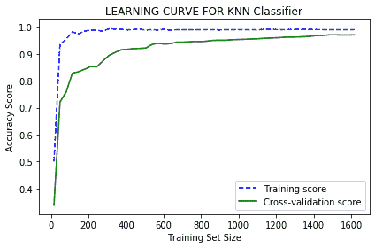

# 使用学习曲线–ML

> 原文:[https://www.geeksforgeeks.org/using-learning-curves-ml/](https://www.geeksforgeeks.org/using-learning-curves-ml/)

机器学习模型的学习模型显示了机器学习模型的预测误差如何随着训练集的大小增加或减少而变化。
在继续之前，我们必须先了解方差和偏差在机器学习模型中的含义。

**偏差:**
基本上就是一个模型的平均预测值和预测的正确值之差。高偏差模型对训练数据做了大量假设。这导致模型过于简化，并可能导致训练集和测试集的高误差。然而，这也使得模型学习起来更快，更容易理解。通常，像线性回归这样的线性模型算法具有很高的偏差。

**方差:**
是训练数据发生变化时模型的预测会发生的变化量。理想情况下，机器学习模型不应该随着训练集的变化而有太大的变化，也就是说，算法应该善于提取数据的重要细节，而不考虑数据本身。具有高方差的算法的例子是决策树、支持向量机(SVM)。

理想情况下，我们希望模型具有低方差和低偏差。为了实现更低的偏差，我们需要更多的训练数据，但是随着训练数据的增加，模型的方差会增加。所以，我们必须在两者之间取得平衡。这被称为**偏差-方差权衡。**
学习曲线可以帮助找到合适的训练数据量，以良好的偏差-方差权衡来拟合我们的模型。这就是为什么学习曲线如此重要。
现在我们已经理解了偏差-方差权衡以及为什么学习曲线很重要，现在我们将使用 Python 的 scikit-learn 库学习如何在 Python 中使用学习曲线。

**Python 中学习曲线的实现:**
为了这个例子，我们将使用非常流行的‘digest’数据集。关于这个数据集的更多信息，可以参考下面的链接:[https://sci kit-learn . org/stable/auto _ examples/datasets/plot _ digits _ last _ image](https://scikit-learn.org/stable/auto_examples/datasets/plot_digits_last_image)
我们将在这个例子中使用 k 近邻分类器。我们还将执行 10 倍交叉验证，以获得验证分数并绘制在图表上。

**代码:**

```
#Importing Required Libraries and Modules
import numpy as np
import matplotlib.pyplot as plt
from sklearn.neighbors import KNeighborsClassifier
from sklearn.datasets import load_digits
from sklearn.model_selection import learning_curve

# Load data set
dataset = load_digits()

# X contains data and y contains labels
X, y = dataset.data, dataset.target

# Obtain scores from learning curve function
# cv is the number of folds while performing Cross Validation
sizes, training_scores, testing_scores = learning_curve(KNeighborsClassifier(), X, y, cv=10, scoring='accuracy', train_sizes=np.linspace(0.01, 1.0, 50))

# Mean and Standard Deviation of training scores
mean_training = np.mean(training_scores, axis=1)
Standard_Deviation_training = np.std(training_scores, axis=1)

# Mean and Standard Deviation of testing scores
mean_testing = np.mean(testing_scores, axis=1)
Standard_Deviation_testing = np.std(testing_scores, axis=1)

# dotted blue line is for training scores and green line is for cross-validation score
plt.plot(sizes, mean_training, '--', color="b",  label="Training score")
plt.plot(sizes, mean_testing, color="g", label="Cross-validation score")

# Drawing plot
plt.title("LEARNING CURVE FOR KNN Classifier")
plt.xlabel("Training Set Size"), plt.ylabel("Accuracy Score"), plt.legend(loc="best")
plt.tight_layout()
plt.show()
```

**输出:**

<center>

</center>

从曲线中我们可以清楚地看到，随着训练集规模的增大，训练得分曲线和交叉验证得分曲线会收敛。随着我们添加更多的训练数据，交叉验证的准确性也会提高。因此，在这种情况下，添加训练数据非常有用。由于训练分数非常准确，这表明低偏差和高方差。因此，这个模型也开始过度拟合数据，因为交叉验证分数相对较低，并且随着训练集大小的增加而缓慢增加。

**结论:**
学习曲线是有监督机器学习算法中确定偏差和方差的一个很好的诊断工具。在本文中，我们学习了什么是学习曲线，以及它们是如何在 Python 中实现的。