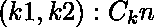
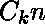
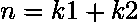

# Python | sympy .二项式 _ 系数()方法

> 原文:[https://www . geesforgeks . org/python-sympy-二项式 _ 系数-方法/](https://www.geeksforgeeks.org/python-sympy-binomial_coefficients-method/)

借助于**辛二项式系数()**方法，我们可以求出给定整数的二项式系数。该方法返回一个字典，其中包含对，其中是二项式系数，。

> **语法:**二项式系数(n)
> 
> **参数:**
> **n–**表示整数。
> 
> **返回:**返回包含对(k1，k2)的字典:C <sub>k</sub> <sup>n</sup> 其中 C<sub>k</sub>T8】n 为二项式系数，n = k1 + k2。

**示例#1:**

```
# import binomial_coefficients() method from sympy
from sympy.ntheory import binomial_coefficients

n = 6

# Use binomial_coefficients() method 
binomial_coefficients_n = binomial_coefficients(n) 

print("binomial_coefficients({}) = {} ".format(n, binomial_coefficients_n))
```

**输出:**

```
binomial_coefficients(6) = {(3, 3): 20, (1, 5): 6, (6, 0): 1, (0, 6): 1, (4, 2): 15, (5, 1): 6, (2, 4): 15}

```

**例 2:**

```
# import binomial_coefficients() method from sympy
from sympy.ntheory import binomial_coefficients

n = 9

# Use binomial_coefficients() method 
binomial_coefficients_n = binomial_coefficients(n) 

print("binomial_coefficients({}) = {} ".format(n, binomial_coefficients_n))
```

**输出:**

```
binomial_coefficients(9) = {(2, 7): 36, (9, 0): 1, (8, 1): 9, (5, 4): 126, (6, 3): 84, (4, 5): 126, (1, 8): 9, (3, 6): 84, (0, 9): 1, (7, 2): 36} 

```