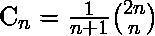

# Python | sympy.catalan()方法

> 原文:[https://www.geeksforgeeks.org/python-sympy-catalan-method/](https://www.geeksforgeeks.org/python-sympy-catalan-method/)

借助 **sympy.catalan()** 方法，我们可以在 sympy 中找到 [Catalan 编号](https://en.wikipedia.org/wiki/Catalan_number)。它表示为–



> **语法:**加泰罗尼亚语(n)
> 
> **参数:**
> **n–**表示第 n 个加泰罗尼亚数字。
> 
> **返回:**返回第 n <sup>个</sup>加泰罗尼亚数字。

**示例#1:**

```py
# import sympy 
from sympy import * n = 4
print("Value of n = {}".format(n))

# Use sympy.catalan() method 
nth_catalan = catalan(n)  

print("Value of nth catalan number : {}".format(nth_catalan))  
```

**输出:**

```py
Value of n = 4
Value of nth catalan number : 14

```

**例 2:**

```py
# import sympy 
from sympy import * n = 15
print("Value of n = {}".format(n))

# Use sympy.catalan() method 
nth_catalan = catalan(n)  

print("Value of nth catalan number : {}".format(nth_catalan))  
```

**输出:**

```py
Value of n = 15
Value of nth catalan number : 9694845

```