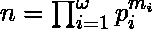

# Python | sympy.core()方法

> 原文:[https://www.geeksforgeeks.org/python-sympy-core-method/](https://www.geeksforgeeks.org/python-sympy-core-method/)

借助 **sympy.core()** 方法，我们可以计算出一个正整数 ***n*** 的。**核心(n，t)** 计算 *** t-th *** 的 *** n *** 的功率自由部分。
如果说***n*T21 的素分解是:**



然后


> **语法:**核心(n，t=2)
> 
> **参数:**
> **n–**表示整数。
> **t–**表示整数(可选)。t 的默认值为 2。
> 
> **返回:**返回 n 的第 t 次幂自由部分

**示例#1:**

```
# import core() method from sympy
from sympy.ntheory.factor_ import core

n = 24
k = 2

# Use core() method 
core_n_k = core(n, k) 

print("core({}, {}) =  {} ".format(n, k, core_n_k)) 
```

**输出:**

```
core(24, 2) =  6 

```

**例 2:**

```
# import core() method from sympy
from sympy.ntheory.factor_ import core

n = 11**4
k = 3

# Use core() method 
core_n_k = core(n, k) 

print("core({}, {}) =  {} ".format(n, k, core_n_k))
```

**输出:**

```
core(14641, 3) =  11 

```