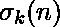

# Python | sympy . divider _ sigma()方法

> 原文:[https://www . geesforgeks . org/python-sympy-divider _ sigma-method/](https://www.geeksforgeeks.org/python-sympy-divisor_sigma-method/)

借助**sympy . divider _ sigma()**方法，我们可以找到正整数 *n* 的除数函数。 ***除数 _sigma(n，k) *** 等于 *** n *** 的所有除数之和乘以 *** k *** 或 ***之和(【x**k 为除数(n)中的 x】)***。

> **语法:**除数 _σ(n，k)
> 
> **参数:**
> **n–**表示整数。
> **k–**表示整数(可选)。k 的默认值为 1。
> 
> **返回:**返回 n 的所有除数之和的 k 次方。

**示例#1:**

```
# import divisor_sigma() method from sympy
from sympy.ntheory import divisor_sigma

n = 8

# Use divisor_sigma() method 
divisor_sigma_n = divisor_sigma(n) 

print("divisor_sigma({}) =  {} ".format(n, divisor_sigma_n)) 
# 1 ^ 1 + 2 ^ 1 + 4 ^ 1 + 8 ^ 1 = 15
```

**输出:**

```
divisor_sigma(8) =  15 

```

**例 2:**

```
# import divisor_sigma() method from sympy
from sympy.ntheory import divisor_sigma

n = 15
k = 2

# Use divisor_sigma() method 
divisor_sigma_n = divisor_sigma(n, k) 

print("divisor_sigma({}, {}) =  {} ".format(n, k, divisor_sigma_n)) 
# 1 ^ 2 + 3 ^ 2 + 5 ^ 2 + 15 ^ 2 = 260
```

**输出:**

```
divisor_sigma(15, 2) =  260 

```