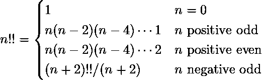

# Python | sympy .阶乘 2()方法

> 原文:[https://www . geesforgeks . org/python-sympy-factorial 2-method/](https://www.geeksforgeeks.org/python-sympy-factorial2-method/)

借助**因子 2()** 方法，我们可以找到[双因子](https://en.wikipedia.org/wiki/Double_factorial)。数字的双阶乘由–



> **语法:**阶乘 2(n)
> 
> **参数:**
> **n–**表示要计算双阶乘的数。
> 
> **返回:**返回数字的双阶乘，即 n。

**示例#1:**

```py
# import sympy 
from sympy import * 

n = 10
print("Value of n = {}".format(n))

# Use sympy.factorial2() method 
factorial2_n = factorial2(n)  

print("Double factorial of n : {}".format(factorial2_n))  
```

**输出:**

```py
Value of n = 10
Double factorial of n : 3840

```

**例 2:**

```py
# import sympy 
from sympy import * 

n = -3
print("Value of n = {}".format(n))

# Use sympy.factorial2() method 
factorial2_n = factorial2(n)  

print("Double factorial of n : {}".format(factorial2_n))  
```

**输出:**

```py
Value of n = -3
Double factorial of n : -1

```