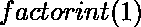
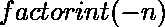

# Python | sympy.factorint()方法

> 原文:[https://www . geesforgeks . org/python-sympy-factorint-method/](https://www.geeksforgeeks.org/python-sympy-factorint-method/)

借助**sympy . factory int()**方法，可以求出给定整数的因子及其对应的重数。对于小于 2 的输入，**factory int()**的行为如下:

*   –返回空因式分解{}。
*   –返回。
*   –将添加到因子中，然后是因子。

> **语法:**
> 因子(n)
> 
> **参数:**
> **n–**表示整数。
> 
> **返回:**
> 返回一个字典，其中包含 n 的质因数作为关键字
> 以及它们各自的乘数作为值。

**示例#1:**

```
# import factorint() method from sympy
from sympy import factorint

n = 2**3 * 3**4 * 5**6

# Use factorint() method 
factor_dict = factorint(n) 

print("Dictionary containing factors of {} with respective multiplicities : {}".
      format(n, factor_dict))
```

**输出:**

```
Dictionary containing factors of 10125000 
with respective multiplicities : {2: 3, 3: 4, 5: 6}

```

**例 2:**

```
# import factorint() method from sympy
from sympy import factorint

n = 6**4 * 13

# Use factorint() method 
factor_dict = factorint(n) 

print("Dictionary containing factors of {} with respective multiplicities : {}".
      format(n, factor_dict))
```

**输出:**

```
Dictionary containing factors of 16848 
with respective multiplicities : {2: 4, 3: 4, 13: 1}

```