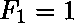
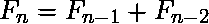
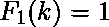
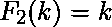
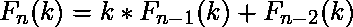
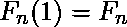

# Python | sympy.fibonacci()方法

> 原文:[https://www . geesforgeks . org/python-sympy-Fibonacci-method/](https://www.geeksforgeeks.org/python-sympy-fibonacci-method/)

借助 **sympy .斐波那契()**方法，我们可以在 sympy 中找到[斐波那契数和斐波那契多项式](https://en.wikipedia.org/wiki/Fibonacci_number)。

## `fibonacci(n) -`

斐波那契数是由初始项、和两项递推关系定义的整数序列。

> **语法:**斐波那契(n)
> 
> **参数:**
> **n–**表示斐波那契数要计算到的数字。
> 
> **返回:**返回第 n 个<sup>斐波那契数。</sup>

**示例#1:**

```py
# import sympy 
from sympy import * 

n = 7
print("Value of n = {}".format(n))

# Use sympy.fibonacci() method 
nth_fibonacci = fibonacci(n)  

print("Value of nth fibonacci number : {}".format(nth_fibonacci))  
```

**输出:**

```py
Value of n = 7
Value of nth fibonacci number : 13

```

## `fibonacci(n, k) -`

斐波那契多项式由、和的定义。对于所有正整数、。

> **语法:**斐波那契(n，k)
> 
> **参数:**
> **n–**表示第 n 个<sup>次</sup>斐波那契多项式。
> **k–**表示斐波那契多项式中的变量。
> 
> **返回:**返回 k，F <sub>n</sub> 中的第 n 个斐波那契多项式(k)

**例 2:**

```py
# import sympy 
from sympy import * 

n = 5
k = symbols('x')
print("Value of n = {} and k = {}".format(n, k))

# Use sympy.fibonacci() method 
nth_fibonacci_poly = fibonacci(n, k)  

print("The nth fibonacci polynomial : {}".format(nth_fibonacci_poly))  
```

**输出:**

```py
Value of n = 5 and k = x
The nth fibonacci polynomial : x**4 + 3*x**2 + 1

```

**示例#3:**

```py
# import sympy 
from sympy import * 

n = 6
k = 3
print("Value of n = {} and k = {}".format(n, k))

# Use sympy.fibonacci() method 
nth_fibonacci_poly = fibonacci(n, k)  

print("The nth fibonacci polynomial value : {}".format(nth_fibonacci_poly))  
```

**输出:**

```py
Value of n = 6 and k = 3
The nth fibonacci polynomial value : 360

```