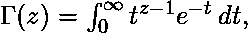

# Python | sympy.gamma()方法

> 原文:[https://www.geeksforgeeks.org/python-sympy-gamma-method/](https://www.geeksforgeeks.org/python-sympy-gamma-method/)

借助 **sympy.gamma()** 方法，我们可以在 sympy 中找到 [gamma 函数](https://en.wikipedia.org/wiki/Gamma_function)。γ(z)代表，对于正整数 z，与相同。

> **语法:**伽玛(Z)
> 
> **参数:**
> **Z–**是伽玛函数的输入值。
> 
> **返回:**返回输入值的伽玛函数结果。

**示例#1:**

```
# import sympy 
from sympy import * 

Z = 5
print("Z = {}".format(Z))

# Use sympy.gamma() method 
gamma_Z = gamma(Z)  

print("gamma(Z) : {}".format(gamma_Z))  
```

**输出:**

```
Z = 5
gamma(Z) : 24

```

**例 2:**

```
# import sympy 
from sympy import * 

X = symbols('x')
print("X = {}".format(X))

# Use sympy.gamma() method 
gamma_X = gamma(X)  

print("gamma(X) : {}".format(gamma_X))  
```

**输出:**

```
X = x
gamma(X) : gamma(x)

```