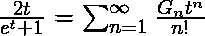

# Python | sympy.genocchi()方法

> 原文:[https://www.geeksforgeeks.org/python-sympy-genocchi-method/](https://www.geeksforgeeks.org/python-sympy-genocchi-method/)

借助 **sympy.genocchi()** 方法，我们可以在 sympy 中找到 [Genocchi 数字](https://en.wikipedia.org/wiki/Genocchi_number)。

## `genocchi(n) -`

吉诺基数是满足关系的整数序列**G<sub>n</sub>T5。**

> **语法:** genocchi(n)
> 
> **参数:**
> **n–**表示要计算基因组数的数量。
> 
> **返回:**返回第 n <sup>个</sup>吉诺基号码。

**示例#1:**

```
# import sympy 
from sympy import * 

n = 7
print("Value of n = {}".format(n))

# Use sympy.genocchi() method 
nth_genocchi = genocchi(n)  

print("Value of nth genocchi number : {}".format(nth_genocchi))  
```

**输出:**

```
Value of n = 7
Value of nth genocchi number : 0

```

**例 2:**

```
# import sympy 
from sympy import * 

n = 10
print("Value of n = {}".format(n))

# Use sympy.genocchi() method 
n_genocchi = [genocchi(x) for x in range(1, 11)]  

print("N genocchi number are : {}".format(n_genocchi))  
```

**输出:**

```
Value of n = 10
N genocchi numbers are : [1, -1, 0, 1, 0, -3, 0, 17, 0, -155]

```