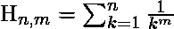

# Python | sympy.harmonic()方法

> 原文:[https://www.geeksforgeeks.org/python-sympy-harmonic-method/](https://www.geeksforgeeks.org/python-sympy-harmonic-method/)

借助**sympy . harmony()**方法，我们可以在 SymPy 中找到[调和数](https://en.wikipedia.org/wiki/Harmonic_number)。

**harmonic(n)**

**n <sup>次</sup>T3】次谐波数由–给出。**

> **语法:**调和(n)
> 
> **参数:**
> **n–**表示要计算谐波数的数量。
> 
> **返回:**返回第 n 个<sup>次</sup>谐波数。

**示例#1:**

```py
# import sympy 
from sympy import * 

n = 7
print("Value of n = {}".format(n))

# Use sympy.harmonic() method 
nth_harmonic = harmonic(n)  

print("Value of nth harmonic number : {}".format(nth_harmonic))  
```

**输出:**

```py
Value of n = 7
Value of nth harmonic number : 363/140

```

**harmonic(n, m)**

第**n**阶广义谐波数 **m** 由–给出。

> **语法:**调和(n，m)
> 
> **参数:**
> **n–**表示要计算谐波数的数量。
> **m–**表示谐波数的阶数。
> **返回:**返回 m 阶的第 n 次谐波数

**例 2:**

```py
# import sympy 
from sympy import * 

n = 5
m = 2
print("Value of n = {} and m = {}".format(n, m))

# Use sympy.harmonic() method 
nth_harmonic_poly = harmonic(n, m)  

print("The nth harmonic number of order m : {}".format(nth_harmonic_poly))  
```

**输出:**

```py
Value of n = 5 and m = 2
The nth harmonic number of order m : 5269/3600

```