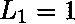

# Python | sympy.lucas()方法

> 原文:[https://www.geeksforgeeks.org/python-sympy-lucas-method/](https://www.geeksforgeeks.org/python-sympy-lucas-method/)

借助 **sympy.lucas()** 方法，我们可以在 sympy 中找到 [Lucas 数字](https://en.wikipedia.org/wiki/Lucas_number)。

## `lucas(n) -`

卢卡斯数满足类似于斐波那契数列的递推关系，其中每个项都是前两项的和。它们是通过选择初始值和以及递归关系生成的。

> **语法:**卢卡斯(n)
> 
> **参数:**
> **n–**表示要计算路卡斯数的数字。
> 
> **返回:**返回第 n 个<sup>卢卡斯号码。</sup>

**示例#1:**

```py
# import sympy 
from sympy import * 

n = 7
print("Value of n = {}".format(n))

# Use sympy.lucas() method 
nth_lucas = lucas(n)  

print("Value of nth lucas number : {}".format(nth_lucas))  
```

**输出:**

```py
Value of n = 7
Value of nth lucas number : 29

```

**例 2:**

```py
# import sympy 
from sympy import * 

n = 10
print("Value of n = {}".format(n))

# Use sympy.lucas() method 
n_lucas = [lucas(x) for x in range(11)]  

print("N lucas number are : {}".format(n_lucas))  
```

**输出:**

```py
Value of n = 10
N lucas number are : [2, 1, 3, 4, 7, 11, 18, 29, 47, 76, 123]

```