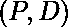
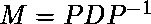

# Python 症状| Matrix .对角化()方法

> 原文:[https://www . geeksforgeeks . org/python-sympy-matrix-对角化-method/](https://www.geeksforgeeks.org/python-sympy-matrix-diagonalize-method/)

借助**症状。矩阵()。对角化()**方法，我们可以[对角化](https://en.wikipedia.org/wiki/Diagonalizable_matrix)一个矩阵。**对角化()**返回一个元组，其中是对角的。

> **语法:**矩阵()。对角化()
> 
> **返回:**返回矩阵的元组，其中第二个元素代表矩阵的对角线。

**示例#1:**

```
# import sympy 
from sympy import * M = Matrix([[3, -2,  4, -2],
                                [5,  3, -3, -2],
                                [5, -2,  2, -2],
                                [5, -2, -3,  3]])

print("Matrix : {} ".format(M))

# Use sympy.diagonalize() method 
P, D = M.diagonalize()  

print("Diagonal of a matrix : {}".format(D))  
```

**输出:**

> 矩阵:矩阵([[3，-2，4，-2]，[5，3，-3，-2]，[5，-2，2，-2]，[5，-2，-3，3]])
> 矩阵的对角线:矩阵([-2，0，0，0，0]，[0，3，0，0]，[0，0，5，0]，[0，0，5，0]])

**例 2:**

```
# import sympy 
from sympy import * M = Matrix([[1, -3, 3], [3, -5, 3], [6, -6, 4]]) 
print("Matrix : {} ".format(M))

# Use sympy.diagonalize() method 
P, D = M.diagonalize()  

print("Diagonal of a matrix : {}".format(D))
```

**输出:**

> 矩阵:矩阵([[1，-3，3]，[3，-5，3]，[6，-6，4]])
> 矩阵的对角线:矩阵([-2，0，0]，[0，-2，0]，[0，0，0]])