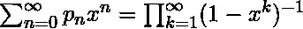

# Python | sympy.partition()方法

> 原文:[https://www . geesforgeks . org/python-sympy-partition-method/](https://www.geeksforgeeks.org/python-sympy-partition-method/)

借助 **sympy.partition()** 方法，我们可以在 sympy 中找到[分区号](https://en.wikipedia.org/wiki/Partition_(number_theory%29)。

## `partition(n) -`

分割数是整数序列**p<sub>n</sub>T5】，表示将 **n** 表示为自然数之和的不同方式的数量(顺序无关)。 **p <sub>n</sub>** 的生成函数由–
给出。**

> **语法:**分区(n)
> 
> **参数:**
> **n–**表示要计算分区号的编号。
> 
> **返回:**返回第 n 个<sup>分区号</sup>。

**示例#1:**

```py
# import sympy 
from sympy import * 

n = 7
print("Value of n = {}".format(n))

# Use sympy.partition() method 
nth_partition = partition(n)  

print("Value of nth partition number : {}".format(nth_partition))  
```

**输出:**

```py
Value of n = 7
Value of nth partition number : 15

```

**例 2:**

```py
# import sympy 
from sympy import * 

n = 10
print("Value of n = {}".format(n))

# Use sympy.partition() method 
n_partition = [partition(x) for x in range(1, 11)]  

print("N partition number are : {}".format(n_partition))  
```

**输出:**

```py
Value of n = 10
N partition number are : [1, 2, 3, 5, 7, 11, 15, 22, 30, 42]

```