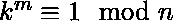

# Python | sympy . reduce _ totilent()方法

> 原文:[https://www . geesforgeks . org/python-sympy-reduce _ totilent-method/](https://www.geeksforgeeks.org/python-sympy-reduced_totient-method/)

借助**sympy . reduced _ total()**方法，我们可以在 SymPy 中找到[Carmichael reduced total function 或 lambda(n)](https://en.wikipedia.org/wiki/Carmichael_function) 。*reducted _ total(n)*或是最小的 *m > 0* ，使得所有 *k* 的相对于 *n* 是质数。

> **语法:**reduce _ total ent(n)
> 
> **参数:**
> **n–**表示整数。
> 
> **返回:**返回最小整数 m > 0，使得 k <sup>m</sup> % n 对于相对于 n 的所有 k 都等于 1

**示例#1:**

```
# import reduced_totient() method from sympy
from sympy.ntheory import reduced_totient

n = 8

# Use reduced_totient() method 
reduced_totient_n = reduced_totient(n) 

print("lambda({}) =  {} ".format(n, reduced_totient_n)) 
# 1 ^ 2 = 1 (mod 8), 3 ^ 2 = 9 = 1 (mod 8),
# 5 ^ 2 = 25 = 1 (mod 8) and 7 ^ 2 = 49 = 1 (mod 8)
```

**输出:**

```
lambda(8) =  2 

```

**例 2:**

```
# import reduced_totient() method from sympy
from sympy.ntheory import reduced_totient

n = 30

# Use reduced_totient() method 
reduced_totient_n = reduced_totient(n) 

print("lambda({}) =  {} ".format(n, reduced_totient_n)) 
```

**输出:**

```
lambda(30) =  4

```