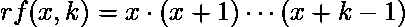

# Python | sympy.rf()方法

> 原文:[https://www.geeksforgeeks.org/python-sympy-rf-method/](https://www.geeksforgeeks.org/python-sympy-rf-method/)

借助 **sympy.rf()** 方法，我们可以找到[上升因子](http://mathworld.wolfram.com/RisingFactorial.html)。上升因子由–



其中 **x** 可以是任意表达式， **k** 是整数。

> **语法:** rf(x，k)
> 
> **参数:**
> **x–**表示任意表达式。
> **k–**表示整数。
> 
> **返回:**返回对应于给定输入的上升因子。

**示例#1:**

```py
# import sympy 
from sympy import * 

x = symbols('x')
k = 5
print("Value of x = {} and k = {}".format(x, k))

# Use sympy.rf() method 
rf_x_k = rf(x, k)  

print("Rising factorial rf(x, k) : {}".format(rf_x_k))  
```

**输出:**

```py
Value of x = x and k = 5
Rising factorial rf(x, k) : x*(x + 1)*(x + 2)*(x + 3)*(x + 4)

```

**例 2:**

```py
# import sympy 
from sympy import * 

x = 7
k = 5
print("Value of x = {} and k = {}".format(x, k))

# Use sympy.rf() method 
rf_x_k = rf(x, k)  

print("Rising factorial rf(x, k) : {}".format(rf_x_k))  
```

**输出:**

```py
Value of x = 7 and k = 5
Rising factorial rf(x, k) : 55440

```