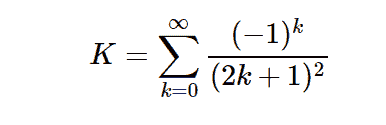

# Python | sympy。加泰罗尼亚常数

> 原文:[https://www . geesforgeks . org/python-sympy-s-Catalan-constant/](https://www.geeksforgeeks.org/python-sympy-s-catalan-constant/)

借助`**sympy.S.Catalan**`值，我们可以直接使用加泰罗尼亚常量的值 **K = 0.91596559** 或者我们可以说在 sympy 加泰罗尼亚常量中是一个**单例值**。

> **用于计算加泰罗尼亚常数的公式–**
> 

**例#1 :**
在这个例子中我们可以看到，通过使用**加泰罗尼亚**常量的 singleton 值，我们能够得到加泰罗尼亚常量的值。

```py
# import sympy
from sympy import *

# Using sympy.S.Catalan value
gfg = S.Catalan.n(10) + S(5)

print(gfg)
```

**输出:**

> 5.915965594

**例 2 :**

```py
# import sympy
from sympy import *

# Using sympy.S.Catalan value
gfg = S.Catalan.n(20)

print(gfg)
```

**输出:**

> 0.91596559417721901505