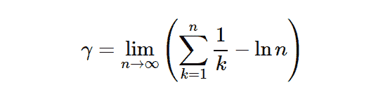

# python | sympty。s . eule gami〔t1〕

> 哎哎哎:# t0]https://www . geeksforgeeks . org/python-sympty-s-eul gama/

借助`**sympy.S.EulerGamma**`值，我们可以直接使用欧拉常数的值，即 **0.5772157** 或者我们可以说在辛欧拉常数中是一个**单值**。

> **用于计算欧拉常数的公式–**
> 

**例#1 :**
在这个例子中我们可以看到，通过使用**欧拉**常数的单例值，我们能够得到欧拉常数的值。

```py
# import sympy
from sympy import *

# Using sympy.S.EulerGamma value
gfg = S.EulerGamma.n(10) + S(2)

print(gfg)
```

**输出:**

> 2.577215665

**例 2 :**

```py
# import sympy
from sympy import *

# Using sympy.S.EulerGamma value
gfg = S.EulerGamma.n(20)

print(gfg)
```

**输出:**

> 0.57721566490153286061