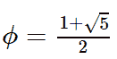

# python | symy . s . golden rantio

> 哎哎哎:# t0]https://www . geeksforgeeks . org/python-sympty-s-golden rantio/

借助`**sympy.S.GoldenRatio**`值，我们可以直接使用黄金分割比常数的值 **1.618033989** 或者我们可以说在 sympy 中黄金分割比常数是一个**单值**。

> **黄金比例常数的值–**
> 

**例#1 :**
在这个例子中我们可以看到，通过使用**黄金分割比例**常量的单例值，我们能够得到黄金分割比例常量的值。

```py
# import sympy
from sympy import *

# Using sympy.S.GoldenRatio value
gfg = S.GoldenRatio.n(10) + S(20)

print(gfg)
```

**输出:**

> 21.61803399

**例 2 :**

```py
# import sympy
from sympy import *

# Using sympy.S.GoldenRatio value
gfg = S.GoldenRatio.n(20)

print(gfg)
```

**输出:**

> 1.6180339887498948482