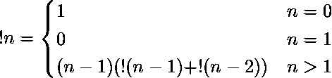

# Python | sympy . subfactory()方法

> 原文:[https://www . geesforgeks . org/python-sympy-subfactorial-method/](https://www.geeksforgeeks.org/python-sympy-subfactorial-method/)

借助**sympy . subfactory()**方法，我们可以在 SymPy 中找到一个数的[subfactory](https://en.wikipedia.org/wiki/Subfactorial)。一个数的子因子由–



> **语法:**子工厂(n)
> 
> **参数:**
> **n–**表示要计算其子工厂的编号。
> 
> **返回:**返回数字的子工厂，即 n。

**示例#1:**

```
# import sympy 
from sympy import * 

n = 4
print("Value of n = {}".format(n))

# Use sympy.subfactorial() method 
subfactorial_n = subfactorial(n)  

print("Subfactorial of n : {}".format(subfactorial_n))  
```

**输出:**

```
Value of n = 4
Subfactorial of n : 9

```

**例 2:**

```
# import sympy 
from sympy import * 

n = 9
print("Value of n = {}".format(n))

# Use sympy.subfactorial() method 
subfactorial_n = subfactorial(n)  

print("Subfactorial of n : {}".format(subfactorial_n))  
```

**输出:**

```
Value of n = 9
Subfactorial of n : 133496

```