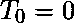
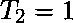
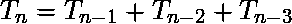
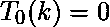
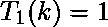
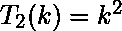
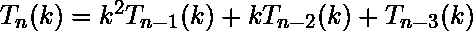
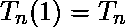

# Python | sympy.tribonacci()方法

> 原文:[https://www . geesforgeks . org/python-sympy-tribonacci-method/](https://www.geeksforgeeks.org/python-sympy-tribonacci-method/)

借助 **sympy.tribonacci()** 方法，我们可以在 sympy 中找到 [tribonacci 数和 Tribonacci 多项式](https://en.wikipedia.org/wiki/Generalizations_of_Fibonacci_numbers#Tribonacci_numbers)。

## `tribonacci(n) -`

Tribonacci 数是由初始项、、和三项递推关系定义的整数序列。

> **语法:** tribonacci(n)
> 
> **参数:**
> **n–**它表示要计算的 Tribonacci 数。
> 
> **返回:**返回第 n 个<sup>号</sup>摩擦号。

**示例#1:**

```py
# import sympy 
from sympy import * 

n = 7
print("Value of n = {}".format(n))

# Use sympy.tribonacci() method 
nth_tribonacci = tribonacci(n)  

print("Value of nth tribonacci number : {}".format(nth_tribonacci))  
```

**输出:**

```py
Value of n = 7
Value of nth tribonacci number : 24

```

## `tribonacci(n, k) -`

对于，特里博纳西多项式由、、和定义。对于所有正整数、。

> **语法:** tribonacci(n，k)
> 
> **参数:**
> **n–**表示第 n 个<sup>次</sup>摩擦多项式。
> **k–**表示 Tribonacci 多项式中的变量。
> 
> **返回:**返回 k，T <sub>n</sub> (k)中的第 n 个 Tribonacci 多项式

**例 2:**

```py
# import sympy 
from sympy import * 

n = 5
k = symbols('x')
print("Value of n = {} and k = {}".format(n, k))

# Use sympy.tribonacci() method 
nth_tribonacci_poly = tribonacci(n, k)  

print("The nth tribonacci polynomial : {}".format(nth_tribonacci_poly))  
```

**输出:**

```py
Value of n = 5 and k = x
The nth tribonacci polynomial : x**8 + 3*x**5 + 3*x**2

```

**示例#3:**

```py
# import sympy 
from sympy import * 

n = 6
k = 3
print("Value of n = {} and k = {}".format(n, k))

# Use sympy.tribonacci() method 
nth_tribonacci_poly = tribonacci(n, k)  

print("The nth tribonacci polynomial value : {}".format(nth_tribonacci_poly))  
```

**输出:**

```py
Value of n = 6 and k = 3
The nth tribonacci polynomial value : 68289

```