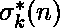

# Python | sympy.udivisor_sigma()方法

> 原文:[https://www . geesforgeks . org/python-sympy-udi visor _ sigma-method/](https://www.geeksforgeeks.org/python-sympy-udivisor_sigma-method/)

借助 **sympy.udivisor_sigma()** 方法，我们可以对任意正整数 ***n*** 计算出[酉除数函数](http://mathworld.wolfram.com/UnitaryDivisorFunction.html) 。 *** udivisor_sigma(n，k) *** 等于 *** n *** 的所有[幺除子](http://mathworld.wolfram.com/UnitaryDivisor.html)的和，其幂为 *** k *** 或 ***的和(【x**k 代表 udi visor(n)中的 x】)***。

> **语法:**听者 _sigma(n，k)
> 
> **参数:**
> **n–**表示整数。
> **k–**表示整数(可选)。k 的默认值为 1。
> 
> **返回:**返回 n 的所有幺正除数的和与 k 的幂的乘积。

**示例#1:**

```py
# import udivisor_sigma() method from sympy
from sympy.ntheory.factor_ import udivisor_sigma

n = 12

# Use udivisor_sigma() method 
udivisor_sigma_n = udivisor_sigma(n) 

print("udivisor_sigma({}) =  {} ".format(n, udivisor_sigma_n)) 
# 1 ^ 1 + 3 ^ 1 + 4 ^ 1 + 12 ^ 1 = 20
```

**输出:**

```py
udivisor_sigma(12) =  20

```

**例 2:**

```py
# import udivisor_sigma() method from sympy
from sympy.ntheory.factor_ import udivisor_sigma

n = 18
k = 2

# Use udivisor_sigma() method 
udivisor_sigma_n = udivisor_sigma(n, k) 

print("udivisor_sigma({}) =  {} ".format(n, udivisor_sigma_n)) 
```

**输出:**

```py
udivisor_sigma(18) =  410

```