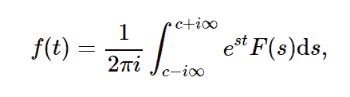

# python 中的积分.逆 _ 拉普拉斯变换()

> 原文:[https://www . geeksforgeeks . org/sympy-integrations-inverse _ la place _ transform-in-python/](https://www.geeksforgeeks.org/sympy-integrals-inverse_laplace_transform-in-python/)

借助**逆 _ 拉普拉斯变换()**方法，可以计算 F(s)的拉普拉斯变换的逆。



> **语法:**逆 _ 拉普拉斯变换(F，s，t)
> **返回:**返回未赋值的变换函数。

**示例#1 :**
在这个示例中，我们可以看到，通过使用逆拉普拉斯变换()方法，我们能够计算逆拉普拉斯变换并返回未赋值的函数。

## 蟒蛇 3

```
# import inverse_laplace_transform
from sympy.integrals.transforms import inverse_laplace_transform
from sympy import exp, Symbol
from sympy.abc import s, t

a = Symbol('a', positive = True)
# Using inverse_laplace_transform() method
gfg = inverse_laplace_transform(exp(-a * s)/s, s, t)

print(gfg)
```

**输出:**

> 重型(-a + t)

**例 2 :**

## 蟒蛇 3

```
# import inverse_laplace_transform
from sympy.integrals.transforms import inverse_laplace_transform
from sympy import exp, Symbol
from sympy.abc import s, t

a = Symbol('a', positive = True)
# Using inverse_laplace_transform() method
gfg = inverse_laplace_transform(exp(-a * s)/s, s, 5)

print(gfg)
```

**输出:**

> 重型(5–a)